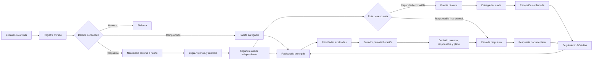
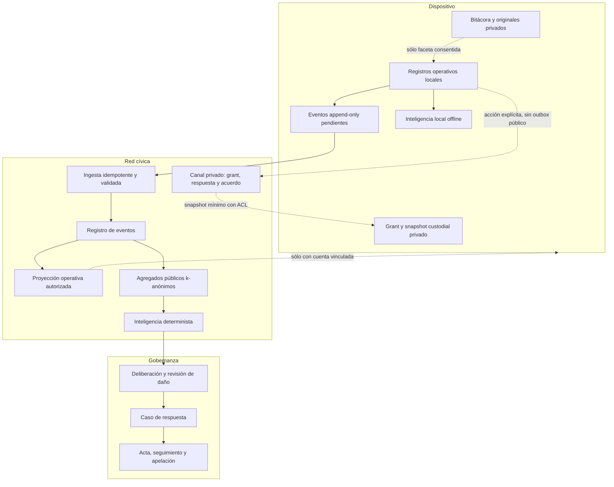

# Modelo operativo cívico de ¡BASTA!

Fecha de revisión: 2026-07-14

Estado: constitución de producto y contrato para implementación

Alcance: juego móvil, red cívica, inteligencia, conexiones, respuestas y mandatos

## 1. Propósito

¡BASTA! no debe ser una red social, una encuesta ni una máquina de peticiones. Su
trabajo es reducir la distancia entre una experiencia situada y una respuesta
comprobable, conservando el control de la persona sobre sus datos.

La unidad de valor es:

> una incertidumbre territorial que obtiene evidencia suficiente, custodia,
> responsable, respuesta y aprendizaje sin exponer a quien participó.

La plataforma puede ayudar a gobernar, pero no puede adjudicarse representación.
Participar no equivale a votar; una coincidencia no demuestra prevalencia; una
salida de IA no es un mandato; y una ubicación compartida no autoriza publicar
un punto exacto.

## 2. El ciclo completo

Ningún salto puede ocultarse. En especial, `escucha → necesidad` requiere una
decisión adicional de exposición y custodia; `coincidencia → conexión` requiere
consentimiento de ambas partes; `borrador → mandato` requiere deliberación y una
autoridad humana identificable.

## 3. Personas y promesa para cada una

| Persona | Viene a | Debe poder | Nunca debe sufrir |
|---|---|---|---|
| Habitante / testigo | contar o registrar algo real | guardar en privado, compartir una faceta o pedir respuesta | que su relato completo se publique por inferencia |
| Persona que necesita apoyo | llegar a una respuesta segura | elegir custodio, vigencia, precisión y canal; retirar o corregir | exposición de identidad, contacto o punto exacto |
| Persona u organización que aporta | ofrecer tiempo, bienes, espacio o saber | definir cantidad, radio, vigencia y condiciones | contacto no solicitado o promesas automáticas |
| Verificadora | aportar una segunda mirada | declarar método, distancia, resultado e incertidumbre | revisar su propio dato o una cola infinita |
| Coordinadora / custodio | sostener una operación | definir pasaporte, territorio, denominador, equipo, pendientes y cierre | ver datos personales que no necesita |
| Analista / investigadora | estudiar patrones y desempeño | consultar agregados, cobertura, calidad, versiones y exportar | confundir participantes con población total |
| Institución responsable | responder con trazabilidad | aceptar, derivar, presupuestar, actualizar y cerrar un caso | recibir un “mandato” sin evidencia ni derecho a réplica |
| Público | comprender el territorio | ver radiografías protegidas y límites metodológicos | acceder a filas, contactos o grupos pequeños |

Los roles son capacidades revocables, no jerarquías permanentes. Autoría,
verificación, custodia, entrega y confirmación deben poder pertenecer a personas
distintas y quedar registradas como tales.

## 4. Las cinco capas de datos

### Capa 1 — memoria privada

Relato, reflexión, borrador, foto original y precisión completa. Permanece en el
dispositivo salvo elección explícita. La bitácora no es materia prima automática
para el análisis colectivo.

### Capa 2 — registro operativo bajo custodia

Necesidad, recurso, observación o visita con propósito, categoría, vigencia,
procedencia, ubicación y precisión compartida. Puede requerir identidad o canal
privado. Una necesidad personal admite un grant local para un único círculo u
organización concretos. Sólo el círculo numérico verificado puede recibir una
proyección mínima por el canal autenticado; el acuse de inbox prueba entrega
técnica, no aceptación del caso ni respuesta. El círculo puede registrar que
está evaluando y luego declarar capacidad controlada. Después puede crear una
única propuesta privada; el dispositivo autor del grant la acepta o rechaza.
`accepted` sólo registra que ambas partes acordaron intentar coordinar la
capacidad congelada: todavía no identifica ni reserva un recurso, no habilita
contacto y no prueba entrega o resolución.

### Capa 3 — feed operativo mínimo

Proyección descargable para las partes que realmente pueden verificar o
coordinar. No incluye claves de actor, relato privado, contacto ni precisión
superior a la consentida. Cerrar sesión debe desactivar y borrar esta proyección
antes de cualquier intento remoto.

El canal custodial privado no es esta capa de feed: usa ACL y contratos propios
para grant, respuesta y coordinación bilateral, y nunca se materializa como
Trama, match, feed colectivo u outbox público.

### Capa 4 — agregado público protegido

Conteos por campaña, categoría, estado y territorio permitido. Exige un mínimo
de fuentes distintas, suprime grupos pequeños, declara período, truncamiento,
cobertura y denominadores. Nunca expone eventos ni personas.

### Capa 5 — inteligencia y decisión

Balances, oportunidades de coordinación, prioridades y borradores no
vinculantes, calculados desde la capa 4. Cada salida lleva evidencia, límites,
versión y acciones de revisión. No existe ranking individual ni perfil político.

## 5. Contrato geográfico

Se almacenan por separado:

1. lugar del asunto;
2. posición del dispositivo al capturar;
3. error o precisión de medición;
4. precisión aceptada para operación;
5. precisión aceptada para publicación.

Una coordenada no es un consentimiento. La vista pública debe degradar la
geografía a punto desplazado, celda, barrio o jurisdicción según el pasaporte.
La persona siempre puede corregir el lugar del asunto sin falsificar la
procedencia del dispositivo.

Las misiones declaran un denominador antes de recoger evidencia: celdas,
instituciones, hogares invitados u otra unidad explícita. Una visita sin hallazgo
es evidencia de cobertura y debe registrarse separada de un hallazgo positivo.

## 6. El agente de conexiones

El agente no “asigna personas”. Produce candidatos explicables y deja la
decisión a las partes y al custodio.

### Entradas permitidas

- categoría y subtipo compatibles;
- cantidad o capacidad disponible;
- vigencia;
- distancia compatible calculada sin revelar puntos;
- restricciones declaradas;
- estado de corroboración;
- consentimiento para ser contactado mediante mediación;
- historial del caso, nunca una puntuación moral de la persona.

### Salida mínima

- por qué podría servir;
- qué condiciones todavía faltan confirmar;
- qué dato no se usó;
- riesgo o salvaguarda aplicable;
- fecha de vencimiento;
- necesidad y recurso referidos por identificadores internos;
- `humanConfirmationRequired: true`.

### Estados del puente

`propuesto → invitaciones enviadas → aceptación bilateral → coordinación →
entrega declarada → recepción confirmada → seguimiento → cerrado/reabierto`

Rechazar o retirarse no baja reputación. No se comparte contacto hasta que ambas
partes aceptan. La persona receptora confirma el resultado; quien entrega no
puede confirmarse a sí mismo.

Este puente completo sigue siendo el objetivo para un recurso concreto. La
propuesta custodial ya implementada es un paso anterior y más estrecho:
`proposed → accepted | declined | expired | closed`. Incluso en `accepted` no
existe todavía reserva, contacto, entrega ni resolución.

## 7. Inteligencia pública y evaluación

Toda radiografía debe contestar cuatro preguntas por separado:

1. **Qué vimos:** señales y necesidades, con fecha y territorio.
2. **Qué tan confiable es:** corroboración, disputa, vigencia y procedencia.
3. **Qué tan completo es:** denominador y cobertura, o declaración explícita de
   que no existe.
4. **Qué respuesta ocurrió:** conexión, entrega, confirmación, tiempo y
   seguimiento.

Indicadores iniciales:

| Dimensión | Indicador | Denominador obligatorio |
|---|---|---|
| Calidad | corroboraciones válidas | señales de campo vigentes |
| Vigencia | señales no vencidas | señales de campo |
| Cobertura | unidades visitadas | unidades planificadas |
| Respuesta | necesidades resueltas | necesidades consideradas |
| Coordinación | puentes confirmados | puentes aceptados |
| Cierre | resultados confirmados a 30 días | acciones declaradas completas |
| Equidad operativa | zonas con cobertura suficiente | zonas del plan |

No se publican tasas con denominador cero. No se denomina “representativa” una
muestra por conveniencia. El total de usuarios, estrellas o capturas no es un
indicador de legitimidad pública.

## 8. De radiografía a mandato

La plataforma sólo crea `borradores para deliberación`. Para convertirse en una
decisión colectiva, cada borrador necesita:

- propósito y territorio;
- evidencia protegida enlazada y versionada;
- calidad, cobertura y voces ausentes;
- evaluación de daño;
- personas afectadas convocadas con un método declarado;
- alternativas, objeciones y disensos registrados;
- responsable institucional o comunitario;
- recursos o presupuesto;
- plazo, indicador de resultado y fecha de revisión;
- mecanismo de apelación, corrección y retiro;
- acta humana de aprobación.

La ausencia de mayoría no autoriza a una IA a reemplazar la deliberación. La
convergencia puede señalar un tema que merece atención; no determina por sí sola
qué debe hacerse ni quién queda obligado.

## 9. Límites del agente de inteligencia

El agente puede:

- detectar faltantes de verificación, cobertura o vigencia;
- proponer puentes de categorías compatibles;
- ordenar trabajo por seguridad y urgencia operativa;
- explicar cada cálculo;
- redactar preguntas y un borrador para deliberar;
- comparar versiones e informar qué cambió.

El agente no puede:

- determinar verdad, culpabilidad o intención;
- publicar relato, identidad, contacto o coordenada privada;
- puntuar personas, barrios o ideologías;
- decidir destinatarios sensibles sin revisión;
- contactar o conectar partes automáticamente;
- convertir frecuencia de uso en poder político;
- aprobar, publicar o ejecutar un mandato;
- escalar urgencia sólo porque pasó el tiempo;
- ocultar incertidumbre con texto persuasivo.

El motor heredado que sintetiza testimonios crudos mediante IA permanece cerrado
por defecto. El camino soportado usa agregados protegidos y produce resultados
deterministas y auditables antes de cualquier enriquecimiento textual.

## 10. Arquitectura funcional

Propiedades obligatorias:

- eventos idempotentes y append-only;
- estado derivado calculado en servidor, no aceptado del cliente;
- corrección como nuevo evento, no edición silenciosa;
- retiro que afecta proyecciones y análisis futuros;
- recibo de divulgación legible por la persona;
- exportación y borrado local;
- separación entre identidad de cuenta, dispositivo y actor público;
- sincronización que falla cerrada al cerrar sesión;
- versiones de protocolos, agregados, informes y decisiones.

## 11. Recorridos objetivo

### Pedir apoyo

`Escuchar → guardar relato privado → extraer una necesidad → elegir custodio y
destinatario → fijar lugar/precisión/vigencia → vista previa exacta → recibo →
corroboración → puente o caso institucional → resultado → seguimiento`

Estado actual: está implementado `pedido privado bajo custodia → grant local,
nominativo, acotado y revocable → entrega manual a círculo custodial verificado
→ inbox coordinador → evaluación → capacidad declarada → propuesta privada →
aceptación o rechazo del dispositivo autor → retiro idempotente`. Una
organización sigue sólo local. `accepted` es acuerdo para intentar coordinar;
conectar y reservar un recurso concreto, abrir contacto protegido, coordinar la
entrega y confirmar el resultado permanecen cerrados. Un pedido personal no
entra al feed colectivo ni a Tramas como atajo.

### Ofrecer un recurso

`Categoría → capacidad/cantidad → condiciones/radio/vigencia → lugar → firma y
audiencia → vista previa → recibo → candidatos → aceptación bilateral → entrega
→ confirmación receptora`

### Operación territorial

`Propósito → custodio → pasaporte/version → lazo → denominador → equipo → rutas
→ visitas con o sin hallazgo → segunda mirada → pendientes → respuesta → cierre
versionado → evaluación posterior`

### Estudiar y decidir

`Elegir período/territorio/protocolo → leer fuente y cobertura → revisar calidad
→ comparar necesidades/recursos/respuesta → inspeccionar evidencia agregada →
formular preguntas → deliberar → asignar responsable/plazo/recursos → publicar
acta → seguir y apelar`

## 12. Orden de construcción

### Fase A — confianza y recolección

- escucha privada y facetas consentidas;
- necesidad y recurso bajo custodia;
- grant destinatario local y entrega autenticada a círculo sin publicación colectiva;
- respuesta controlada, propuesta y decisión bilateral mínimas por canal
  custodial privado;
- geografía y precisión separadas;
- recibos, corrección, retiro y exportación;
- misiones con denominador y visita sin hallazgo;
- sincronización offline segura.

### Fase B — respuesta

- bandejas de corroboración y coordinación (inbox, evaluación, capacidad y
  acuerdo bilateral mínimo ya existen);
- asociación explicable con una oferta o recurso concreto;
- reserva bilateral y canal de contacto protegido;
- entrega, confirmación y seguimiento;
- responsables institucionales y derivación.

### Fase C — inteligencia

- agregados protegidos versionados;
- sala local y lectura de red claramente separadas;
- cobertura, calidad, vigencia y resultados;
- exportación de informes reproducibles;
- comparación temporal sin reidentificación.

### Fase D — decisiones públicas

- borrador no vinculante;
- deliberación de personas afectadas;
- acta, responsable, presupuesto y plazo;
- seguimiento 7/30/90;
- apelación y revisión;
- archivo público versionado.

## 13. Definición de “programa nacional”

La plataforma estará lista para sostener un programa nacional cuando, como
mínimo:

- cada flujo declare propósito, custodio, audiencia y retención;
- las campañas usen protocolos versionados, no inferencias desde títulos;
- la ausencia de hallazgo pueda medirse;
- ninguna pantalla dependa de red para preservar trabajo;
- toda tarea tenga estados cargando, offline, vacío, sin permiso, error
  recuperable y completo;
- una necesidad pueda terminar en resultado confirmado y seguimiento;
- analistas puedan reproducir conteos desde contratos versionados;
- el público vea límites y grupos suprimidos;
- toda decisión tenga evidencia, deliberación, responsable, recursos, plazo y
  apelación;
- una auditoría externa pueda reconstruir quién pudo hacer qué, sin acceder a
  identidades que no necesita.

La excelencia visual debe hacer estas garantías comprensibles. No debe usarse
para convertir incertidumbre en certeza, participación en espectáculo o una
recomendación técnica en autoridad política.
