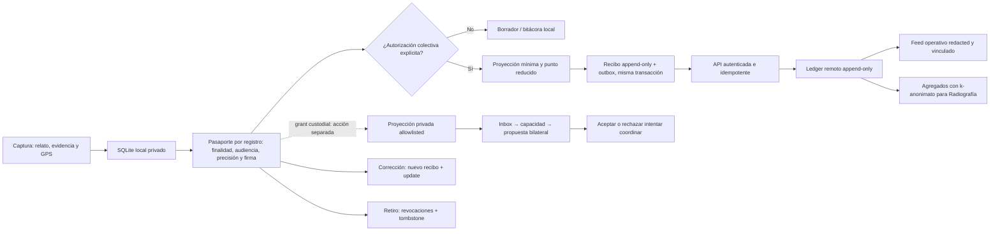

# Auditoría de gobernanza de datos cívicos

Fecha de corte: 2026-07-14
Alcance: app `juego`, outbox/sincronización y contrato cívico de `SocialJusticeHub`.

## Dictamen ejecutivo

La arquitectura ya tiene una base valiosa para recolectar evidencia territorial sin convertir el mapa en una máquina de vigilancia: captura offline, separación entre punto exacto y punto compartido, consentimiento por registro, firma opcional, recibos locales, corrección, retiro auditable, feed restringido y agregados con umbral de privacidad.

Esta auditoría cerró brechas críticas de implementación: un punto exacto ya no puede conservar sus coordenadas al cambiar de privado a colectivo; publicación, corrección y retiro escriben contexto, recibo, outbox y estado dentro de una misma transacción; claves idempotentes conflictivas dejan de fallar silenciosamente; un logout offline no puede volver a descargar el feed; y el borrado de la proyección remota incluye sus pasaportes geográficos.

La plataforma todavía **no debe prometer gobernanza de nivel nacional** hasta cerrar cuatro decisiones estructurales:

1. cifrado de datos sensibles en reposo;
2. retención física y eliminación remota verificable, no sólo vencimiento o tombstone;
3. recuperación de autoridad sobre registros remotos cuando se pierde o reinicia la identidad del dispositivo;
4. completar custodia y acceso por propósito para necesidades sensibles más allá
   del acuerdo mínimo; una cuenta vinculada no debe poder descargar el universo
   de casos individuales.

## Primeros principios

1. **Finalidad antes que dato.** Toda campaña debe declarar quién decide, para qué, con qué método y cuándo termina. Si no cambia una decisión o una acción legítima, el dato no se pide.
2. **Mínimo necesario.** Relato, foto, contacto, identidad y punto exacto son capas separadas. Compartir una faceta no autoriza compartir las demás.
3. **Lugar conocido no significa lugar publicado.** Calidad de captura, precisión pública y consentimiento son ejes independientes.
4. **Identidad graduada, no anonimato forzado.** La persona puede publicar sin firma, con alias o con nombre declarado. Esa firma es presentación, no identidad verificada ni autoridad.
5. **Offline no significa opaco.** Cada mutación debe ser durable, idempotente, visible y recuperable antes de depender de la red.
6. **Corregir sin reescribir la historia.** Una corrección agrega otro evento; un retiro agrega un tombstone y revocaciones. Ninguna interfaz debe alterar silenciosamente el pasado.
7. **Vigencia no es retención.** Dejar de mostrar o usar un dato vencido no equivale a borrarlo del teléfono, backups o ledger remoto.
8. **El poder necesita separación.** Autor, verificador, contraparte, confirmador, custodio y decisor no son el mismo rol por defecto.
9. **La persona conserva agencia.** Debe poder saber qué salió, corregirlo, retirarlo, exportarlo y solicitar eliminación; perder un teléfono no puede anular esos derechos.
10. **Lo público se deriva.** La Radiografía consume agregados protegidos; nunca filas privadas ni el ledger crudo.

## Flujo real

El punto exacto y las URI locales de fotos terminan en la capa local. El canal
colectivo recibe sólo la proyección autorizada. Para necesidades privadas ya
existe una ACL acotada a círculo custodial autenticado y un contrato separado
para propuesta/decisión bilateral. Este canal no entra al feed, Tramas ni outbox
público. Otras entidades, la oferta concreta y el contacto de contraparte
permanecen cerrados.

## Matriz requisito → evidencia → brecha

Leyenda: **Cumple** = control implementado y verificable; **Parcial** = protección útil con deuda concreta; **Brecha** = requisito fundamental ausente.

| Requisito | Evidencia verificable | Estado | Brecha o acción siguiente |
| --- | --- | --- | --- |
| Esquema local versionado | `src/db/schema.ts`; migraciones `0001`, `0005`–`0016`; `_journal.json`; `migrations.js` | Cumple | Agregar checks de dominio en DB para coordenadas, precisión, audiencia y estados. |
| Captura offline durable | Transacciones de `createObservation`, `createNeed`, `createResource`; `sync_outbox` | Cumple | Probar restauración real de snapshots web y recuperación después de cierre forzado en dispositivos físicos. |
| Separación exacto/público | `civic_record_contexts`; `location-policy.ts`; `record-context.ts` | Cumple | `civic_observations` aún duplica el punto exacto por compatibilidad; reducir a una única bóveda sensible en una migración futura. |
| `exact` nunca sale al canal colectivo | `sharedPrecisionForAudience`; reproyección en `setRecordContextAudience`; payloads leen el punto del pasaporte | Cumple | Mantener prueba contractual cliente-servidor en CI para cada entidad nueva. |
| Coordenadas válidas | `validGeoPoint`; normalización y grilla autoritativa en `server/civic/contracts.ts` | Parcial | Las tablas SQLite no tienen checks WGS84; una DB corrupta puede contener puntos inválidos aunque no deban salir. |
| Consentimiento de ubicación por registro | `locationConsent`, `confirmedAt`; default `false`; `canDiscloseRecordLocation` | Cumple | La UI debe conservar una copia legible del texto exacto de consentimiento por versión, no sólo su finalidad resumida. |
| Autoría no obligatoriamente anónima | `attributionMode: anonymous/alias/named`; `attributionConsent`; `GeoAttributionCard` | Cumple | Nombre/alias es autodeclarado. No usarlo como identidad verificada, reputación o permiso. |
| Audiencia verificable | Feed sólo admite `collective`; grants de necesidad exigen cuenta+dispositivo, círculo custodial, membresía y coordinación activa; la propuesta exige otra cuenta coordinadora y la decisión separada exige cuenta grantora+dispositivo autor | Parcial | Es separación de cuentas y decisiones, no prueba de personas distintas o independencia organizacional. La ACL existe sólo para la coordinación custodial mínima; `counterpart`, organizaciones y contacto siguen deshabilitados. |
| Decisión terminal auditable | `terminalDecision` y `decidedAt` quedan separados de `state`; cierre/vencimiento no los borra; una decisión nueva falla después del cierre | Cumple para el acuerdo mínimo | El replay exacto posterior devuelve `200` sólo a la misma cuenta grantora y dispositivo owner; recupera el recibo previo, no reabre la coordinación. |
| Recuperación idempotente de respuesta | El replay exacto se resuelve después de revalidar cuenta/rol/círculo; `civic_custody_response_intents` persiste cuenta, identidad y cuerpo antes del HTTP, incluso si el grant sale del inbox | Cumple | Una respuesta con identidad nueva sigue bloqueada tras revoke/expiry/close; la intención sólo se limpia con recibo válido. |
| Ejecución privada verificable | `execution/v1`, ledger remoto, `refreshedAt` DB, parser cerrado, cache grantor e intención durable `0016` | Cumple v1 | Sigue sin E2E/cifrado propio; no confundir evento, entrega declarada, recepción y necesidad resuelta. |
| Lazo y misión territorial privados | `saveTerritory` no ofrece publicación; misiones/celdas no entran al outbox | Cumple | Diseñar una proyección territorial separada antes de compartir polígonos, rutas o asignaciones. |
| Relato de escucha privado | `civic_listenings`; `listening-privacy.ts`; `shareListening` deriva sólo facetas | Cumple | Auditar con fixtures adversariales cada cambio de facetas allowlisted. |
| Fotos y notas privadas | `publicEvidence` elimina URI; verificaciones ya no envían `note`; servidor rechaza media local/EXIF | Cumple | Falta un flujo de evidencia multimedia cifrada y consentida si alguna campaña realmente la necesita. |
| Redacción de contacto | `redactPublicValue`; validación redundante en servidor | Cumple para canal colectivo | `contactConsent` todavía no tiene un canal protegido de contraparte. No habilitar contacto dentro del feed colectivo. |
| Recibo antes de divulgar | `civic_disclosure_receipts`; `enqueueRecordDisclosure`; misma clave que outbox | Cumple | El recibo enumera campos, pero aún no guarda hash canónico del payload ni acuse remoto. |
| Recibos append-only | `kind`, `revokesReceiptId`; `appendDisclosureRevocation`; UI de historial | Parcial | Es append-only por repositorio, no por protección criptográfica/DB. El borrado total legítimo también borra el ledger local. |
| Idempotencia local | Unique index de outbox/recibos; detección de payload o autorización conflictiva | Cumple | Incorporar una herramienta de resolución explícita para `dead_letter`, no sólo reintento manual. |
| Idempotencia y autoría remota | Hash canónico, ownership y transacción en `server/civic/service.ts` / `postgres-store.ts` | Cumple | Rotación/recuperación del actor sigue pendiente. |
| Estados derivados protegidos | Correcciones cliente omiten `status`/`confidence`; verificaciones son append-only | Parcial | El servidor debe rechazar o quitar siempre campos derivados en `update`, aunque un cliente antiguo los mande. |
| Corrección atómica | `updateObservationContext`, `updateNeedContext`, `updateResourceContext` | Cumple | La edición actual corrige lugar/firma; falta corrección estructurada del contenido con motivo y diff legible. |
| Retiro auditable | `withdraw*`; recibos de revocación; tombstone mínimo; feed/agregados lo retiran | Cumple para circulación | No equivale a eliminación del evento histórico ni de backups. Debe explicarse siempre con ese alcance. |
| Vigencia operativa | `expiresAt`; mapas, conexión, verificación, analytics y agregados excluyen vencidos | Cumple | Vencimiento no purga el dato ni cambia automáticamente todas las filas a `stale/expired`. |
| Retención física | `retentionDays` en misión sólo calcula `expiresAt` | Brecha | Definir y ejecutar borrado/redacción por clase: exacto, relato, evidencia, proyección y ledger. |
| Feed mínimo y autorizado | Cuenta vinculada; allowlist de campos; sin actor keys; conexiones sólo a partes; grant, inbox, respuesta y acuerdo custodiales separados del feed | Parcial | El feed colectivo todavía entrega entidades individuales amplias. El canal privado llega a acuerdo para intentar coordinar, pero no ofrece recurso concreto, reserva, contacto protegido, entrega ni seguimiento. |
| Logout fail-closed | Gate persistente `civic_feed_enabled_v1`; recheck de respuesta en vuelo; limpieza de contextos remotos | Cumple | El unlink remoto puede quedar pendiente; registrar/reintentar esa deuda sin volver a habilitar el pull. |
| Identidad seudónima y secreto | `identity.ts`; 256 bits en SecureStore; servidor guarda HMAC con pepper | Cumple para continuidad del dispositivo | Web usa AsyncStorage, accesible a JavaScript del origen; requiere endurecimiento contra XSS y estrategia de claves web. |
| Recuperación de autoridad | Ownership remoto ligado al `actorKey` original | Brecha | Al resetear identidad se pierde capacidad de corregir/retirar registros previos. Implementar delegación/recovery vinculada a cuenta o clave de recuperación. |
| Cifrado en reposo | Protección del SO/SecureStore sólo cubre secretos, no SQLite ni export | Brecha | Cifrar campos exactos, relatos y evidencia; evaluar SQLCipher o cifrado de campo con claves en SecureStore. |
| Exportación | `exportarTodo` v10, snapshot transaccional, incluye recibos, outbox, decisión terminal e intenciones privadas pendientes | Parcial | JSON es texto plano e incluye ubicaciones exactas y deudas operativas. Ofrecer export cifrado con passphrase y manifiesto de sensibilidad. |
| Borrado local | `borrarTodo`; doble confirmación; bloquea pérdida de intents execution ambiguos | Cumple localmente | Si falla el reset de credenciales, la UI informa; falta verificación posterior y borrado de archivos de evidencia/cache. |
| Eliminación remota / derechos de titular | No hay endpoint DSAR/erase; tombstone sólo retira proyecciones | Brecha | Crear solicitud autenticada, trazabilidad de ejecución, alcance de backups y respuesta descargable. |
| Agregados públicos seguros | `aggregates.ts` y `listening-insights.ts`: mínimo 5 actores, bandas, celdas normalizadas | Cumple en contrato | Hacer revisión formal de ataques por diferencia temporal y consultas repetidas antes de abrir API masiva. |
| Moderación, apelación y daño | `unsafe` existe; reporte de círculos existe | Parcial | Falta flujo cívico de bloquear, denunciar, revisar, apelar y retirar datos peligrosos con SLA y custodio. |
| Observabilidad sin exposición | Errores cliente cortos; servidor evita datos cívicos en mensajes según threat model | Parcial | Falta inventario verificable de logs/APM, política de redacción y pruebas automáticas de no filtración. |

## Cambios críticos aplicados en esta auditoría

1. **Reproyección real al publicar.** `location-policy.ts` valida WGS84 y convierte `exact` a `100m` para toda audiencia no privada. `setRecordContextAudience` recalcula desde el punto exacto en vez de conservar un punto público exacto anterior.
2. **Una sola fuente para el payload.** Observaciones, necesidades y recursos leen coordenadas, precisión, etiqueta, audiencia y firma desde `civic_record_contexts`; la fila operativa ya no puede filtrar un valor viejo o más preciso.
3. **Consentimiento fail-closed.** Crear un registro ya no infiere consentimiento por tener punto + `publish`; la ausencia vale `false`. Divulgar exige un contexto colectivo existente.
4. **Atomicidad de gobernanza.** Crear, publicar, corregir y retirar agrupan contexto, recibos, outbox y estado en transacciones SQLite.
5. **Conflictos idempotentes visibles.** Reutilizar una clave con otra entidad, operación, payload o autorización produce un error y rollback, en vez de devolver silenciosamente el evento anterior.
6. **Estado derivado fuera de correcciones.** Los `update` de lugar/firma omiten `status` y `confidence`; un cliente no debe declararse corroborado ni disponible por una edición geográfica.
7. **Retiro no repetible.** Un registro ya retirado no vuelve a producir el mismo idempotency key con otro timestamp.
8. **Logout offline seguro.** El gate local se escribe antes de limpiar el feed, se consulta antes de autenticar y otra vez antes de aplicar una respuesta que pudo llegar en vuelo.
9. **Limpieza completa de proyección.** Logout borra también `civic_record_contexts` de observaciones, necesidades y recursos remotos.
10. **Minimización adicional.** Notas de verificación quedan locales y el cliente ya no tiene una opción para publicar el polígono completo de un lazo territorial.
11. **Vigencia aplicada.** Una observación vencida ya no entra a la cola de verificación, además de estar excluida de mapas, matches y agregados.
12. **Coordinación custodial separada.** Una propuesta inmutable congela la
    capacidad y sólo admite una decisión terminal de la cuenta grantora y su
    dispositivo autor. `terminalDecision` conserva ese asiento por separado del
    estado operativo después de cierre o vencimiento. Usa el namespace remoto
    `custody_need`, separado de `need`, y no reutiliza matches, Tramas, feed ni
    outbox público.

## Backlog de lanzamiento

### P0 — condición para datos sensibles a escala nacional

**1. Bóveda cifrada local**

- Cifrar `statement`, `desiredOutcome`, evidencia, contacto y coordenadas exactas con una clave no exportable guardada en Keychain/Keystore.
- En web, definir explícitamente si se admite dato sensible; si se admite, usar WebCrypto, CSP estricta y aislamiento de origen.
- Prueba de aceptación: copiar el archivo SQLite/IndexedDB no revela texto ni coordenadas.

**2. Política de retención ejecutable**

- Definir por campaña y clase: vigencia operativa, retención exacta local, retención de proyección, retención de evidencia, ledger y backup.
- Ejecutar un barrido idempotente que primero retire de circulación, luego borre/redacte el dato sensible y registre sólo un recibo no identificante.
- Prueba de aceptación: adelantar el reloj más allá de `retentionDays` elimina el punto exacto y el contenido definido, también tras restaurar backup.

**3. Derechos remotos y recuperación**

- Permitir que una cuenta verificada adopte/delegue autoridad sobre actores que vinculó, sin fusionar identidades ni habilitar auto-verificación.
- Implementar export remoto, corrección, retiro y solicitud de eliminación con estado y comprobante.
- Prueba de aceptación: después de perder el teléfono, la persona puede retirar sus registros anteriores sin hacerse dueña de registros ajenos.

**4. Necesidades bajo custodia, no en un feed global**

- Implementado parcialmente: una escucha privada deriva una necesidad local y
  puede entregar una proyección allowlisted a la coordinación actual de un
  círculo privado/célula, con vencimiento, acuse e idempotencia. No entrega
  relato, contacto, emisor, custodio, `needId` ni punto exacto.
- Implementado también: la coordinación puede asentar `assessing` y luego
  `support_available` con cantidad opcional acotada y unidad derivada. El
  ledger remoto es append-only y la vista no expone respondente ni historial.
- Implementado además: después de `support_available`, otra cuenta coordinadora
  puede crear una única propuesta privada con capacidad y vencimiento congelados.
  La cuenta grantora acepta o rechaza en una decisión separada con su dispositivo
  autor. El estado operativo y `terminalDecision` se conservan por separado: el
  cierre impide decisiones nuevas, pero el replay exacto de una ya asentada
  devuelve `200` tras revocación o vencimiento sólo a esa cuenta y dispositivo.
  Esta separación no prueba que sean personas distintas. `accepted` sólo acuerda
  intentar coordinar; no reserva, contacta, entrega ni resuelve.
- Falta asociar una oferta o recurso concreto, reservarlo bilateralmente,
  registrar responsable y abrir un canal protegido antes de entrega y
  seguimiento, sin ampliar el payload base ni reutilizar Tramas/feed.
- Ejecutar esa asociación sobre atributos mínimos; revelar la oferta sólo a las
  partes elegibles y revelar contacto únicamente mediante un grant posterior y
  específico.
- Incorporar `sensitivity` efectiva al control de acceso, no sólo como metadata local. `high` nunca debe entrar al feed colectivo amplio.
- Prueba de aceptación: dos cuentas vinculadas sin membresía/grant no pueden enumerar necesidades ajenas ni inferir su punto, texto o firma.

### P1 — confianza operacional

- Recibo con hash canónico del payload redacted, `eventId`, fecha de acuse y hash/identificador del servidor.
- Consentimientos append-only asociados a `entityType/entityId`, finalidad y texto/version exactos; no sólo una fila global por scope/version.
- Canal protegido posterior para contacto, con grant específico, caducidad,
  bloqueo y auditoría; el acuerdo bilateral mínimo actual no lo habilita y el
  contacto nunca debe entrar al feed colectivo.
- Export cifrado y borrado verificable de archivos de cámara/cache.
- Moderación cívica: reportar, resguardar, apelar, resolver y transparentar tiempos del custodio.
- Reintento persistente del unlink remoto y pantalla clara de deuda pendiente sin reactivar el feed.
- Auditoría de sesgos: cobertura desigual, zonas sin conectividad, duplicados, brigading y concentración por organización.

### P2 — robustez y escala

- Checks SQLite y migraciones de saneamiento para WGS84, pares completos, precisión, audiencias y cantidades.
- Hash chain o firma periódica del ledger de recibos, compatible con el derecho de borrado total local.
- Pruebas E2E con pérdida de red en cada frontera transaccional, reinicio del proceso y replay.
- Presupuesto de privacidad contra ataques por diferencia temporal en agregados y límites de consulta pública.
- Catálogo de datos y ROPA: finalidad, base legal, custodio, procesadores, transferencia, plazo y mecanismo de derechos por campo.

## Evidencia de validación

- TypeScript: `npm run check`.
- Lint: `npm run lint -- --no-cache`.
- Pruebas: `npm test` y suites específicas de ubicación, recibos, feed, logout,
  privacidad y coordinación custodial.
- Migraciones: aplicación secuencial `0000`–`0016` sobre una base SQLite vacía;
  existen `civic_record_contexts`, `civic_disclosure_receipts`, `sync_outbox` y
  el snapshot de coordinación en `civic_need_access_grants`; `0014` agrega y
  recupera `remoteCoordinationTerminalDecision`; `0015` agrega reintentos de
  respuesta y `0016` agrega cache/intents exactos de ejecución. La exportación
  de ese inventario usa la versión 10.

Pruebas añadidas:

- `src/civic/location-policy.test.ts`
- `src/civic/disclosure-ledger.test.ts`
- `src/civic/feed-governance.test.ts`
- `src/civic/sync-feed-gate.test.ts`
- `src/civic/community-auth-governance.test.ts`
- `src/civic/custody-coordination.test.ts`
- `src/civic/custody-execution.test.ts`
- `src/civic/custody-execution-flow.test.ts`

## Regla de decisión

La plataforma puede seguir piloteando captura territorial de bajo riesgo con las salvaguardas actuales. No debe recolectar de forma nacional puntos exactos de hogares, salud, violencia, situación migratoria, identidad política o contacto hasta cerrar los P0 y realizar revisión legal, de seguridad y de gobernanza comunitaria independiente. El principio rector es simple: **si el sistema no puede proteger, explicar, corregir y borrar responsablemente un dato, todavía no tiene derecho a pedirlo**.
