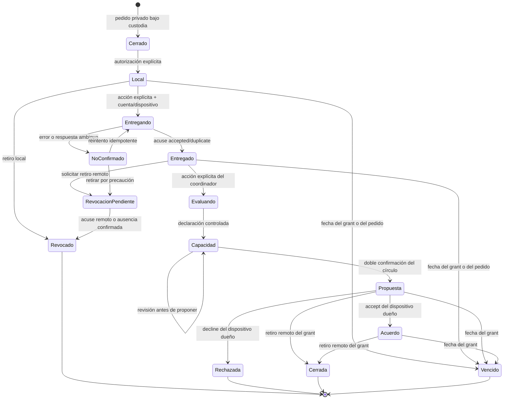

# Permisos destinatarios para necesidades bajo custodia

Fecha de revisión: 2026-07-14
Estado: grant privado, respuesta de capacidad y propuesta/acuerdo bilateral mínimo implementados; oferta concreta, contacto protegido, entrega y resultado pendientes

## Propósito y límite

Una necesidad privada puede autorizar una derivación mínima para **un círculo
o una organización concretos** sin volverse pública. Registrar el permiso crea
primero un acta local: no publica, no entra al outbox y no prueba recepción.

Una segunda acción puede entregar esa proyección a un círculo numérico del que
la cuenta es miembro, siempre que sea una célula o un círculo privado. La app
sólo muestra `entregado` después del acuse autenticado del servidor. Ese acuse
prueba disponibilidad en el inbox coordinador; todavía no significa que el
círculo aceptó atender, que encontró un recurso ni que el caso se resolvió. El
receptor puede asentar después `assessing` o `support_available`; ninguno de
esos estados prueba entrega de ayuda, recepción ni resolución.

Sólo después de `support_available`, la coordinación puede proponer un acuerdo
privado a la persona grantora. `accepted` significa que ambas partes acordaron
**intentar coordinar** esa capacidad congelada. No identifica ni reserva un
recurso, no abre contacto y no prueba entrega, recepción o resolución.

## Ciclo de vida



Hay como máximo un permiso vigente por necesidad. Para cambiar de destinatario
se revoca el anterior y se crea un acta nueva. Permisos vencidos o revocados no
se borran: preservan la historia de quién autorizó qué alcance, para quién, con
qué propósito y hasta cuándo.

El diagrama muestra el estado operativo efectivo. La decisión histórica se
guarda por separado: un acuerdo o rechazo previo puede pasar a `Cerrada` o
`Vencido` sin perder la constancia `accept` o `decline` que lo precedió.

## Identidad destinataria

El grant exige:

- clase controlada: `circle` u `organization`;
- nombre público local, rechazando correos, enlaces y cadenas con apariencia de
  teléfono;
- referencia estable restringida a letras, números, `.`, `_`, `-` y `:`.

La clave resultante (`circle:<referencia>` o `organization:<referencia>`) evita
confundir dos grupos con nombres parecidos. Por sí sola no es una credencial.
La entrega sólo se habilita cuando `circle:<id-numérico>` coincide con una
membresía devuelta por la red y el servidor vuelve a comprobar cuenta,
dispositivo, membresía, carácter custodial y coordinación activa dentro de la
misma operación. Una organización puede quedar autorizada offline, pero no
tiene todavía identidad ni representación verificables y no puede recibir.

## Alcances y propósitos

Alcances:

- `essentials`: categoría, urgencia, vigencia y, cuando son válidas, cantidad y
  unidad controlada;
- `essentials_and_safe_area`: lo anterior más la coordenada ya aproximada y su
  precisión. Nunca admite `exact` o `100m`, ni copia el nombre del lugar.

Propósitos:

- `assess_support`: evaluar si existe capacidad;
- `coordinate_support`: preparar responsables, tiempos y recursos;
- `deliver_support`: habilitar lo mínimo para una entrega futura acordada.

El vencimiento se limita a 30 días y nunca supera el del pedido.

## Proyección congelada

`projection_json` se construye por lista permitida y queda congelado al otorgar
el permiso. Su contrato v1 es:

```text
schema, policyVersion, grantId,
recipient { kind, key }, purpose, scope,
need { category, quantity?, unitCode?, urgency, expiresAt, safeArea? }
```

No contiene título libre, relato de Escucha, resultado deseado, custodio,
referente, contacto, firma, etiqueta de lugar ni coordenada exacta. Las unidades
del borrador son texto libre y sólo pasan si coinciden con un vocabulario seguro,
que se normaliza a códigos cerrados (`people`, `meals`, `units`, `hours`,
`kilograms`, `liters`, `trips`, `days`, `beds`, `kits`); cualquier otra se omite.

El adaptador de transporte construye un cuerpo nuevo por lista permitida. No
envía `purpose`, `scope`, nombre/clave local de destinatario, motivo de
revocación ni el `projection_json` completo. El canal remoto recibe únicamente
categoría, cantidad/unidad controlada, urgencia, zona segura opcional,
vencimiento y el sobre técnico del grant. `needId` se usa internamente para
demostrar propiedad, pero no vuelve en la respuesta ni en el inbox.

## Entrega, inbox y retiro

`deliverCustodiedNeedAccess` exige la misma cuenta para todos los reintentos,
obtiene la prueba del dispositivo y usa una clave idempotente estable. Los
estados locales distinguen `local`, `delivering`, `delivered`, `failed`,
`revocation_pending` y `revoked_remote`. Una respuesta perdida nunca se traduce
en éxito: queda `failed` y, al retirar, la app intenta revocar igualmente por si
el servidor sí hubiera alcanzado a crear el grant.

Después de una entrega, “Comprobar estado en red” repite idempotentemente la
misma operación. Si la coordinación receptora ya lo retiró, el replay devuelve
`revoked`/`closed` y la app asienta `remote_closed` sin inventar quién ejecutó
el retiro; si venció, pasa a `expired`. Un error de esa consulta conserva el último acuse `delivered` y
muestra el fallo: no borra una certeza anterior ni inventa una nueva.

El inbox autenticado reemplaza su snapshot y sólo muestra grants vigentes a
coordinaciones actuales del círculo receptor. Expone el grant y su payload
cerrado, no emisor, relato, contacto, custodio ni identificador estable del
caso. La coordinación puede retirarlo de su bandeja, pero esa acción tampoco
afirma que la necesidad fue resuelta.

## Respuesta operativa mínima

La coordinación receptora dispone de dos declaraciones cerradas:

- `assessing`: tomó el permiso para evaluarlo; no asigna responsable, no promete
  capacidad y no abre un canal de contacto;
- `support_available`: declara capacidad para coordinar. Puede incluir una
  cantidad positiva nunca mayor a la solicitada y siempre con la unidad
  derivada por el servidor. También puede omitir cantidad. No significa que el
  apoyo fue entregado o recibido.

La matriz es monotónica: `pending → assessing → support_available`. No se puede
saltar de `pending` a capacidad ni retroceder. Antes de crear una propuesta, una
nueva declaración de capacidad queda como revisión append-only. La primera
propuesta congela la última respuesta aplicada y bloquea revisiones posteriores;
el replay exacto de una respuesta ya registrada sigue siendo idempotente.
Repetir exactamente una operación usa `responseId` y `Idempotency-Key`; repetir
`assessing` con una identidad nueva conserva un recibo no aplicado para que esa
clave tampoco pueda reutilizarse con otro contenido.

Si se perdió el recibo HTTP y el grant venció o fue revocado antes del
reintento, la cuenta coordinadora actual todavía puede recuperar únicamente ese
replay exacto. El servidor autentica cuenta, círculo y rol antes de buscar la
identidad idempotente; la vista devuelta puede ser `expired`, `revoked` o
`closed`. Toda respuesta nueva continúa bloqueada y el cliente retira esa fila
del inbox activo en vez de presentarla como operativa.

El request sólo admite `grantId`, `responseId`, disposición y cantidad
opcional. La unidad se deriva; no admite texto, contacto, persona, `needId`,
responsable ni resultado. El servidor revalida cuenta activa, coordinación
actual y círculo custodial antes de revelar incluso un replay; para una
respuesta nueva además exige grant abierto dentro de la operación serializada.
El inbox y el grantor al comprobar estado ven únicamente la última respuesta
aplicada: disposición, cantidad/unidad controladas, `responseVersion` opaca y
fecha, sin identidad del coordinador ni historial interno. Esa versión es la
precondición de la propuesta: si la capacidad cambia entre pantalla y
confirmación, el servidor rechaza sin congelar silenciosamente otros términos.

`response` es una clave obligatoria de la vista remota, aun cuando valga
`null`. Por eso esta ampliación exige desplegar cliente y backend coordinados;
las versiones incompatibles fallan cerradas en vez de ignorar campos.

Una revocación que pudo requerir red se asienta localmente sólo después de un
acuse válido, de un `404` comprobado con la misma cuenta grantora, o del
vencimiento. Ante red ausente o cuenta distinta, queda
`revocation_pending` y el permiso no se presenta falsamente como revocado.

## Condiciones fail-closed

El permiso sólo se crea si, dentro de la misma transacción:

- la necesidad pertenece al dispositivo, sigue `draft`, sin descripción ni
  consentimiento de contacto;
- existe custodia activa y el pasaporte de la necesidad continúa `private`;
- no existe recibo de divulgación, outbox ni match para esa necesidad;
- el destinatario, alcance, propósito y fechas pasan las listas permitidas;
- no hay otro permiso vigente;
- si se autoriza zona, existe una proyección válida no exacta.

Ante cualquier duda no se crea una fila y no sale información.

## Propuesta y acuerdo privado

Después de una respuesta `support_available`, el círculo puede crear con doble
confirmación una propuesta privada bajo
`basta-civic-custody-coordination/v1`. La propuesta congela exactamente la
capacidad de esa última respuesta y vence junto con el grant. Sólo puede crearla
otra cuenta coordinadora activa, distinta de la cuenta grantora. La cuenta
grantora consulta el estado y decide `accept` o `decline` con la prueba del mismo
dispositivo autor que otorgó el grant, además de la confirmación reforzada en la
interfaz. Es una separación de cuentas y asientos; no demuestra personas
distintas ni independencia organizacional.

Los IDs de propuesta y decisión son deterministas a partir del grant para que
un reinicio o reintento no duplique la operación. El cliente rechaza envelopes,
campos, unidades, estados o fechas fuera de contrato, y cruza cada propuesta
con un grant activo conocido: mismo `grantId`, capacidad, vencimiento e inicio
posterior a la respuesta. Ambas bandejas usan keyset opaco y estable por serial,
con el mismo `asOf` en todas las páginas de cada lectura; no usan offset ni
incluyen needId o actores en el cursor. El loader alcanza registros 51+ y sigue
hasta 20 páginas/1.000 elementos. Si aún queda cursor, o una carrera entre las
dos lecturas impide cruzar una propuesta, marca cobertura parcial: una ausencia
nunca habilita revisar capacidad. Nada de este canal entra en Tramas, el feed o
el outbox público. Existe como máximo una propuesta inmutable por grant y una
sola decisión terminal.

Un reintento exacto de creación también puede recuperar su recibo después de
revocación o vencimiento, siempre que la misma cuenta siga coordinando el
círculo. Esa excepción ocurre después de autenticar la capability actual y
antes de exigir operabilidad; nunca crea una propuesta nueva sobre un grant
cerrado.

El snapshot separa `remoteCoordinationState`, el estado operativo efectivo, de
`remoteCoordinationTerminalDecision`, la constancia append-only `accept`,
`decline` o `null`. `decidedAt` existe exactamente cuando hay decisión terminal.
Mientras el grant y el rol coordinador son operables, `proposed` exige decisión
nula, `accepted` exige `accept` y `declined` exige `decline`. Revocar, vencer el
grant o perder toda otra cuenta coordinadora elegible sólo prevalece sobre el
estado, que pasa a `closed` o `expired`; no borra la decisión ya asentada.

`terminalDecision` es obligatorio en cada proposal remoto aunque valga `null`.
El contrato conserva el nombre `basta-civic-custody-coordination/v1`, de modo
que esta ampliación exige desplegar cliente y backend coordinadamente y falla
cerrada ante un envelope viejo o incompleto.

Tras cualquiera de esos cierres se rechaza toda decisión nueva. El único `200`
permitido es el replay exacto de una decisión ya confirmada, incluso después de
revocación o vencimiento, y sólo después de autenticar la misma cuenta grantora
activa y el mismo dispositivo autor todavía válido. Ese replay debe coincidir también
en ID determinista, clave idempotente y contenido; recupera un recibo perdido,
no vuelve a decidir. `accepted` sólo habilita intentar coordinar: no equivale a
reserva, contacto, entrega ni resolución.

## Persistencia, exportación y borrado

`civic_need_access_grants` es local y no forma parte de `SyncEntity`. Las
migraciones `0010`, `0011`, `0012`, `0013`, `0014`, `0015` y
`0016_civic_custody_execution_intents` agregan el acta, el estado de transporte,
el último snapshot controlado de respuesta y el snapshot mínimo de coordinación.
`0014` suma `remoteCoordinationTerminalDecision` y recupera `accept`/`decline`
de snapshots anteriores cuyo estado todavía lo expresaba; no inventa una
decisión para filas `closed`, `expired` o `proposed`. Los historiales de
respuesta y decisión son append-only en el servidor y no se descargan al
dispositivo.

`0015` agrega una única intención pendiente por cuenta+grant. Antes del HTTP,
la app guarda `responseId`, el cuerpo exacto y la mínima proyección cerrada que
necesita para validar el recibo (círculo, payload permitido, fechas, estado y
última respuesta visible). No guarda emisor, `needId`, relato, contacto ni
ubicación exacta. Un reinicio o la desaparición del grant del inbox no cambia
esa identidad: la interfaz sólo permite recuperar el mismo comando. Un payload
distinto queda bloqueado hasta validar el replay; recién entonces se borra la
fila. Cerrar sesión la oculta, pero no la elimina: al volver a entrar sólo la
misma cuenta puede verla y reintentarla.

`0016` agrega el último `execution/v1` validado al grant y una sola intención
por cuenta+propuesta. Persiste UUID criptográfico, versión, body plano y snapshot
antes del HTTP y reutiliza la misma idempotency key tras reinicio. Un recibo
incluye `refreshedAt` de PostgreSQL: sólo esa hora puede abrir la reconciliación
de recepción. Las filas corruptas se aíslan sin borrar ni exponer su JSON y
mantienen bloqueada la propuesta.

Cada comando, incluso `assessing`, nace con un UUID aleatorio: el servidor
exige unicidad global y derivarlo sólo del grant haría colisionar a dos cuentas
coordinadoras. La estabilidad proviene de SQLite, no de compartir identidad.
En web, cada snapshot lleva una revisión CAS; una pestaña atrasada falla antes
del HTTP en vez de sobrescribir la intención ya persistida por otra pestaña.
El fetch queda ligado al `userId` que vio la pantalla y se vuelve a comprobar
antes de cualquier commit local. Cambiar de cuenta durante una lectura o
mutación conserva la deuda de la cuenta original y descarta el resultado tardío.
También la renovación y el cierre normal de sesión usan CAS sobre la identidad
completa de la sesión (`userId`, access token y refresh token), por lo que un
refresh, link o logout tardío de A no puede borrar, limpiar el feed ni resucitar
sobre una sesión B más reciente. El reset total explícito de Ajustes queda
bloqueado si existe una intención de ejecución cuya constancia todavía puede
recuperarse.

Un recibo de respuesta separa `recordedResponse`, la constancia exacta de la
identidad idempotente enviada, de `grant.response`, la proyección vigente. La
primera debe coincidir en `responseId`, disposición, cantidad y unidad derivada
del comando guardado, además de versión y tiempo válidos. La segunda sólo debe
ser monotónica: `assessing` puede haber avanzado a `support_available`, y un
replay de una oferta de 12 puede observar una revisión vigente de 6 sin perder
la prueba exacta de 12. Un recibo adulterado no limpia la intención.

La exportación v10 incluye tanto `needCustodies` como `needAccessGrants`,
incluido el estado efectivo y la decisión terminal del snapshot privado, y
`custodyResponseIntents`/`custodyExecutionIntents` como deuda operativa
sensible. El borrado aplicativo se niega a continuar mientras exista una
intención execution; cuando es seguro, elimina intenciones antes que grants,
custodias y necesidad.

Antes de “Borrar todo”, Ajustes cuenta todo grant `delivering`, `delivered`,
`failed` o `revocation_pending` e intenta retirarlo, sin confiar en `status`,
`expiresAt` ni en el reloj local. Mientras no exista evidencia remota que deje
la fila en `revoked_remote`, el borrado de SQLite, sesión e identidad queda
bloqueado: `BORRAR IGUAL` sólo sigue disponible para retiros colectivos, no
para capabilities privados ambiguos. En web, entrega y revocación hacen durable
la cuenta vinculada y el estado de deuda antes del HTTP; si la fotografía
IndexedDB no puede confirmarse, no tocan la red. Ambas operaciones toman un
Web Lock compartido y el borrado uno exclusivo: mientras lo mantiene, Ajustes
comprueba la fotografía persistida común y no lo libera hasta confirmar el
snapshot vacío. Un cerrojo adicional de la pestaña impide que una entrega que
ya esperaba sesión/token alcance la red durante el borrado. Este resguardo no
hace que la deuda sobreviva a la pérdida física del dispositivo ni reemplaza
la exclusión entre procesos en navegadores sin Web Locks.

Esto no promete borrado físico irrecuperable en flash, copias del sistema,
exportaciones previas o respaldos externos. La garantía actual es de inventario
y eliminación lógica dentro de la base controlada por la app.

## Archivos y pruebas

- esquema/migraciones: `src/db/schema.ts`, `drizzle/0010_civic_need_access_grants.sql`, `drizzle/0011_civic_need_access_grant_delivery.sql`, `drizzle/0012_civic_custody_responses.sql`, `drizzle/0013_civic_custody_coordination.sql`, `drizzle/0014_civic_custody_terminal_decision.sql`, `drizzle/0015_civic_custody_response_intents.sql`, `drizzle/0016_civic_custody_execution_intents.sql`;
- reglas y repositorio: `src/civic/need-access-grants.ts`;
- transporte/revocación: `src/civic/need-access-grant-delivery.ts`;
- coordinación bilateral: `src/civic/custody-coordination.ts`;
- receptor remoto y reintentos durables: `src/civic/community-api.ts`, `src/civic/custody-response-intents.ts`, `src/app/circulos.tsx`;
- ejecución y replay durable: `src/civic/custody-execution.ts`, `src/civic/custody-execution-intents.ts`, `docs/CUSTODY_EXECUTION.md`;
- interfaz: `src/components/civic/NeedAccessGrantPanel.tsx`;
- pruebas: `src/civic/need-access-grants.test.ts`, `src/civic/need-access-grant-delivery.test.ts`, `src/civic/community-api-custody.test.ts`, `src/civic/custody-coordination.test.ts`, `src/civic/custody-execution.test.ts` y `src/civic/custody-execution-flow.test.ts`.

Las pruebas cubren lista permitida, descarte de texto sensible, rechazo de punto
exacto, identidad destinataria, ausencia de outbox/recibos, un solo permiso
vigente, vencimiento fail-closed, cuerpo remoto allowlisted, acuses estrictos,
bloqueo por cuenta distinta, respuesta ambigua, deuda de revocación y retiro
sin borrar ni reescribir la proyección original. También cubren el parser
fail-closed de respuestas, cantidades/unidades, tiempos, claves extra y
recibos estrictos de la mutación receptora, persistencia previa al HTTP,
reutilización exacta después de reinicio, bloqueo de payload conflictivo y
limpieza sólo después de un recibo válido. La coordinación bilateral suma
casos de IDs deterministas exigidos por cliente/servidor/SQL, una sola
propuesta/decisión, precondición de versión, capacidad congelada, paginación
keyset sin omisiones con empates y más de 50 registros,
cuenta coordinadora distinta, prueba exacta del dispositivo grantor, estados
terminales, conservación separada de `terminalDecision`, replay exacto después
de cierre y reconciliación fail-closed.

## Límites que siguen abiertos

- No hay cifrado de aplicación local ni cifrado de extremo a extremo frente al
  operador del servidor.
- No existe identidad organizacional, mensajería ni canal de contacto. Ya hay
  acuerdo bilateral mínimo, pero todavía no reserva recursos ni demuestra
  contacto, entrega, seguimiento o resolución.
- La separación implementada exige otra cuenta coordinadora para proponer y una
  decisión aparte de la cuenta grantora con su dispositivo autor. No prueba que
  sean personas distintas, independencia organizacional ni una segunda mirada
  sobre la necesidad.
- El grant y su acuerdo no hacen matching con un recurso concreto ni registran
  reserva, responsable, SLA, entrega de ayuda, resultado o seguimiento.
- No hay recuperación segura del grantId y deudas de retiro desde otro
  dispositivo; la pérdida física o un borrado externo a la app todavía puede
  destruir esa capacidad.
- El vencimiento corta acceso lógico, pero no implementa todavía purga física,
  backups verificables ni una política nacional de retención.
- Una pantalla que permanece abierta no programa todavía un temporizador al
  próximo `expiresAt`; el repositorio vuelve a evaluar el vencimiento al actuar
  o refrescar, pero la etiqueta visual puede quedar atrasada hasta ese momento.
