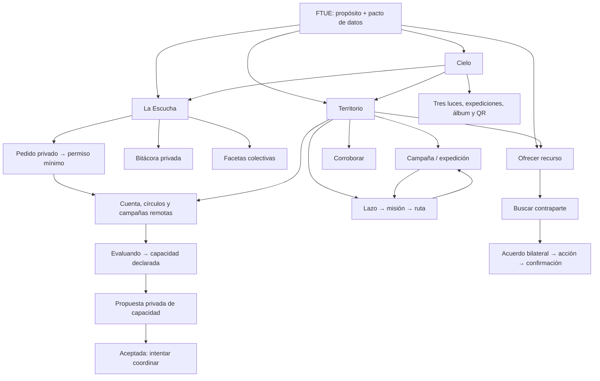
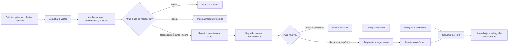

# Auditoría de flujos del juego cívico

Fecha: 2026-07-14

Alcance: cliente Expo `juego`, rutas visibles, acciones y relevos entre pantallas.

Método: lectura de rutas, estados, repositorios consumidos y pruebas puras. El navegador integrado no estuvo disponible para automatización, por lo que no se presentan inferencias visuales como pruebas de interacción real.

## 1. Tesis desde primeros principios

La unidad de valor no es una estrella, una publicación ni una pantalla completada. Es una incertidumbre territorial que termina en una respuesta confirmada sin quitarle control a la persona.

La cadena mínima es:

`experiencia situada → registro privado → faceta operativa → lugar y procedencia → segunda mirada → contraparte o responsable → acción → resultado confirmado → aprendizaje`

De ahí salen seis reglas para juzgar cualquier flujo:

1. **Toda invitación debe tener una consecuencia real.** Un CTA que abre otra función o una cola que devuelve trabajo ya hecho rompe la confianza.
2. **El siguiente paso debe depender del estado real.** Sin red no se promete una contraparte; sin GPS no se promete cobertura; sin otra identidad no se promete corroboración independiente.
3. **Privado, colectivo y operativo no son sinónimos.** Escuchar puede terminar en la bitácora. Publicar una faceta puede alimentar un pulso. Pedir apoyo exige además custodia y un circuito de respuesta.
4. **La geografía es parte del significado.** El lugar del asunto, la posición del teléfono, la precisión medida y la precisión compartida deben seguir separados.
5. **Los roles son capacidades, no jerarquías.** Participar, verificar y coordinar requieren permisos y tareas diferentes, pero una persona puede cambiar de rol.
6. **El cierre importa más que el volumen.** La interfaz debe conducir hacia corroboración, entrega, confirmación y seguimiento; nunca premiar un callejón de capturas repetidas.

## 2. Arquitectura de experiencia actual

Hay cuatro superficies conceptuales, pero sólo dos puertas globales visibles en el Cielo:

- **Cielo:** memoria personal, ritual diario, progresión y expediciones.
- **Escucha:** relato privado y derivación opcional de facetas agregadas.
- **Territorio:** campañas, mapa, misiones, corroboración, recursos, conexiones y control de datos.
- **Red de confianza:** cuenta, círculos y campañas remotas dentro de `/circulos`.

No existe una navegación global persistente. El `Stack` oculta el encabezado nativo y cada ruta depende de `PanelHeader`, historial o CTAs internos (`src/app/_layout.tsx`, `src/components/ui/PanelHeader.tsx`). Esto permite una estética inmersiva, pero vuelve decisivo que cada pantalla ofrezca un relevo correcto.

La flecha `Escucha → necesidad operativa local bajo custodia → círculo
autenticado` ya existe. El pedido registra primero un grant local, nominativo y
revocable; una acción separada entrega sólo la proyección mínima y espera acuse.
El relevo `inbox coordinador → evaluación → capacidad declarada` ya existe con
estados controlados y auditables. También existe `capacidad → propuesta privada
→ aceptación o rechazo de la persona`, fuera de Tramas, feed y outbox público.
Esa aceptación es sólo un acuerdo para intentar coordinar; `oferta o recurso
concreto → reserva → contacto protegido → entrega → confirmación` permanece
cerrado y no se reemplaza con una publicación global.

La interfaz distingue ahora el estado operativo de la constancia histórica:
`state` puede pasar a `closed` o `expired`, mientras `terminalDecision` conserva
el `accept` o `decline` ya asentado. Ese cierre impide toda decisión nueva; sólo
el replay exacto de una decisión previa puede recuperar su recibo con la misma
cuenta grantora y el mismo dispositivo autor.

La misma regla de recuperación acotada se aplica a una respuesta de círculo ya
asentada: una cuenta que aún coordina puede repetir exactamente `responseId`,
clave y contenido y recibir la vista `expired`, `revoked` o `closed`; cualquier
respuesta nueva queda bloqueada y la fila sale del inbox operativo.

## 3. Inventario de rutas y acciones visibles

| Ruta | Función actual | Acciones visibles y relevos |
|---|---|---|
| `/` | Cielo y hogar personal | Abre Escucha, Territorio, Ver, Encender, Dar, Rito condicional, Expediciones, Álbum, Bitácora, QR y Ajustes. |
| `/ftue` | Orientación cívica | Comprender propósito y pacto de datos; elegir, sin registrar nada, entre Escucha privada, Territorio o Aportar. Completarlo no concede consentimiento. |
| `/ver` | Pregunta diaria | Guardar reflexión y volver por historial. |
| `/encender` | Captura libre | Crear estrella; puede abrir Expediciones cuando hay una activa; vuelve por historial. |
| `/dar` | Compromiso personal | Registrar compromiso y volver por historial. |
| `/rito` | Reparación de racha | Completar rito y volver por historial. |
| `/album` | Colección y progresión | Cambiar entre Constelaciones, Cartas y Paletas; sólo salida por header. |
| `/expediciones` | Catálogo y progreso | Abrir expediciones activas, iniciar plantillas o fundar una propia. |
| `/expediciones/fundar` | Expedición propia | Elegir plantilla, zona y meta; crea y reemplaza por el detalle. |
| `/expediciones/[id]` | Cuaderno de campaña o expedición | Captura multipaso, lugar, firma, publicación y QR. Cuando viene de una misión ahora conserva ese contexto y ofrece volver a la ruta. |
| `/bitacora` | Memoria privada | Alternar Escuchas/Reflexiones y abrir una nueva Escucha. |
| `/escuchar` | Escucha estructurada | Cinco pasos, destino privado/colectivo; después abre Bitácora, Territorio o Aportar para una capacidad compartida. |
| `/escuchar/necesidad/[id]` | Custodia y autoridad de la persona | Crear/revocar el grant, entregarlo al círculo, comprobar capacidad y propuesta, y aceptar o rechazar el intento de coordinación sin publicar el pedido. |
| `/ajustes` | Preferencias y soberanía de datos | Notificaciones, identidad local, recibos, exportación y borrado. |
| `/qr` | Intercambio cara a cara | Dar chispa, recibir QR, círculo local y, cuando llega `expedicionId`, compartir realmente esa expedición. |
| `/compartir` | Postal del Cielo | Abre el share-sheet; salida por header. |
| `/territorio` | Hub cívico | Escuchar, campañas fundadoras, gesto sugerido, Misiones, Mapa, Corroborar, Conectar, Aportar, Mis datos y Círculos. |
| `/territorio/mapa` | Lazo y lectura espacial | Dibujar/usar área visible, elegir pasaporte, nombrar y fundar misión; tras aportar muestra el recurso y permite buscar conexiones. |
| `/territorio/misiones` | Lista operativa | Abrir misión o trazar una nueva. |
| `/territorio/misiones/[id]` | Operación y cobertura | Leer/corregir pasaporte antes de empezar, tomar ruta, registrar hallazgo o recorrido sin hallazgo mediante GPS, pausar y cerrar cuando todas las visitas/hallazgos cumplen el pasaporte. |
| `/verificar` | Ronda de corroboración | Elegir procedencia y veredicto. Ahora omite registros ya revisados por la misma identidad. |
| `/conectar` | Matching y memoria de puentes | Proponer/abrir sala. El estado vacío ahora distingue red comprobando, local, sin cuenta y conectada. |
| `/aportar` | Recurso operativo | Categoría, cantidad, radio, lugar, firma y consentimiento; publica y muestra el recurso en el mapa. |
| `/publicar` | Cola de borradores de observación | Revisar lugar/firma y sumar al mapa común. Sólo aparece como gesto sugerido cuando existen borradores. |
| `/mis-datos` | Control posterior | Filtrar señales/necesidades/recursos, corregir contexto o retirar un aporte. |
| `/circulos` | Red remota y bandeja custodial | Vincular cuenta, gestionar círculos/campañas y, como coordinación actual, evaluar un grant, declarar capacidad y proponer un acuerdo privado sin afirmar reserva, contacto ni entrega. |
| `/tramas/[id]` | Sala bilateral | Aceptar desde el lado representado, abrir coordinación, declarar entrega, confirmar recepción, retirarse y buscar apoyo seguro. |

### Entradas que no convergen todavía

- `QR > Círculo` mantiene un círculo local cara a cara; `/circulos` representa círculos remotos con cuenta. Comparten nombre, no identidad ni ciclo de vida (`src/app/qr.tsx`, `src/app/circulos.tsx`).
- Territorio ofrece dos campañas fundadoras jugables; `/circulos` muestra campañas remotas como tarjetas sin acción de abrir, unirse o convertirlas en misión (`src/app/territorio/index.tsx`, `src/app/circulos.tsx`).
- `/publicar` revisa sólo observaciones. Recursos se publican dentro de `/aportar` y escuchas dentro de `/escuchar`; tres modelos de publicación producen tres expectativas diferentes.

## 4. Flujos por persona

### Persona nueva

**Actual**

1. `/ftue` explica para qué existe la infraestructura.
2. Declara el pacto de datos antes de pedir una voz, cuenta o permiso.
3. Permite entrar por Escucha privada, lectura territorial o aporte de recurso.
4. También permite explorar el territorio sin registrar nada.

**Fricción**

- Los cinco destinos del dock son iconos sin etiqueta visual permanente (`src/app/index.tsx`).

**Ideal**

Conservar esta entrada sin cuenta y sumar, después del primer acto, una explicación contextual del Cielo y del juego personal. Nunca convertir pasar el onboarding en consentimiento de publicación, ubicación o identidad.

### Participante recurrente

**Actual**

- Puede escuchar y guardar en privado o compartir facetas.
- Puede recorrer campañas con pin corregible, procedencia, precisión y firma.
- Puede ofrecer un recurso y buscar una contraparte.
- Puede tomar tres celdas de una misión y capturarlas mediante una expedición.

**Correcciones de esta fase**

Cada misión guarda su propio vínculo a una expedición activa. La celda se activa sólo después de asegurar ese cuaderno. El detalle recibe `missionId` y `missionCell`, deja visible el contexto y, tras cualquier resultado, ofrece volver a la ruta en vez de invitar a una captura genérica (`src/app/territorio/misiones/[id].tsx`, `src/app/expediciones/[id].tsx`, `src/civic/workflow-navigation.ts`).

Los marcadores ya son accionables en web y nativo. El toque entrega sólo el identificador a una regla pura que construye una ficha por lista permitida: tipo, categoría, estado y precisión consentida. Según el registro ofrece corroborar, conectar/ofrecer o abrir la misión vinculada; no copia título, relato, contacto, autoría, etiqueta de lugar ni coordenadas (`src/civic/map-point-action.ts`, `src/app/territorio/mapa.tsx`, `src/components/civic/TerritoryMap.*`).

**Pendiente**

- Una celda sólo registra hallazgos positivos; todavía falta “visita sin hallazgo”, indispensable para medir cobertura sin sesgo.
- El progreso de expedición cuenta capturas, mientras la misión cuenta celdas válidas. Son dos denominadores distintos presentados en un mismo relevo.

### Persona verificadora

**Actual**

1. La red entrega observaciones ajenas.
2. `/verificar` excluye la autoría propia.
3. Se declara método y luego veredicto.
4. La verificación queda append-only y actualiza calidad local.

**Problema demostrado y corregido**

Al volver a la pantalla, `observationsToVerify` podía incluir una señal que esa misma identidad ya había revisado. La pantalla luego rechazaba el segundo voto, pero no permitía avanzar: trabajo terminado reaparecía como tarea imposible.

`unreviewedObservationsForActor` filtra esas señales antes de construir la ronda y evita mostrar cualquier tarjeta hasta conocer la identidad (`src/civic/workflow-navigation.ts`, `src/app/verificar.tsx`).

**Pendiente**

- Falta una segunda mirada explícitamente georreferenciada con distancia y error de medición.
- “No puedo verificar” se guarda como procedencia honesta, pero la interfaz no distingue con claridad posponer de cerrar la tarea para esa persona.
- No hay bandeja por misión, cercanía, vencimiento o riesgo; sólo una cola lineal.

### Persona coordinadora

**Actual**

- Puede dibujar una zona, elegir uno de dos pasaportes, fundar misión, tomar su propia ruta, pausar y cerrar.
- Si coordina un círculo remoto puede generar invitaciones.
- Puede ver progreso de campañas remotas.

**Fricción estructural**

- No puede asignar rutas a otras personas ni ver aceptación/carga de equipo desde la misión local.
- No puede crear o administrar una campaña remota desde el teléfono.
- Las campañas remotas son informativas: sus tarjetas no abren detalle ni una misión local.
- Una visita ya puede acreditarse sin fabricar un hallazgo; todavía no existe una vista coordinadora de pendientes, disputas, vencimientos y responsables.

**Ideal**

`definir propósito y custodio → dibujar territorio → estimar denominador → invitar equipo → rutas aceptadas → visitas/hallazgos → corroboraciones pendientes → respuesta responsable → cierre versionado → seguimiento`

La coordinación debe medir capacidad de cierre, no cantidad de participantes ni capturas.

## 5. Hallazgos priorizados

| Prioridad | Hallazgo | Evidencia | Estado |
|---|---|---|---|
| P0 | Una escucha marcada “quiero buscar apoyo” no se convertía en necesidad operativa ni entraba a un circuito con custodia. | `src/app/escuchar.tsx`; `src/app/escuchar/necesidad/[id].tsx`; `civic_need_custodies`; `civic_need_access_grants`; canales privados de grants y coordinación | Corregido hasta acuerdo bilateral mínimo: pedido, grant, entrega al inbox, evaluación, capacidad, propuesta y decisión de la persona. Pendiente: recurso/oferta concreta, reserva, contacto protegido, entrega y seguimiento. |
| P0 | El mapa no permite abrir señal, necesidad o recurso desde un marcador. Lugar y acción quedan separados. | `TerritoryMap.types.ts`, `.native.tsx`, `.web.tsx`, `map-point-action.ts` | Corregido con ficha mínima, acción contextual y pruebas de no divulgación. |
| P0 | Campañas remotas, campañas fundadoras y círculo QR/local no convergen. | `src/app/circulos.tsx`, `src/app/territorio/index.tsx`, `src/app/qr.tsx` | Pendiente. |
| P1 | Una señal ya verificada reaparecía y se volvía una tarea imposible. | `observationsToVerify` + guard tardío en `src/app/verificar.tsx` | Corregido en UI con regla pura y prueba. |
| P1 | En modo local, Conectar sugería seguir creando recursos como si eso pudiera producir una contraparte remota. | Estado vacío de `src/app/conectar.tsx`; matching exige un lado remoto. | Corregido con mensajes/CTAs por estado real. |
| P1 | Una captura de misión caía en una expedición genérica, podía reutilizar el cuaderno de otra misión y no ofrecía retorno persistente. | `capture` en misión y detalle de expedición | Corregido con vínculo por misión, contexto de celda y CTA de retorno. |
| P1 | Cobertura y hallazgo estaban fusionados: una celda sólo avanzaba creando una observación positiva. | `mission-cell-visit.ts`; `missions.ts`; detalle de misión | Corregido: recorrido sin hallazgo exige GPS actual, descarta el punto y no afirma ausencia; los hallazgos conservan corroboración propia. |
| P1 | “Pasarla por QR” ignoraba `expedicionId` y abría Dar una chispa. | Detalle enviaba el parámetro; `/qr` no lo leía ni llamaba `codificarExpedicion`. | Corregido con pestaña y QR real de la definición. |
| P1 | Un coordinador no puede convertir una campaña remota en operación móvil ni repartir rutas. | Cards sin `onPress` en `/circulos`; asignación local sólo a la identidad actual. | Pendiente. |
| P2 | El onboarding enseñaba el ritual personal pero no el ciclo cívico ni los modos de privacidad. | `src/app/ftue.tsx` | Corregido con propósito, pacto previo y tres puertas reversibles sin captura forzada. |
| P2 | El dock usa cinco iconos sin etiquetas visibles y no hay navegación persistente fuera del Cielo. | `src/app/index.tsx`, `src/app/_layout.tsx` | Pendiente. |
| P2 | Publicar significa tres cosas según la ruta. | `/publicar`, `/aportar`, `/escuchar` | Pendiente; requiere lenguaje y arquitectura común. |

## 6. Cambios implementados en esta fase

### 6.1 Ronda de verificación finita

- Regla pura `unreviewedObservationsForActor`.
- Una identidad sin resolver no recibe una cola transitoria.
- Una señal ya revisada por esa identidad no reaparece al volver o sincronizar.

### 6.2 Estado vacío honesto en Conectar

- `checking`: explica que está buscando.
- `local`: permite preparar un recurso, pero declara que no habrá contraparte remota hasta configurar y sincronizar la red.
- `link_required`: conduce a vincular cuenta.
- `connected`: permite ofrecer recurso o volver cuando simplemente falta una coincidencia.

### 6.3 Relevo misión → campo → misión

- Clave estable `civic.mission-expedition.v1:<missionId>` en settings existentes; sin migración.
- Si el cuaderno ligado terminó o no corresponde a la plantilla, se abre uno nuevo para esa misión.
- La celda sólo se activa después de asegurar el cuaderno.
- La ruta transporta misión y etiqueta de celda.
- El detalle oculta el QR genérico durante un tramo operativo, muestra contexto persistente y vuelve mediante `replace` a la misión correcta.
- Incluso un GPS insuficiente o una captura fuera de celda termina en un mensaje persistente y retorno; no invita a capturar otra cosa sin ruta.

### 6.4 QR de expedición real

- `/qr` lee `expedicionId`.
- Genera `basta.exped.v1` con plantilla, título, zona y meta usando el codec existente.
- Declara qué viaja y qué queda fuera: capturas, fotos, lugares exactos, brasas y progreso.
- Conserva Dar, Recibir y Círculo como pestañas alternativas.

### 6.5 Puntos del mapa accionables sin ampliar la divulgación

- Web agrega una capa de toque de 40 px y nativo usa un blanco mínimo de 44 px; ambos entregan el mismo `pointId`.
- La selección se resuelve en `map-point-action.ts`; la ficha se reconstruye por lista permitida y nunca extiende el registro de SQLite.
- Borradores, registros retirados/cerrados y estados inseguros dejan de entrar al mapa operativo.
- Una observación ajena pendiente abre la ronda con esa señal primero; una propia nunca ofrece auto-verificación.
- Cuando territorio y campaña coinciden con una misión activa, la acción abre esa misión exacta.
- Las pruebas cubren decodificación de selección, navegación contextual, prioridad de la ronda y descarte de campos sensibles. El criterio completo está en `docs/MAP_POINT_SAFETY.md`.

### 6.6 Escucha → pedido bajo custodia

- El cierre de una escucha de tipo necesidad ofrece un relevo explícito, no una
  publicación implícita.
- La pantalla separa custodio, destinatario esperado, vía de contacto,
  cantidad, urgencia, vigencia y un punto seguro de referencia.
- El pedido deriva sólo categoría y un título controlado; nunca copia relato,
  resultado deseado, referente ni teléfono.
- `civic_need_custodies` guarda los datos de custodia localmente y la necesidad
  queda `draft`, sin recibo ni outbox.
- Mis datos reserva “sólo local” para lo que no salió y marca un grant entregado
  como “fuera del feed público”; nunca confunde canal privado con publicación ni
  ofrece retirar de la red algo que no salió.
- La UI declara la limitación: vincular cuenta o círculo no publica ni entrega
  el pedido; entregar exige una segunda acción y un acuse.

### 6.7 Grant privado para un destinatario

- `civic_need_access_grants` conserva destinatario concreto, alcance, propósito,
  vencimiento, estado y revocación sin entrar al outbox.
- La proyección se congela por lista permitida: categoría, urgencia, vigencia y
  opcionalmente cantidad/unidad segura y zona aproximada sin nombre.
- No copia relato, custodio, contacto, firma, etiqueta de lugar o punto exacto.
- Sólo admite un grant vigente; cambiar destinatario exige revocar y deja
  historia local.
- La UI distingue acta local, entrega en curso, acuse, fallo ambiguo,
  revocación pendiente y retiro remoto; nunca convierte un timeout en éxito.
- Sólo un círculo numérico cuya membresía custodial fue comprobada puede
  recibir. Las organizaciones y referencias no verificadas quedan locales.
- La bandeja coordinadora muestra el payload mínimo vigente y permite
  rechazar/retirar; no expone `needId`, relato, emisor, contacto ni custodio.
- La coordinación puede pasar de pendiente a evaluación y luego declarar
  capacidad, con cantidad opcional acotada y unidad derivada; no puede saltar,
  retroceder ni agregar texto libre.
- El grantor recupera la última declaración al comprobar estado, pero la UI no
  la llama entrega, recepción ni resolución.
- Un recibo perdido de respuesta o creación de propuesta puede recuperarse por
  replay exacto tras el cierre sólo después de revalidar la capability actual;
  no habilita una escritura nueva ni vuelve activo el grant.
- El grantor puede comprobar el estado por replay idempotente: un retiro del
  círculo se reconcilia como cierre remoto en vez de seguir apareciendo activo.
- Tras `support_available`, una cuenta coordinadora activa distinta de la
  grantora puede crear una única propuesta privada con la capacidad y el
  vencimiento congelados. La cuenta grantora decide en un asiento separado desde
  el dispositivo autor. Esto separa cuentas y decisiones, pero no demuestra que
  intervengan personas distintas.
- La propuesta y su decisión usan `basta-civic-custody-coordination/v1`; no se
  convierten en match, Trama, feed ni evento del outbox público. `accepted`
  significa acuerdo para intentar coordinar, no reserva ni entrega.
- El snapshot conserva `remoteCoordinationTerminalDecision` por separado de
  `remoteCoordinationState`: un cierre o vencimiento no borra el resultado. La
  migración `0014_civic_custody_terminal_decision`, las colas privadas `0015`
  y `0016`, y la exportación v10 preservan esa distinción y los reintentos aún
  sin constancia.
- No se admite una decisión nueva después de revocar, vencer o cerrar el grant.
  Un replay exacto ya confirmado devuelve `200` sólo para la misma cuenta
  grantora y el dispositivo owner exacto, y no reabre la operación.
- `execution/v1` ya registra reserva operativa, disposición, movimiento,
  entrega declarada, recepción independiente, seguimiento y retiro sin texto ni
  contacto. Sigue pendiente un canal E2E de contacto/logística y una oferta
  material verificable. Contratos: `docs/NEED_ACCESS_GRANTS.md` y
  `docs/CUSTODY_EXECUTION.md`.

## 7. Flujo ideal propuesto

### Próximas decisiones recomendadas

1. Extender el canal privado ya implementado desde **acuerdo para intentar
   coordinar → oferta concreta explicable → reserva bilateral → contacto
   protegido → entrega → confirmación → seguimiento**, sin reutilizar Tramas ni
   el feed colectivo.
2. Extender la ficha protegida ya implementada con vigencia y procedencia agregada sólo cuando exista una política de divulgación explícita para esos campos.
3. Unificar “campaña” con un adaptador explícito entre campaña remota, pasaporte local y misión; no inferir protocolos desde títulos o categorías.
4. Crear la bandeja coordinadora: rutas, responsables, celdas sin visita, hallazgos pendientes, disputas, vencimientos y respuestas.
5. Construir una bandeja coordinadora sobre la nueva distinción entre visita acreditada y hallazgo corroborable.
6. Unificar el patrón de publicación: borrador privado → vista previa de campos → audiencia/custodia → recibo → envío → estado visible → corrección/retiro.

## 8. Criterios de aceptación para la próxima fase

- Una persona que pide apoyo puede nombrar quién custodiará el pedido y llegar a una necesidad operativa sin publicar su relato.
- Una propuesta aceptada sigue mostrando que sólo habilita intentar coordinar;
  no marca recurso reservado, contacto, entrega ni resolución.
- Si esa propuesta luego vence o se cierra, la pantalla muestra por separado el
  estado no operable y la decisión terminal previa; no ofrece decidir de nuevo.
- Tocar cualquier marcador abre un detalle y al menos una acción válida o una explicación de por qué no está disponible.
- Una campaña de red puede abrirse en el teléfono y declarar su correspondencia exacta con pasaporte, formulario, territorio y versión.
- Un coordinador puede asignar o invitar a tomar rutas sin ver coordenadas privadas de participantes.
- Una celda puede cerrarse como visitada sin hallazgo; los hallazgos conservan su propia calidad.
- Toda pantalla de tarea tiene estados `cargando`, `vacío`, `sin permiso`, `offline`, `error recuperable`, `completo` y una salida segura.
- Ninguna recompensa depende de publicar, firmar con nombre o compartir más precisión.

## 9. Conclusión honesta

El sistema ya demuestra un núcleo poco común y valioso: captura georreferenciada
con control de precisión, procedencia, recuperación local y corroboración
independiente. El flujo operativo colectivo ya tiene matching, Tramas y
confirmación; el flujo de custodia, deliberadamente separado, llega ahora hasta
una propuesta y decisión bilateral mínimas sin publicar el caso.

Todavía no es un programa nacional cerrado. Ya puede convertir una voz que pide
apoyo en un pedido local bajo custodia, autorizar una proyección mínima,
entregarla a la coordinación autenticada de un círculo y retirarla sin publicar
el relato. También puede proponer esa capacidad y aceptar o rechazar el intento
de coordinación. La brecha decisiva ahora es asociar una oferta o recurso
concreto, reservarlo y registrar canal protegido, responsable, entrega,
resultado y seguimiento en un mismo ciclo verificable,
además de recuperar derechos de retiro tras perder el dispositivo. La app dice
la verdad: ni un acuse de inbox ni `accepted` prometen una entrega o solución.
