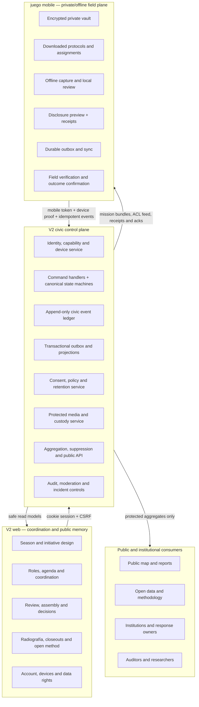
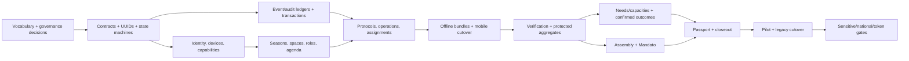

# ¡BASTA! V2 — Integrated Web Platform + Mobile Civic Operating System Blueprint

**Status:** No-code implementation blueprint
**Date:** 2026-07-24
**Scope:** `v2` web/API platform + `juego` mobile app
**Decision horizon:** V2 build, bounded pilots, migration from the current civic backend, and later national-readiness gates
**Not in scope:** Writing application code, issuing a token, migrating raw production data, or launching a sensitive-data campaign

---

## 0. How to use this document

This is the program-level source of truth for designing and implementing the integrated V2 product. It is intentionally more specific than a feature roadmap.

Use it in this order:

1. Ratify the product decisions and vocabulary in Sections 1–6.
2. Write and approve the ADRs and domain specifications listed in Section 39.
3. Build the canonical data model, authorization model, event contracts, and safety controls before building new surfaces.
4. Commission one delivery plan per implementation phase in Section 31.
5. Make every story satisfy the Definition of Ready and Definition of Done in Section 37.
6. Do not advance a rollout gate until all its exit evidence exists.

This plan supersedes the **logged-in product emphasis** of Phase 5 in the current Papel y Tinta master plan. It does not supersede the design system, public editorial journey, content-library work, or existing V2 engineering standards.

### Binding interpretation rule

If a later screen, schema, endpoint, or growth idea conflicts with the privacy and civic-legitimacy rules in this plan, the screen, schema, endpoint, or growth idea changes—not the rule.

---

## 1. Executive outcome

### 1.1 Product thesis

> **V2 web is the coordination, governance, review, analysis, and public-memory plane. The mobile app is the private, offline field-work plane. A versioned civic API and event ledger are the only bridge.**

The two products share:

- One civic vocabulary.
- One network identity and authorization model.
- One set of canonical workflow state machines.
- One versioned protocol and campaign-passport model.
- One server audit trail.
- One public aggregation and suppression policy.
- One definition of a confirmed outcome.

They do **not** duplicate every capability.

### 1.2 The value unit

The system is not optimized for a post, vote, capture, streak, or daily active user. Its value unit is:

> **A situated uncertainty or need that moves through evidence, custody, responsibility, response, confirmation, and learning without exposing the person who contributed it.**

The existing product north metric remains:

> **Verified needs that reach confirmed resolution without exposing vulnerable people.**

### 1.3 The decisive product rule

Every contribution must return value in the same journey:

- **Recognition:** a durable, user-controlled receipt of useful work.
- **Insight:** a safe view of the pattern or consequence the contribution informed.
- **Connection:** a legitimate next action, person, role, resource, or response.

“Thank you for your submission” is not enough.

### 1.4 V2 primary logged-in experience

Replace the current self-improvement/social-gamification emphasis with:

1. **Hoy / Mi camino**
2. **Temporadas y agenda**
3. **Iniciativas y roles**
4. **Operativos y misiones**
5. **Necesidades y capacidades**
6. **Asamblea y expedientes**
7. **Territorio y Radiografía**
8. **Comunidad vinculada al trabajo**
9. **Pasaporte de contribuciones**
10. **Cuenta, privacidad y dispositivos**

Life areas, personal goals, weekly check-in, coaching, and private reflection remain available under **Cuidarme y aprender**. They do not determine civic eligibility, reputation, representation, or authority.

### 1.5 Mobile primary experience

Preserve the mobile app’s identity and offline strengths:

- **Cielo:** private ritual, meaning, and memory.
- **Territorio:** current season, downloaded work, routes, capture, review, needs/capacities, agenda, and sync.
- **Corriente:** verified work, decisions, closeouts, gratitude, and the weekly Acta—not an infinite social feed.
- **Álbum:** private game memory.
- **Bitácora:** private listening, reflection, and drafts.
- **Mis datos / Pasaporte:** disclosure control, receipts, correction, withdrawal, recovery, and device status.

The phone must not become a miniature administrator dashboard. The web must not become a second raw field-data vault.

---

## 2. What the second pass adds

The first pass correctly identified Seasons, schedules, roles, quests, resource pooling, assemblies, tools, gratitude, maturity labels, and contribution memory. The second pass reveals the deeper integrations that are easy to miss:

### 2.1 Seasons are a civic operating contract

A season is not a decorative theme. It binds:

- Purpose and territory.
- Start, field, review, decision, and closeout windows.
- Participating initiatives.
- Stewardship and temporary roles.
- Events and field windows.
- Versioned data-collection protocols.
- Open needs and capacities.
- Deliberation and decision authority.
- Outcome commitments.
- Retention clocks.
- Public closeout and handoff.

### 2.2 Time must create closure, not FOMO

ReGen Civics’ strongest temporal idea is not “seasonal content.” It is a shared rhythm that makes beginnings, commitments, reflection, and endings legible.

For ¡BASTA!:

- Deadlines exist because field conditions, evidence, roles, and decisions expire.
- Reminders support commitments; they do not shame inactivity.
- The end of a season revokes temporary roles, freezes a reproducible result, closes or transfers open work, starts retention, and publishes limitations.
- A new season requires new purpose, protocol versions, and consent where applicable.

### 2.3 “The game remembers” must mean a receipt, not permanent raw evidence

Contribution memory should preserve:

- What category of work was accepted.
- Under which protocol/version.
- What role the person held.
- What review status it reached.
- What outcome it informed.
- What visibility the person chose.

It must not preserve or reconstruct:

- A private story.
- Exact household location.
- Contact information.
- Raw sensitive media.
- A vulnerable recipient.
- A public score of civic worth.

### 2.4 Roles and permissions are different

A public role communicates responsibility, term, outputs, and handoff. A server capability authorizes a specific action on a specific resource.

Never infer a sensitive permission from:

- A profile title.
- XP or badge.
- Initiative membership alone.
- A device identity.
- A self-declared skill.
- A public contribution history.

### 2.5 A “community” is useful only when attached to work

The useful ReGen pattern is not a generic forum. It is:

- Questions attached to a season or initiative.
- Requests and offers attached to a real need.
- Objections attached to a proposal version.
- Lessons attached to a completed operation.
- A digest/Acta that says what changed.

The V2 community feed should not compete with the coordination system for attention.

### 2.6 There are two very different marketplaces

Do not mix:

1. **Public/open capacity needs:** time, skills, equipment, spaces, knowledge, transport, or funds needed by a season or initiative.
2. **Custodied human needs:** support requests that may reveal vulnerability and require purpose-bound, time-limited, protected access.

They may use related matching primitives, but they require different visibility, consent, contact, moderation, and retention.

### 2.7 Season, initiative, operation, protocol, mission, and expedition are not synonyms

Without consolidation, V2 would add a new Season engine on top of:

- Web initiatives.
- Web challenges.
- Web proposals.
- Mobile civic missions.
- Mobile protocol missions.
- Mobile expeditions.
- Local circles.
- Remote circles.
- Founder campaigns.
- Remote campaigns.

The canonical vocabulary in Section 6 is therefore a prerequisite, not copy polish.

### 2.8 The current V2 civic routes cannot be the mobile integration target

Before mobile cutover, V2 must quarantine or redesign:

- Anonymous raw Pulso text reused as public evidence.
- XP for raw signal submission.
- Proposals that enter voting without a dossier or authority.
- Public individual rankings and streak pressure.
- Challenges completed by client-side step advancement.
- One-bit initiative evidence verification.
- Generic initiative membership without a role, commitment, or capability boundary.

### 2.9 Tokens are not the next dependency

The next dependency is trustworthy contribution:

`protocol → work → evidence → independent review → outcome → receipt → appeal`

Tokens remain a later, separately governed stage. V2 ADR 0005 remains binding.

---

## 3. Research and evidence base

### 3.1 ReGen Civics patterns reviewed

Useful patterns:

- [Seasons](https://regencivics.earth/seasons): bounded cohorts, weekly sessions, deliverables, peer learning, selection, reflection, and transition rituals.
- [Schedule](https://regencivics.earth/schedule): explicit dates/times, open sessions, calendar export, and recurring rhythm.
- [Quests](https://regencivics.earth/quest): paths, seasonal groupings, “what you gain / what the community gains,” and concrete deliverables.
- [Crowd Pooling](https://regencivics.earth/crowd-pooling): money, land, time, skills, and knowledge treated as contribution forms.
- [Community](https://regencivics.earth/community): support/offering tags, work-related categories, digest, and public-readable discussions.
- [Features](https://regencivics.earth/features): visible product feedback and voting.
- Team/role, assembly, glossary, tools, map, maturity, gratitude, and public-method surfaces reviewed in the prior pass.

Important caution:

- Several ReGen surfaces are empty or prototypes.
- Public activity counts do not validate a workflow.
- Token/governance language introduces legal and power risks.
- Some quests would require safety and evidence review before ¡BASTA! could adopt them.
- The site’s density, repeated onboarding overlays, and overlapping metaphors should not be copied.

Treat ReGen as a source of product patterns—not as proof that those patterns work at scale.

### 3.2 Local sources that govern this plan

- `juego/docs/PRODUCT_CONSTITUTION.md`
- `juego/docs/CIVIC_OPERATING_MODEL.md`
- `juego/docs/DATA_ARCHITECTURE.md`
- `juego/docs/PRIVACY_THREAT_MODEL.md`
- `juego/docs/DATA_GOVERNANCE_AUDIT.md`
- `juego/docs/NATIONAL_READINESS_GAPS.md`
- `juego/docs/WORKFLOW_AUDIT.md`
- `juego/docs/PROTOCOLO_VIVO.md`
- `v2/CLAUDE.md`
- `v2/docs/architecture/README.md`
- `v2/docs/adr/0001` through `0006`
- `v2/docs/plans/2026-07-21-papel-y-tinta-master-plan.md`

---

## 4. Current-state assessment

### 4.1 V2 strengths to preserve

- Clear greenfield boundary from V1.
- Strict TypeScript and feature-slice conventions.
- PostgreSQL/Drizzle repository layer.
- HttpOnly browser authentication, CSRF, CSP/CORS, rate limiting, and request IDs.
- Integration-test requirement for endpoints.
- Existing schemas for initiatives, milestones, tasks, activity, membership requests, evidence, proposals, resources, community, notifications, feedback, and gamification.
- Papel y Tinta design direction.
- Real-data/no-fake-number rule.
- Public editorial journey, library, open-data, and method work.

### 4.2 V2 gaps

| Area | Current state | Required change |
|---|---|---|
| Initiatives | Rich schema; thin list/detail/join/leave API and UI | Turn into durable workspaces with seasons, roles, protocols, outcomes, closeout, and permissions |
| Evidence | Single `isVerified` flag | Append-only, method-specific, independent verification events |
| Pulso | Raw free text can become public/readable and earn XP | Separate testimony, public signal, operational evidence, and protected aggregate |
| Proposals | Draft/voting/accepted/rejected + `-1/0/+1` | Full versioned dossier, consultation, objections, authority, implementation, review, and appeal |
| Gamification | XP, streaks, badges, manual challenge advancement, public rankings | Private/non-authoritative feedback; collective operational scorecards; no public ranking |
| Community | Generic posts, likes, views, saves | Work-linked threads, structured intents, Acta, moderation, and object permissions |
| Resources | Editorial and user resource schemas; no complete surface | Separate toolbox content from capacity offers and protected need matching |
| Feedback | Schema/repository exist; no complete public loop | Add transparent product-feedback intake, triage, response, and changelog |
| Notifications | Basic in-app lifecycle | Duty/action model, channel preferences, calendar, expiry, dedupe, privacy-safe previews |
| Profile | Minimal personal profile plus XP | Participation preferences, roles, device management, private passport, and disclosure controls |
| Map | Public/anonymous voices by province | Layered public Radiografía plus protected operational coverage; never raw private rows |
| Logged-in roadmap | Personal goals, challenges, classification, community, coaching | Re-center on civic coordination; demote personal support to optional area |

### 4.3 Mobile strengths to preserve

- Offline-first SQLite.
- Local UUIDs and durable outbox.
- Explicit local/queued/synced/attention states.
- Exact/public location separation.
- Per-record disclosure context and receipts.
- Versioned mission passport.
- Coverage cells and visit-without-finding.
- Independent verification provenance.
- Needs/resources matching.
- Bilateral acceptance.
- Delivery declaration and recipient confirmation.
- Correction, withdrawal, and expiry semantics.
- Optional account and device identity.
- Private Cielo, Álbum, and Bitácora.

### 4.4 Mobile gaps that block scale

- Duplicate/overlapping mission, campaign, expedition, and circle concepts.
- Remote campaigns cannot become coherent local operations.
- Coordinators cannot assign and monitor distributed routes adequately.
- No complete offer → reservation → protected contact → delivery → follow-up journey.
- Sensitive local data is not yet in a complete encrypted vault.
- Retention is mostly operational expiry, not verified physical/cryptographic deletion.
- Device-loss recovery and authority delegation are incomplete.
- Revocation debt may depend on retaining the device.
- Web storage is not suitable for sensitive originals.
- No final V2 identity/API cutover contract.

### 4.5 V1/legacy rule

V2 must port proven **semantics**, not import the legacy application as a runtime dependency.

Preserve:

- Append-only/idempotent civic events.
- Device/account separation.
- Server-side location normalization.
- Exact/contact/media rejection from public channels.
- Independent review.
- Bilateral acceptance.
- Provider declaration plus recipient confirmation.
- Protected aggregates.

Do not inherit:

- Raw-row sharing.
- Unversioned forms.
- Unsafe environment-flag dependencies.
- One-bit verification.
- Raw member-visible campaign entries.
- Entry-count progress without a denominator.
- Data whose original purpose or consent cannot support V2 use.

---

## 5. Non-negotiable product principles

1. **Purpose before data.** No field without a legitimate decision or action.
2. **Private by default.** Capture is not publication.
3. **Public data is derived.** Public surfaces consume protected projections and aggregates.
4. **Exact location stays in the native private vault** unless a separately authorized custodian flow explicitly requires it.
5. **Participation is not representation.**
6. **AI does not determine truth, legitimacy, recipients, or civic authority.**
7. **No public individual ranking, ideology score, or activity-based political power.**
8. **No reward for exposing a sensitive need or sharing more precision.**
9. **Every shared object shows provenance, quality, coverage, validity, and limitations.**
10. **Every task has loading, empty, offline, permission, conflict, recoverable-error, complete, and safe-exit behavior.**
11. **Every shared mutation is idempotent, auditable, and reversible where policy permits.**
12. **Corrections append; they do not silently rewrite history.**
13. **Withdrawal is distinct from deletion; expiry is distinct from both.**
14. **Author, verifier, provider, recipient, custodian, moderator, appeal reviewer, and decision authority are distinct roles by default.**
15. **A role is temporary and revocable.**
16. **A protocol is immutable once collection starts; changes create a new version.**
17. **No sensitive field in logs, analytics, traces, crash reports, or notification previews.**
18. **A need is not resolved until the recipient or affected side confirms the result.**
19. **Every season closes, hands off, or explicitly records why it could not.**
20. **Tokens are deferred until the non-financial system proves real utility, fairness, safety, and governance.**

---

## 6. Canonical product vocabulary

| User-facing concept | Canonical meaning | Absorbs/replaces |
|---|---|---|
| **Temporada** | Bounded civic program with purpose, dates, territory, governance, work, review, and closeout | New orchestration layer; not another mission engine |
| **Iniciativa** | Durable project, organization, or collective goal that may span multiple seasons | V2 initiatives |
| **Círculo / Grupo de coordinación** | Verified collaboration or custody container with scoped membership and ACLs | Local/remote circles, but only after explicit mapping |
| **Operativo** | Coordinated field or response operation with territory, denominator, and protocol | Mobile `civic_missions`; remote campaigns |
| **Protocolo / Pasaporte** | Immutable, versioned method: purpose, fields, evidence, precision, verification, risk, retention, closure | Mission passport + campaign definition + form contract |
| **Misión** | Finite work package or field assignment accepted by a person/team inside an operation | Cell/route assignment; general finite task |
| **Expedición** | Optional narrative presentation of a protocol-driven exercise | Mobile expeditions; not a separate network domain |
| **Aporte** | Observation, evidence, review, resource, work product, response, or confirmed outcome | Civic contribution/event family |
| **Necesidad** | A request for a response; public/open or protected/custodied depending on risk | Mobile needs + season/initiative requests |
| **Capacidad** | Time, skill, equipment, space, transport, knowledge, funds, or institutional ability offered under conditions | Resource offer + role capacity |
| **Puente** | Bilaterally accepted need/capacity coordination | Match/trama/custody execution |
| **Rol** | Term-bound responsibility with authority, commitment, expected outputs, support, and handoff | Initiative member role, team office, seasonal role |
| **Encuentro** | Scheduled session, field window, review, assembly, festival, or closeout | Agenda/event |
| **Expediente** | Versioned proposal, evidence, consultation, objections, decision, implementation, and review record | Current proposal |
| **Acta** | Periodic summary of what changed, what was decided, and what remains | Digest; replaces generic engagement feed as default |
| **Cierre** | Findings, coverage, limitations, outcomes, incidents, unresolved work, learning, and handoff | Completed/archived plus public closeout |
| **Pasaporte de contribuciones** | User-controlled record of accepted work and learning, without raw sensitive origin | Activity, receipts, selected badges |
| **Gratitud** | Human acknowledgement attached to a concrete contribution | Non-competitive recognition |
| **Radiografía** | Protected aggregate view of evidence, coverage, quality, response, and gaps | Public intelligence/map |
| **Mandato** | Human-approved decision record with evidence, authority, resources, owner, deadline, outcome, and appeal | Never a popularity ranking |

### 6.1 Explicit consolidation decisions

- Mobile `civic_missions` become **Operativos**.
- Mobile cells/routes become **Misiones de campo**.
- Mobile expeditions remain a narrative/capture UX over a protocol, not a second civic object.
- `pv_misiones` must be mapped to general work packages/team actions or retired; it must not remain a parallel user-facing mission engine.
- A PLAN is a proposition/reference framework, not automatically an initiative, season, mandate, or official national mission.
- The 22 PLANes may enter as proposals from the founding circle, visibly attributed, versioned, adaptable, and without structural privilege.
- An initiative can participate in many seasons.
- An operation belongs to a season and may be stewarded by an initiative or coordination group.
- A season may contain several operations with different risk classes and passports.
- A collaboration/custody group is not identical to an initiative’s public membership.

---

## 7. Target product architecture

### 7.1 Boundary rule

- V2 PostgreSQL is the system of record for shared coordination, permissions, event history, operational projections, decisions, and public aggregates.
- Native mobile encrypted storage is the system of record for private originals, exact points, private notes, unshared drafts, and pending offline work.
- Web browser storage is never the system of record for sensitive originals.
- Public pages never query the raw civic ledger directly.
- The API derives all public and authorized views from explicit policy.

---

## 8. System-of-record matrix

| Domain | Authoritative system | Mobile cache/offline role | Public representation |
|---|---|---|---|
| Accounts, organizations | V2 PostgreSQL | Session/device binding only | Opt-in profile fields |
| Device and actor identities | V2 identity service + native secure store | Device secret and pseudonymous actor | Never public |
| Seasons | V2 PostgreSQL | Cached current/upcoming season | Public season page and archive |
| Initiatives | V2 PostgreSQL | Cached joined/related initiatives | Public workspace subset |
| Coordination/custody groups | V2 PostgreSQL | Cached scoped membership/capabilities | None unless group chooses a public profile |
| Roles/openings | V2 PostgreSQL | Offers, acceptance, duties | Public opening; private applications |
| Events/agenda | V2 PostgreSQL | Offline agenda and reminders | Public/member event view |
| Protocol/passport versions | V2 PostgreSQL, immutable | Downloaded signed snapshot | Public safe methodology |
| Operations | V2 PostgreSQL | Offline operation snapshot | Public description and aggregates |
| Assignments/routes | V2 PostgreSQL | Accepted/downloaded bundle | Counts/coverage only |
| Private story/reflection | Encrypted mobile vault | Primary | Never public by default |
| Exact coordinates | Encrypted mobile vault | Primary | Never public |
| Original media | Encrypted mobile vault until consent; protected object store if shared | Primary capture/cache | Redacted derivative only where allowed |
| Disclosure receipt | Mobile + V2 acknowledgement | Durable local copy | Not public |
| Operational contribution | V2 civic ledger | Local pending copy/outbox | Safe projection or aggregate |
| Verification events | V2 civic ledger | Offline-capable review event | Quality state/aggregate |
| Needs/capacities | V2 for shared projection; mobile for protected original | Offline creation and protected coordination | Public only if explicitly open/non-sensitive |
| Matches/bridges/actions | V2 PostgreSQL + event ledger | Accepted steps and confirmation | Aggregate outcome only |
| Proposal dossier/decision | V2 PostgreSQL + audit ledger | Read/participate cache | Public record unless protected |
| Contribution passport | V2 receipt projection + user privacy choices | Cached personal view | Opt-in entries only |
| Gratitude | V2 PostgreSQL | Send/receive queue | Contribution-level acknowledgement; no totals/rank |
| Public Radiografía | Versioned V2 projection | Contextual local summary | Primary |
| Technical logs | Observability system | Local safe diagnostics | Never public |

---

## 9. Responsibility split

| Capability | V2 web | Mobile |
|---|---|---|
| Discover and understand | Primary | Contextual |
| Create/edit seasons | Primary | Read; emergency pause only with explicit capability |
| Schedule/manage encounters | Primary | View, remind, RSVP/check in |
| Select initiatives/cohorts | Primary | View and respond |
| Define roles and authority | Primary | Accept/decline/handoff |
| Publish open capacity needs | Full | Quick flow |
| Request protected support | Steward view | Primary private flow |
| Design/version protocol | Primary | Consume signed immutable version |
| Define territory/denominator | Primary | Validate/download |
| Assign or claim routes | Coordinator workspace | Accept, navigate, release |
| Offline capture | Not primary | Primary |
| Original evidence | Review protected derivative | Primary capture |
| Corroboration | Complex/desk review | Nearby/simple review |
| Proposal authoring/deliberation | Primary | Read, signal, object, receive deadlines |
| Decision record | Primary | Summary and follow-up |
| Public map/Radiografía | Primary | Operational/local view |
| Contribution passport | Full | Concise/cached |
| Private journal | Never centralized by default | Primary |
| Account/data rights | Full remote control | Local data/current device |
| Closeout authoring | Primary | Submit evidence/reflection |
| Closeout reading | Primary | Acta/summary |

---

## 10. Risk classification

Every operation and exercise receives a risk class before implementation or launch.

| Class | Examples | Mobile policy | Web policy | Approval |
|---|---|---|---|---|
| **R0 public/non-personal** | Schedule, learning, public proposals | View/participate | Full | Product steward |
| **R1 low-risk territorial** | Luminarias, sidewalks, public-space infrastructure | Exact capture local; reduced shared point | Reduced operational view + aggregate | Operation + data steward |
| **R2 moderate/custodial** | Community capacity, food support, protected contact | Encrypted native capture only | Minimum authorized projection; no raw source | Privacy + safeguarding + security |
| **R3 high-risk** | Violence, health, minors, migration, political affiliation, exact homes | Prohibited until all P0 gates close | Prohibited | Legal + external security + community governance |

Rules:

- “Anonymous” does not lower a risk class.
- Web collection of R2/R3 data remains disabled unless browser storage reaches an independently reviewed equivalent safety level.
- A season may contain multiple classes; each operation has its own passport and approval.
- Consent does not carry automatically across seasons, operations, recipients, or purposes.
- The higher risk class governs any joined dataset or workflow.

---

## 11. Canonical domain model

All shared entities use stable public UUIDs. Existing serial IDs may remain internal during migration, but they never become cross-client identity.

### 11.1 Identity and organization

#### Account

Required concepts:

- Public UUID.
- Email/contact identity and verification state.
- Authentication methods.
- Account status and suspension history.
- Locale and timezone.
- Accessibility preferences.
- Communication preferences.
- Data-rights status.

An account is not proof of a unique physical person and is never a public reputation score.

#### Device

Required concepts:

- Public UUID.
- Pseudonymous civic actor identity.
- Account link, if any.
- Platform and safe app-version metadata.
- First/last seen.
- Current trust/revocation state.
- Capabilities supported.
- Recovery/delegation relation.
- Lost/revoked timestamp and reason.

Secrets remain in native secure storage. Public and operational APIs never return them.

#### Organization

Required concepts:

- Public UUID and public profile.
- Legal/self-declared/verified status, clearly distinguished.
- Representatives and term dates.
- Conflict declarations.
- Territories and domains.
- Safeguarding/contact roles.
- Audit history.

Organization membership can affect independence checks. Different accounts from the same organization are not necessarily independent reviewers.

### 11.2 Coordination space / circle

A coordination space is a verified private collaboration and custody boundary. It is not simply an initiative’s member list.

Required fields:

- Public UUID, name, purpose, and type.
- Owning organization/initiative where applicable.
- Public/private visibility.
- Governance mode.
- Membership policy.
- Current coordinators and custodians.
- Capability grants.
- Data-sensitivity ceiling.
- Contact/safeguarding policy.
- Created, reviewed, paused, and closed timestamps.

Required child records:

- Memberships.
- Invitations.
- Role assignments.
- Scoped capability grants.
- Organization representation.
- Conflict declarations.
- Membership history.

### 11.3 Season

#### Season template

Optional reusable configuration:

- Program type.
- Default phases.
- Default event types.
- Required closeout sections.
- Allowed operation types.
- Default role templates.
- Default review checklist.

Templates never carry participant consent, active roles, dates, or published protocol versions into a new season.

#### Season instance

Required fields:

- Public UUID and slug.
- Name, theme, and plain-language purpose.
- Program type:
  - territorial listening;
  - data-collection operation;
  - mutual-aid/response cycle;
  - initiative delivery sprint;
  - deliberative/mandate cycle;
  - learning/incubation cohort;
  - emergency operation.
- Geographic and thematic scope.
- Start/end timestamps and IANA timezone.
- Application, selection, active-work, review, decision, and closeout windows.
- Steward space, lead steward, backup steward, data steward, safeguarding owner.
- Eligibility and selection method.
- Visibility.
- Expected outputs and intended outcomes.
- Allowed risk classes.
- Closeout requirements.
- Accessibility and language plan.
- Status and version history.

Required child records:

- Season phases.
- Participating initiatives.
- Applications/selections.
- Events.
- Role openings and assignments.
- Operations.
- Public updates/Actas.
- Closeout.
- Incident and learning summaries.

### 11.4 Encounter / agenda event

Store authoritative event instances before attempting a complex recurrence engine.

Required fields:

- Public UUID.
- Season/initiative/operation relation.
- Event type:
  - orientation;
  - training;
  - open session;
  - field window;
  - review;
  - assembly;
  - decision;
  - closeout;
  - office hours;
  - emergency briefing.
- Title, purpose, preparation, and expected output.
- Start/end with timezone.
- Online/physical/hybrid mode.
- Public-safe venue/access instructions.
- Accessibility details.
- Capacity and RSVP policy.
- Required/optional role attendance.
- Host and backup host.
- Visibility and access grant.
- Recording/transcript/minutes policy.
- Stable ICS UID and sequence.
- Reschedule/cancellation relation.
- Post-event minutes and follow-up.

Do not put a private mission, vulnerable person, exact location, or sensitive subject in a calendar title or push notification.

### 11.5 Initiative

Extend the existing V2 initiative domain rather than replacing it.

Required fields:

- Public UUID and slug.
- Public purpose and intended beneficiaries.
- Kind, with `mission` removed as an ambiguous kind.
- Territory.
- Steward coordination space.
- Governance declaration.
- Visibility.
- Lifecycle status.
- Maturity status, separate from lifecycle:
  - concept;
  - testing;
  - pilot;
  - operating;
  - replicable;
  - paused;
  - retired/composted.
- Current needs/capacities.
- Outcomes and evidence policy.
- Lineage/fork/adoption references.
- Closeout/handoff rules.

Preserve and extend:

- Members and membership requests.
- Milestones.
- Tasks/work packages.
- Activity history.
- Attachments.
- Work-linked messages.

Do not treat current `missionEvidence.isVerified` as civic proof. Migrate it as an attachment until reviewed under the new evidence model.

### 11.6 Role

#### Role template

- Name and public description.
- Responsibility category.
- Default expected outputs.
- Default authority boundaries.
- Suggested experience.
- Conflict constraints.
- Handoff checklist.

#### Role opening

- Season, initiative, operation, or space scope.
- Term dates.
- Seats.
- Time commitment.
- Location/availability needs.
- Responsibilities.
- Authority.
- Expected outputs (“what you seed”).
- Intended outcomes (“what you harvest”).
- Support/resources provided.
- Required and learnable capabilities.
- Selection method and reviewer panel.
- Compensation/reimbursement, if any.
- Conflicts and safeguarding requirements.
- Application deadline.
- Visibility.

#### Role application/nomination

- Applicant or nominee.
- Motivation.
- Relevant experience/capabilities.
- Accessibility/support needs.
- Conflict declarations.
- Consent for reviewers.
- Status and decision rationale.

#### Role assignment

- Person/organization.
- Scope.
- Capability grants.
- Start/end.
- Acceptance receipt.
- Check-in requirements.
- Handoff due date.
- Completion/revocation record.

Technical `owner/admin/member` remains separate. A civic role never grants database authority by name alone.

### 11.7 Capability catalog

Use a controlled, extensible taxonomy:

- Skill.
- Time/availability.
- Equipment.
- Space/land.
- Transport/logistics.
- Knowledge.
- Facilitation/care.
- Institutional authority.
- Communication reach.
- Funds, only as a declared resource type—not a token balance.

Each capability declaration records:

- Source: self-declared, role-completed, training-completed, output-demonstrated, institution-verified.
- Conditions and constraints.
- Territory/radius.
- Availability and expiry.
- Visibility.
- Evidence/receipt link where applicable.
- User-controlled revocation.

Do not convert a self-declaration into verified authority.

For initial V2, money/funds are a declared need, pledge, or externally confirmed contribution—not an in-app wallet or payment rail. Any compensated role/work package must state source, amount/range, conditions, payment owner, and legal/tax responsibility before publication.

### 11.8 Protocol definition and version

#### Protocol definition

Stable identity for a reusable method.

- Public UUID and slug.
- Name and purpose family.
- Owning/stewarding space.
- Applicable risk ceiling.
- Current published version.
- Lineage/fork relation.
- Status: draft, active, retired.

#### Protocol version / campaign passport

No operation becomes active without an approved version containing:

- Purpose and legitimate decision/action.
- Decision recipient or response owner.
- Territory and target population/denominator.
- Risk class.
- Exact fields and why each is necessary.
- Private, operational, and public representation for each field.
- Form/rendering schema.
- Capture instructions and examples.
- Evidence requirements.
- Allowed capture methods.
- Subject location, capture position, accuracy, operational precision, and public precision policies.
- Verifier eligibility and independence.
- Minimum corroboration and dispute rules.
- Validity/freshness.
- Intended audiences and ACLs.
- Consent scopes and exact text/version.
- Retention for private original, exact point, media, projection, receipt, aggregate, and backup.
- Contact and safeguarding plan.
- Pause/kill conditions.
- Closure condition and follow-up.
- Accessibility and offline requirements.
- Minimum/maximum supported app version.
- Approvals and review history.
- Canonical content hash/signature.

Lifecycle:

`draft → method_review → privacy_review → safety_review → approved → published → retired`

Once the first contribution is accepted, that published version is immutable.

### 11.9 Operation

An operation instantiates exactly one published protocol version.

Required fields:

- Public UUID and slug.
- Season and steward initiative/space.
- Protocol version.
- Purpose in this context.
- Territory and denominator plan.
- Start/end/grace windows.
- Intake and review windows.
- Risk class.
- Coordinator, data steward, safeguarding owner, verification lead.
- Assignment model: open claim, invitation, coordinator assignment, emergency roster.
- Capacity limits.
- Public visibility.
- Kill-switch state.
- Closeout owner.
- Status and version.

Required child records:

- Territory/cell plan.
- Assignments.
- Field visits.
- Contributions.
- Evidence.
- Verifications.
- Disputes.
- Responses/actions.
- Coverage and quality projections.
- Closeout.

### 11.10 Field mission / assignment

Required fields:

- Public UUID.
- Operation and protocol version.
- Coverage cells/route/work package.
- Assigned/claiming account and device actor.
- Eligibility evidence.
- Lease/claim start and expiry.
- Expected effort.
- Downloaded bundle hash/version.
- Accepted safety/consent receipt.
- Progress.
- Release/reassignment reason.
- Submission and review state.

The coordinator does not need a participant’s movement trail. Store only what the protocol requires to prove an assigned visit.

### 11.11 Contribution and evidence

#### Contribution

Common envelope:

- Event UUID and idempotency key.
- Entity UUID and revision.
- Account/device actor.
- Season, initiative, operation, assignment, and protocol version.
- Contribution type.
- Occurred-at and received-at.
- Safe operational projection.
- Disclosure receipt reference.
- Current derived quality/workflow state.
- Correction/withdrawal lineage.

Contribution types remain distinct:

- Public narrative/voice.
- Listening facet.
- Observable fact.
- Field visit with finding.
- Field visit without finding.
- Need.
- Capacity offer.
- Work product.
- Institutional response.
- Delivery declaration.
- Recipient confirmation.
- Proposal input.

Never silently convert a dream, preference, or story into an observable fact.

#### Evidence asset

- Evidence UUID.
- Contribution/revision.
- Evidence class.
- Content hash.
- Local-only or uploaded.
- Protected storage object.
- MIME/type metadata.
- Capture timestamp.
- Consent and intended reviewer audience.
- Redaction/EXIF status.
- Retention/deletion date.
- Access history.

Original media is private by default. Public derivatives require separate approval.

### 11.12 Verification

Verification is an append-only event, not a mutable boolean.

Required fields:

- Verification UUID.
- Contribution revision.
- Reviewer account/device/organization.
- Eligibility snapshot.
- Conflict-of-interest declaration.
- Method:
  - seeing now;
  - knowing the place;
  - identified source;
  - field revisit;
  - document review;
  - cannot verify.
- Verdict:
  - confirm;
  - correct;
  - duplicate;
  - stale;
  - contested;
  - unsafe;
  - cannot determine.
- Evidence classes reviewed.
- Location-distance/precision class where relevant.
- Uncertainty.
- Structured reason/correction.
- Protocol version.
- Occurred/received timestamps.
- Appeal/reversal lineage.

Rules:

- No self-verification by actor, linked account, linked device family, or disallowed organization.
- “Unsafe” quarantines the projection pending safeguarding review.
- Conflicting reviews create `contested`; they are not averaged away.
- Verification expires when evidence freshness expires.

### 11.13 Need, capacity, bridge, and response

#### Need

- Private original reference.
- Safe structured category.
- Quantity/unit, where safe.
- Urgency and validity.
- Custodian.
- Intended response recipient.
- Protected area/reference point.
- Sensitivity.
- Allowed audience.
- Current operational state.

#### Capacity offer

- Category and controlled capability.
- Quantity/unit.
- Availability.
- Conditions.
- Service territory/radius.
- Offering person/organization.
- Evidence/provenance.
- Visibility.
- Expiry.

#### Match candidate

The matching service returns:

- Candidate need/capacity references.
- Explainable compatibility reasons.
- Missing conditions.
- Risks.
- Expiry.

It never auto-connects, auto-contacts, or claims suitability.

#### Bridge / coordination case

- Need and capacity references.
- Purpose-bound grants.
- Bilateral proposal.
- Separate acceptance events.
- Reservation.
- Protected contact grant.
- Responsible person/organization.
- Logistics/readiness state.
- Delivery declaration.
- Recipient confirmation.
- Follow-up dates.
- Outcome/reopen state.
- Revocation/withdrawal.

“Accepted” means agreement to attempt coordination. “Resolved” requires confirmation and follow-up policy.

### 11.14 Assembly proposal / expediente

Required fields:

- Stable proposal UUID.
- Immutable versions.
- Problem/question.
- Territory and scope.
- Linked protected aggregate/evidence snapshots.
- Coverage, quality, suppression, and missing voices.
- Author and steward.
- Affected groups and consultation method.
- Decision requested.
- Named decision authority.
- Decision method and eligible participants.
- Alternatives.
- Arguments and evidence.
- Objections, disapprovals, and unresolved questions.
- Amendments and lineage.
- Support/opposition/abstention signals, version-bound.
- Harm and equity review.
- Costs/resources.
- Implementation owner.
- Deadline.
- Outcome indicator.
- Review date.
- Appeal/correction path.
- Final rationale and human approval record.

Votes are signals unless a declared governance rule says otherwise. A material amendment creates a new version and does not inherit votes silently.

### 11.15 Work-linked community

Every thread has an anchor:

- Season.
- Initiative.
- Operation.
- Protocol version.
- Assignment/work item.
- Proposal version.
- Evidence correction.
- Closeout.
- Toolbox item.

Thread intents:

- Question.
- Evidence.
- Correction.
- Objection.
- Support request.
- Capacity offer.
- Decision.
- Field update.
- Safety risk.
- Lesson.

Generic discussion remains possible, but it is not the primary product loop.

### 11.16 Contribution receipt and passport

Receipt:

- Receipt UUID.
- Owner account and originating actor internally.
- Season, initiative, operation, role, protocol version.
- Contribution category.
- Accepted/reviewed/outcome state.
- Verification provenance summary.
- Rule version.
- Issued/corrected/revoked timestamps.
- Outcome link.
- Visibility preference.

The receipt contains no raw evidence, exact point, private narrative, contact, or vulnerable recipient.

Passport:

- Private by default.
- Owner chooses individual entries to disclose.
- Shows work, learning, roles, and outcomes—not a single composite score.
- Corrected or revoked receipts remain legible with their status.
- Different views may be generated for a role application, organization, or public profile with specific consent.

### 11.17 Gratitude

Gratitude:

- Attaches to a concrete contribution, role, lesson, or act of care.
- Contains an optional short message subject to moderation.
- Can be private, recipient-only, team, or public-safe.
- Has no public total, ranking, multiplier, or governance effect.
- Cannot unlock sensitive access.
- Cannot be purchased in V2.

### 11.18 Public projection

Every published aggregate snapshot records:

- Snapshot UUID and generation time.
- Season/operation/protocol version.
- Territory and period.
- Numerator and declared denominator.
- Contributor band.
- Coverage.
- Quality/corroboration/dispute.
- Response/outcome state.
- Suppression reason.
- Precision.
- Methodology version.
- Source-event cutoff/cursor.
- Corrections/withdrawals applied.
- Reproducibility hash.

Public pages never need a private row to render.

### 11.19 Moderation, incident, and data-rights cases

#### Moderation/safeguarding case

- Report type and severity.
- Affected object.
- Reporter protection.
- Quarantine state.
- Assigned steward and conflict checks.
- Triage/investigation/remediation.
- Appeal authority.
- Deadlines/SLA.
- Safe public transparency category.

#### Data-rights request

- Request type: access, export, correction, withdrawal, deletion, recovery.
- Identity/actor scope.
- Affected systems/artifacts.
- Status and deadlines.
- Execution evidence.
- Backup treatment.
- Receipt/download.
- Appeal/escalation.

---

## 12. Canonical state machines

State transitions must be implemented server-side, tested exhaustively, and shown consistently on both clients.

### 12.1 Season

`draft → internal_review → applications_open → selection → scheduled → active → closing → closeout_published → archived`

Side/terminal states:

- paused;
- cancelled;
- blocked_by_safety.

Rules:

- `active` requires required owners, phases, dates, accessibility plan, and at least one approved work/learning path.
- `closing` stops new normal intake but preserves a published grace rule for queued offline work.
- `closeout_published` requires findings, coverage, limitations, incidents, outcomes, unresolved work, and handoff.
- Closing revokes or expires temporary roles.

### 12.2 Initiative

`draft → forming → active ↔ paused → completing → completed → archived`

Alternative:

- retired/composted with reason and lessons.

Maturity is a separate axis; “active” does not imply “proven.”

### 12.3 Role opening and assignment

Opening:

`draft → open → reviewing → offered → filled | unfilled → archived`

Assignment:

`offered → accepted → active → handoff_due → completed`

Alternatives:

- declined;
- revoked;
- resigned;
- cancelled.

Capability grants expire or revoke with the assignment.

### 12.4 Event

`draft → scheduled → live → completed → minutes_pending → archived`

Alternatives:

- rescheduled;
- cancelled;
- recording_unavailable.

Rescheduling increments ICS sequence and notifies only intended audiences.

### 12.5 Protocol

`draft → method_review → privacy_review → safety_review → approved → published → retired`

Published versions are immutable after the first accepted event.

### 12.6 Operation

`draft → protocol_review → safety_review → scheduled → active ↔ paused → closing → closed → evaluated → archived`

`blocked_by_safety` may occur from any pre-archived state.

### 12.7 Assignment

`available → claimed → downloaded → in_progress → submitted → awaiting_review → verified | changes_requested | rejected → closed`

Alternatives:

- released;
- expired;
- cancelled;
- withdrawn.

### 12.8 Contribution

Device-visible:

`local_draft → queued → syncing → received`

Server-derived:

`received → under_review → changes_requested → resubmitted → corroborated | contested | rejected → resolved | stale`

Cross-cutting:

- withdrawn;
- expired;
- redacted;
- unsafe_quarantine.

Operational state and historical receipt remain separate.

### 12.9 Need/capacity bridge

Need/capacity:

`draft → available → candidate_match → proposed → reserved → delivering → delivered → confirmed → follow_up → closed`

Alternatives:

- declined;
- withdrawn;
- expired;
- cancelled;
- reopened.

Rules:

- Candidate is not match acceptance.
- Bilateral acceptance is not reservation.
- Delivery declaration is not receipt.
- Confirmation is not guaranteed long-term resolution.

### 12.10 Proposal

`draft → evidence_review → affected_party_consultation → forming → objection_window → ready_for_decision → decided_accepted | decided_rejected → implementation → review_due → confirmed | amended | reopened → archived`

Historical decision remains visible after expiry, amendment, or operational closure.

### 12.11 Moderation/safeguarding

`reported → safety_quarantine → triaged → investigation → upheld | dismissed → remediation → appeal → resolved`

Credible high-harm exposure may quarantine first and review second.

### 12.12 Data-rights request

`received → identity_scope_verified → inventory → executing → awaiting_backup_expiry | completed | partially_completed → appealed | closed`

The UI must state exactly what “completed” means.

---

## 13. Identity, authentication, and authorization

### 13.1 Keep four identities distinct

1. **Web account:** authentication, communication, and user-owned network state.
2. **Physical device/installation:** continuity of a particular client and secure credential.
3. **Pseudonymous civic actor:** authorship/ownership of offline civic events.
4. **Scoped civic role/capability:** authority to act in one season, initiative, operation, proposal, or protected case.

No identifier substitutes for another.

### 13.2 Web authentication

Preserve V2’s current browser security posture:

- HttpOnly access and refresh cookies.
- Same-origin API.
- CSRF double-submit header.
- Strict CSP/CORS.
- No auth tokens in localStorage.
- Short session lifetime appropriate to sensitive roles.
- Step-up authentication for device recovery, break-glass access, or sensitive administration.

### 13.3 Native mobile authentication

Write a native-auth ADR because V2’s current rules assume a browser.

Recommended model:

- Authorization Code + PKCE through the system browser.
- Short-lived mobile-audience access token kept in memory.
- Rotating refresh credential in native SecureStore only.
- Independent pseudonymous device credential for civic event continuity.
- Account-device link requires proof of both account session and device credential.
- Roles/capabilities are checked against live server policy, not trusted from a long-lived token.
- Device inventory, remote revocation, and lost-device recovery.
- No sensitive Expo-web field work until an approved WebCrypto/isolation design exists.

### 13.4 Account linking journey

1. Web user selects **Vincular un teléfono**.
2. Web creates a short-lived, single-use QR/code.
3. Mobile displays:
   - account identity;
   - permissions being granted;
   - what remains local;
   - whether prior local contributions are eligible to associate.
4. User chooses separately:
   - link future network work;
   - keep all prior work local;
   - select specific eligible prior receipts/events.
5. Server records the link and issues receipts to both clients.
6. Device screen shows name, last seen, capabilities, and revoke/recover actions.

Never silently upload existing stars, Bitácora, private stories, photos, exact points, or drafts.

### 13.5 Capability model

Authorization evaluates:

`actor + account + organization + role + scope + action + resource + protocol version + time + conflict constraints`

Examples:

| Action | Required authority |
|---|---|
| Browse public season/map/closeout | Public |
| Save a private draft | Device only |
| Publish an intentional public voice | Explicit disclosure; account according to abuse policy |
| Submit a collective observation | Valid device actor + accepted protocol |
| Read participant operational feed | Linked account/device + scoped role |
| Accept an assignment | Eligible participant role |
| Verify | Independent reviewer eligibility |
| Read protected need | Specific active grant + current custody membership |
| Reserve capacity | Authorized counterpart + atomic server transition |
| Manage initiative | Scoped initiative permission |
| Publish protocol/activate operation | Steward permission + approval gates |
| Record a binding decision | Named decision authority |
| View passport | Owner |
| Publish passport entry | Owner’s entry-specific consent |
| Break-glass administration | Separate audited role + reason + expiry |

### 13.6 Separation-of-duty rules

Depending on the passport, reject:

- Author as verifier.
- Linked account/device family as independent verifier.
- Provider as recipient confirmer.
- Moderator as appeal reviewer on the same case.
- Proposal author as sole final authority.
- Campaign author as sole privacy approver.
- Institution responding to a case as sole outcome confirmer.
- Coordinator accessing a protected need without a custody grant.

### 13.7 Recovery

Recovery must:

- Revoke a lost device.
- Preserve server-side withdrawal/revocation debt.
- Delegate authority over prior actor-owned events to the verified account.
- Avoid merging actor identities.
- Avoid turning a replacement device into an “independent” verifier.
- Preserve audit history.
- Let the person export, correct, withdraw, or request deletion after device loss.

---

## 14. API, event, and synchronization contract

### 14.1 Architectural style

Keep a modular monolith in V2:

- Existing Express app.
- Feature slices.
- PostgreSQL/Drizzle repositories.
- Shared contract package/specification.
- Transactional civic event and audit ledgers.
- Transactional outbox for derived work.

Do not create another backend or import SocialJusticeHub code at runtime.

### 14.2 Compatibility-first migration

The phone already uses `/api/v1/civic/*`. Do not change backend and payload semantics in the same mobile release.

Sequence:

1. Freeze the existing civic contract.
2. Capture golden accepted/rejected/replay/authorization fixtures.
3. Reimplement the compatible contract in V2.
4. Move mobile traffic to V2 with no payload change.
5. Add seasons/roles/protocols/operations around the stable ingress.
6. Introduce a breaking `/api/v2/civic/*` only when genuinely necessary.

### 14.3 Canonical namespaces

Recommended public contract families:

- `/api/v1/seasons`
- `/api/v1/calendar`
- `/api/v1/initiatives`
- `/api/v1/spaces`
- `/api/v1/roles`
- `/api/v1/protocols`
- `/api/v1/operations`
- `/api/v1/assignments`
- `/api/v1/civic/*`
- `/api/v1/coordination/*`
- `/api/v1/assembly/*`
- `/api/v1/passport/*`
- `/api/v1/data-rights/*`
- `/api/v1/public/*`

Temporary aliases may preserve current V2 routes, but one namespace becomes canonical with a deprecation date.

### 14.4 Contract artifacts

Create one canonical contract source containing:

- OpenAPI 3.1.
- JSON Schemas.
- Zod server/web schemas.
- Enumerations and state machines.
- Stable error codes.
- Golden request/response fixtures.
- Privacy/redaction fixtures.
- Compatibility policy.
- Changelog and deprecation dates.

Because mobile has its own Expo dependency graph:

- Generate deterministic mobile client types/validators.
- Include a contract checksum.
- CI fails if generated artifacts drift.
- Mobile never imports V2 source at runtime.

### 14.5 Identifier and version rules

Every shared response carries as applicable:

- Stable public UUID.
- Resource version or ETag.
- Contract version.
- Protocol version/hash.
- Server timestamp.
- Request ID.
- Cursor or receipt ID.

Do not expose internal serial IDs as durable cross-client identity.

### 14.6 Commands versus events

#### Device-created civic facts

Append-only event envelope:

- `eventId`.
- Stable `idempotencyKey`.
- Entity public UUID.
- Operation and protocol version.
- Actor/device.
- Occurred-at.
- Expected/base revision where relevant.
- Redacted authorized payload.
- Disclosure receipt.
- Client/contract version.

#### Server-owned orchestration changes

Explicit command:

- `commandId`.
- Resource UUID.
- Intended transition.
- `expectedVersion`.
- Reason/body.
- Current authority.

Use commands for season state, role grants, assignment claims, protocol publication, reservations, and decisions.

### 14.7 Server acknowledgement

Per event:

- accepted;
- duplicate/exact replay;
- rejected validation;
- rejected authorization;
- rejected independence;
- conflict/version mismatch;
- permanently unsupported;
- accepted but projection pending.

Include:

- canonical event/receipt UUID;
- server received timestamp;
- resource version;
- safe error/recovery code;
- replacement protocol/version when applicable.

Never delete the local outbox row before a valid per-event acknowledgement.

### 14.8 Read feeds

Use separate feeds:

- Public configuration: seasons, events, public protocol manifests.
- Participant work: assignments and permitted operation state.
- Collective civic feed: redacted contributions.
- Private custody: grants, coordination, execution.
- Passport: owner-only receipts.
- Notifications: privacy-safe event metadata.

Each feed:

- Uses an opaque monotonic cursor.
- Is paginated and bounded.
- Includes tombstones.
- Applies current authorization at read time.
- Fails closed after logout/unlink.

Polling on focus/connectivity plus push hints is sufficient initially. No WebSocket dependency is required.

### 14.9 Push rules

Push payload contains:

- Generic title.
- Non-sensitive body.
- Opaque notification ID/deep link target.

The app authenticates and fetches protected detail after open. Never put a private need, exact place, person, or sensitive allegation in a push payload.

### 14.10 Mission bundle

A complete offline bundle contains:

- Operation UUID/version.
- Frozen protocol version/hash/signature.
- Form schema and renderer version.
- Purpose and decision recipient.
- Steward/safety contacts.
- Territory/coverage plan.
- Assignment/route.
- Evidence and verification rules.
- Risk, consent, privacy, and safety text.
- Public precision and retention.
- Start/end/grace windows.
- Closeout condition.
- Help/examples.
- Minimum/maximum supported app version.

Mobile validates completeness and compatibility before field work. The bundle remains usable offline.

### 14.11 Conflict policy

| Situation | Resolution |
|---|---|
| Private draft edited locally | Device wins; nothing syncs until explicit submission |
| Protocol changes after download | In-progress work keeps frozen version; new work gets new version |
| Assignment taken before offline claim arrives | Reject claim with explanation; preserve local intent |
| Create replay, same payload/hash | Return original success |
| Same idempotency key, different payload | Hard conflict and dead-letter attention |
| Correction | Append a new revision; never overwrite |
| Verification replay | Deduplicate by contribution + independent actor |
| Same account verifies from another phone | Reject as non-independent |
| Reservation while offline | Show pending; server transaction decides |
| Proposal amendment conflict | New immutable version with expected-version check |
| Consent withdrawal offline | High-priority durable event; visible debt until ack |
| Logout during pull | Disable feed first; discard late response |
| Permanent validation failure | Dead letter with human recovery |
| Transient failure | Exponential backoff |
| Clock disagreement | Server DB time governs shared deadlines/expiry |

No last-write-wins for civic workflow state.

### 14.12 Transactional invariants

For each accepted event/command:

1. Validate contract and privacy.
2. Authenticate actor/account.
3. Check ownership, capability, and independence.
4. Claim idempotency key.
5. Append civic event or audit action.
6. Update canonical operational projection.
7. Append outbox jobs.
8. Commit atomically.

Before implementation, prove that the selected Neon/Postgres driver supports required atomicity, concurrency, conditional updates, and locking. If not, use a transaction-capable driver or atomic database function per critical transition.

Notifications, aggregate rebuilds, passport receipts, and Actas may be asynchronous and replayable. Core state, idempotency, ownership, independence, bilateral acceptance, and reservations may not be eventually guessed.

### 14.13 Release controls

Use server-authoritative, auditable flags scoped by:

- Environment.
- Client version.
- Season/operation.
- Territory.
- Account/role cohort.

Required controls:

- Read-only preview.
- Synthetic/internal data.
- Canary participants.
- Mobile endpoint cutover.
- Public projection.
- Matching/contact.
- AI assistance.
- Recognition.

Flags never weaken authorization, privacy thresholds, protocol review, or consent. A disabled feature returns an explicit safe state, not a misleading empty screen.

---

## 15. Web information architecture

### 15.1 Public navigation

Primary:

- **La idea**
- **El mapa**
- **El mandato**
- **Los PLANes**
- **Participar**

`Participar` contains:

- Temporadas.
- Agenda.
- Iniciativas.
- Roles abiertos.
- Operativos.
- Ofrecer una capacidad.
- Necesito apoyo.
- Abrir la app.

### 15.2 Public routes

#### `/temporadas`

- Current, upcoming, closing, and archived seasons.
- Explain what a season does.
- Filter by territory, theme, type, and status.
- Honest empty/paused states.

#### `/temporadas/:slug`

Standard sections:

1. Purpose and status.
2. Territory and dates.
3. Stewards/authority.
4. Participating initiatives.
5. Agenda.
6. Open roles.
7. Operations.
8. Progress with denominator.
9. Method and limitations.
10. Decisions/responses.
11. Closeout or expected closeout.

#### `/agenda`

- Calendar and list views.
- User-local timezone plus source timezone.
- Event type, territory, online/physical, accessibility.
- Add to Google/Apple/Outlook.
- Subscribe to public/member calendar feeds.

#### `/agenda/:event`

- Purpose and expected output.
- Preparation.
- Timezone and access.
- Accessibility.
- Host.
- RSVP policy.
- Recording/minutes/follow-up.
- Cancellation/reschedule history.

#### `/iniciativas`

- Search/filter by territory, theme, status, season, maturity, and open need.
- Public-safe maturity labels.

#### `/iniciativas/:slug`

- Durable initiative record using the common object grammar below.
- Seasons, roles, milestones, needs, evidence, decisions, and closeouts.

#### `/roles`

- Current openings across seasons/initiatives.
- Time, term, responsibilities, authority, support, outputs, selection, handoff.

#### `/operativos` and `/operativos/:slug`

- Public-safe purpose, passport, territory, schedule, coverage, quality, responses, closeout.
- No participant routes, exact points, private rows, or small-group inference.

#### `/asamblea` and `/asamblea/:id`

- Proposal dossiers by stage.
- Evidence, coverage, affected voices, objections, amendments, authority, decision, implementation, and review.

#### `/capacidades`

- Open, non-sensitive season/initiative needs and offers.
- Protected needs never appear in a global public marketplace.

#### `/metodo`

- Protocol registry.
- Version history.
- Proposed method improvements.
- Simulation tools clearly labeled as simulations.

#### `/caja-de-herramientas`

- Problem-oriented matcher.
- Templates and methods.
- Editorial resources.
- “When to use / when not to use.”

#### `/glosario`

- Contextual definitions.
- Links back to real examples.

#### `/estado-del-sistema`

Status vocabulary:

- designed;
- building;
- internal test;
- pilot;
- operational;
- paused;
- blocked by safety;
- retired/composted.

#### `/accesibilidad`

- Public commitment.
- Known limitations.
- Test matrix.
- Accessible issue-reporting route.

#### `/cierres`

- Season, operation, and initiative closeouts.

#### `/mejorar-basta`

- Product feature requests, bugs, accessibility issues, method concerns, and content corrections.
- Public-safe status, response, rationale, and release-note linkage.
- Votes are prioritization signals only.

Existing Biblioteca, Datos Abiertos, privacy, support, and press routes remain.

### 15.3 Authenticated navigation

Use five primary groups:

#### Hoy

- One best next action.
- Current season.
- Upcoming encounter.
- Assigned/claimed work.
- Review requests.
- Changes requested.
- Decisions requiring attention.
- Pending delivery/confirmation.
- Linked-device/sync warning.

Do not make the default personal home a generic analytics dashboard.

#### Trabajo

- My initiatives.
- Open/my roles.
- My operations.
- My assignments.
- Reviews.
- Needs/capacities.
- Coordinator inbox.

#### Territorio

- Map and list alternatives.
- Coverage.
- Operations.
- Verified signals.
- Unknown/under-covered areas.
- Responses and confirmed outcomes.
- Method/limits.

#### Asamblea

- Forming proposals.
- Objection windows.
- Decisions.
- Implementation.
- Review/appeals.
- Archived acts.

#### Aprender

- Biblioteca.
- Training.
- Toolbox.
- Glossary.
- Optional personal reflection/goals/coaching.

Account menu:

- Profile and participation preferences.
- Contribution passport.
- Calendar/notification preferences.
- Linked devices.
- Privacy/consent/data rights.
- Accessibility preferences.
- Support.

### 15.4 Common civic object page grammar

Every Season, Initiative, Operation, and Proposal page follows:

1. Identity and current status.
2. Purpose.
3. Steward and authority.
4. Territory and audience.
5. Dates, milestones, next encounter.
6. Method/protocol.
7. Roles/capacities needed.
8. Available next actions.
9. Progress with honest denominator.
10. Evidence and quality.
11. Responses/outcomes.
12. Work-linked discussion/objections.
13. Change history.
14. Privacy, retention, and appeal.
15. Closeout/handoff.

### 15.5 Coordinator inbox

Must show:

- Routes available/claimed/released.
- Cells unvisited.
- Visits without findings.
- Contributions queued/received/under review.
- Reviewer capacity and independence failures.
- Disputes/unsafe cases.
- Expiring records.
- Response owners.
- Needs awaiting capacity.
- Deliveries awaiting recipient confirmation.
- Protocol/client incompatibility.
- Pending withdrawals/revocations.
- Closeout blockers.

It measures capacity to close work—not participant or capture volume.

### 15.6 Current V2 route disposition

| Current route/surface | V2 integrated disposition |
|---|---|
| `/tablero` | Becomes **Hoy**, an action/duty home; analytics move to object workspaces |
| `/mi-perfil` | Personal profile, participation preferences, roles, and passport visibility |
| `/areas`, `/objetivos`, `/check-in-semanal`, `/coaching` | Remain under optional **Cuidarme y aprender** |
| `/auto-evaluacion-civica` | Private interests/capability/support profile; no archetype authority |
| `/desafios` | Split into learning exercises, private rituals, and real assignments |
| `/clasificacion` | Remove named ranking; redirect to collective **Estado de la temporada** |
| `/comunidad` | Work-linked discussions + general archive + Acta |
| `/notificaciones` | Action/duty inbox with safety, work, agenda, digest, recognition categories |
| `/iniciativas/:slug` | Durable initiative workspace using common civic object grammar |
| `/iniciativas/:slug/documento` | Preserve document/print view; add current status/method lineage |
| `/mandato-vivo` | Radiografía-to-Assembly entry; evidence, coverage, response, and decisions |
| `/mandato-vivo/propuesta/:id` | Full proposal dossier; current votes become signals |
| `/el-mapa` | Public entry to protected Radiografía, with method/list/table alternatives |
| `/explorar-datos` | Reproducible aggregate analysis, not raw civic rows |
| `/datos-abiertos` | Protected exports, methodology, suppression, and versions |
| `/planes` | Reference/proposal library; never canonical mission authority |
| `/biblioteca`/content readers | Preserve under Aprender/public editorial journey |
| Feedback schema without surface | Becomes `/mejorar-basta` with public-safe triage |

Redirects and renames require an explicit URL migration table, analytics update, sitemap update, and accessible announcement.

---

## 16. Mobile information architecture

### 16.1 Preserve the current primary identity

Do not replace the Cielo with a productivity dashboard.

#### Cielo

- Private ritual and memory.
- Contextual current-season card.
- Next field commitment only when safe to show.
- No public work detail by default on app-open/switcher-like surfaces.

#### Corriente

- Verified outcomes.
- Decision updates.
- Open calls tied to real work.
- Closeouts.
- Gratitude.
- Weekly Acta.
- Chronological/territorial relevance; no popularity ranking.

#### Territorio

Operational home:

- Current season.
- Hoy / Esta semana.
- Downloaded assignments.
- Nearby/open operations.
- Review queue.
- Needs/capacities.
- Agenda.
- Sync state.
- Circles/spaces.
- Map and coverage.

#### Álbum

- Personal stars, constellations, narrative, cosmetic recognition.
- Distinct from civic passport.

#### Bitácora

- Strictly private listening, reflections, drafts, and resurfaced memory.

#### Ajustes / Mis datos

- Exact disclosure history.
- Consent.
- Local export/delete.
- Network withdrawal/deletion requests.
- Linked account/device.
- Shared-device mode.
- App lock.
- Backup/recovery status.

### 16.2 New mobile sub-surfaces

- Temporada actual.
- Agenda.
- Descargas para salir.
- Mi trabajo.
- Mis aportes y revisiones.
- Pasaporte.
- Gratitud.
- Dispositivos y red.
- Ayuda de campo.

Avoid another bottom tab unless research proves Territorio cannot contain this hierarchy.

### 16.3 Web-to-mobile handoff

Every operation/assignment page offers:

- **Abrir en la app**.
- QR.
- Universal/app link.
- Short fallback code.
- Bundle size and expiry.
- Protocol version.
- Risk/privacy level.
- What downloads.

Mobile pre-acceptance sheet shows:

- Purpose.
- Steward.
- Territory.
- Expected time.
- Permissions.
- Evidence.
- Public precision.
- Validity and retention.
- Safety.
- What happens after submission.
- Account requirement.

### 16.4 Mobile-to-web handoff

Web shows only acknowledged server state:

- Local draft: invisible.
- Queued: optional safe device-heartbeat metadata only, never payload.
- Received.
- Under review.
- Changes requested.
- Corroborated/contested/rejected.
- Withdrawn/expired/redacted.

Never label a contribution received before a server receipt.

### 16.5 Current mobile route disposition

| Current route/surface | Integrated disposition |
|---|---|
| Cielo `/` | Preserve private ritual; add one safe contextual season card |
| `/corriente` | Work-linked events, outcomes, decisions, gratitude, Acta |
| `/territorio` | Operational home: season, agenda, work, map, sync |
| `/territorio/misiones/*` | Canonical Operativo and field-assignment experience |
| `/misiones/*` (`pv_misiones`) | Migrate useful team/work UI; stop parallel operational writes |
| `/expediciones/*` | Narrative protocol-driven capture; no separate network entity |
| `/circulos` | Coordination spaces and scoped custody membership |
| `/qr` | Deep-link/assignment/bundle/space handoff with explicit payload preview |
| `/escuchar` | Private listening; explicit derivation to facet/need only |
| `/aportar` | Capacity offer with visibility/conditions/expiry |
| `/conectar` | Explainable candidate matches and real connection state |
| `/tramas/:id` | Protected coordination after grants; not a generic chat |
| `/verificar` | Finite independent review queue |
| `/publicar` | Unified disclosure review pattern across contribution types |
| `/mis-datos` | Receipts, correction, withdrawal, passport, remote rights |
| `/ajustes` | Device, lock, backup, export/import, account link, notifications |

The migration plan must specify route aliases, local-row conversion, and which legacy screens become read-only before removal.

---

## 17. End-to-end journeys

Each journey becomes a service blueprint, sequence diagram, and eventual E2E test.

### 17.1 Anonymous visitor with five minutes

1. Arrives through Home, Map, Mandate, or a season link.
2. Sees what is happening now without registration.
3. Chooses:
   - explore a season;
   - see a public-safe nearby/open task;
   - leave an intentional broad voice;
   - learn first;
   - open the app.
4. If leaving a voice:
   - selects voice type;
   - writes a short statement;
   - sees the exact public preview;
   - chooses broad territory, never exact location by default;
   - receives a receipt.
5. Only after value is returned, offer an account to save/follow.

Acceptance:

- Registration is not required to understand the system.
- A low-risk public voice remains clearly distinct from field evidence.
- No XP is awarded for raw volume.

### 17.2 New mobile user

1. One meaningful private question.
2. First private star.
3. Brief explanation of the three lights.
4. Cielo.
5. At first collective action, explain public/private boundary in context.
6. Show operation passport.
7. Request only the permission needed now.
8. Offer account linking only when network collaboration is relevant.

Acceptance:

- Onboarding completion is not consent.
- No account, GPS, camera, or contact permission is required for the private first act.

### 17.3 Participant seeking a role

1. Declares time, territory, interests, accessibility/support needs, and preferred mode.
2. Sees current, genuinely open roles.
3. Reads purpose, authority, term, time, outputs, outcome, support, selection, conflicts, and handoff.
4. Applies/accepts.
5. Receives status and next step.
6. Completes handoff and receives a contribution receipt.

Acceptance:

- XP, archetype, or popularity never grants a role.
- Declaring a support need does not lower selection status invisibly.

### 17.4 Field contributor

1. Discovers operation on web/mobile.
2. Reads passport and safety.
3. Accepts one bounded assignment.
4. Downloads bundle.
5. Works offline.
6. Reviews exact/private data versus shared projection.
7. Confirms attribution and consent.
8. Submits.
9. Sees local → queued → sending → received → under review.
10. Responds to specific changes requested.
11. Receives receipt after accepted review.
12. Later sees aggregate/outcome.
13. Can correct/withdraw under disclosed policy.

Acceptance:

- Restarting the app does not lose work.
- The same event is accepted once.
- A no-finding visit affects coverage, not prevalence.

### 17.5 Independent verifier

1. Opens a finite queue.
2. Filters by operation, territory, expiry, risk, and method.
3. Own/linked contributions are excluded before display.
4. Sees only necessary fields.
5. Declares method and conflicts.
6. Chooses confirm/correct/duplicate/stale/unsafe/cannot determine.
7. Adds structured reason.
8. Understands this is one input, not final truth.
9. Queue ends honestly.

Acceptance:

- No self-verification.
- “Cannot determine” has no penalty.
- An unsafe report enters safeguarding, not popularity moderation.

### 17.6 Season coordinator

Primary surface: web.

1. Creates season from template or blank.
2. Defines purpose, type, territory, dates, authority, risk ceiling, and closeout.
3. Invites/selects initiatives.
4. Creates phases and encounters.
5. Opens roles and capacity needs.
6. Selects/versions protocols.
7. Passes method/privacy/safety review.
8. Publishes operations.
9. Assigns or allows claim of routes.
10. Monitors coverage, review, disputes, expiry, responses, and support.
11. Pauses via kill switch if required.
12. Closes intake with offline grace rule.
13. Completes review/response/handoff.
14. Publishes closeout.
15. Revokes temporary roles and starts retention.

Acceptance:

- Coordinator cannot see unnecessary exact participant location.
- Protocol cannot change in place after collection begins.
- Season cannot silently complete without closeout.

### 17.7 Initiative steward

1. Creates or claims initiative workspace.
2. Publishes purpose, governance, territory, and maturity honestly.
3. Applies to a season.
4. Opens roles and capacity needs.
5. Tracks milestones/work.
6. Links operations and evidence.
7. Records decisions and outcomes.
8. Runs handoff/closeout or composts the initiative with lessons.

Acceptance:

- “Join” always explains role/expectation.
- Maturity claims show evidence/limitations.

### 17.8 Person requesting protected support

1. Listens/records privately.
2. Explicitly chooses to seek support.
3. Creates a minimal structured need without copying private story.
4. Selects custodian and intended recipient type.
5. Reviews exactly what will leave the device.
6. Grants time-limited purpose-bound access.
7. Custodian assesses.
8. A concrete capacity is proposed.
9. Person accepts/declines attempt.
10. Resource is separately reserved.
11. Protected contact opens only after grant.
12. Delivery is declared.
13. Recipient confirms.
14. Follow-up checks whether support remains effective.
15. Person can revoke/withdraw.

Acceptance:

- A timeout is never success.
- `accepted` never means delivered/resolved.
- Public feed never exposes the case.

### 17.9 Person/organization offering capacity

1. Declares type, quantity, conditions, territory, availability, expiry.
2. Chooses public, circle, or mediated audience.
3. Receives explainable candidates.
4. Accepts/declines separately from the other side.
5. Reserves capacity atomically.
6. Enters protected coordination.
7. Declares delivery.
8. Waits for recipient confirmation.
9. Participates in follow-up.

Acceptance:

- Decline/withdrawal has no reputation penalty.
- Offer does not expose contact by default.

### 17.10 Deliberator/facilitator

1. Opens dossier derived from evidence/proposal.
2. Reviews question, authority, evidence, coverage, missing voices, affected groups, alternatives, objections, cost, and deadline.
3. Participates through the declared method.
4. Material amendment creates a version.
5. Authority records decision/rationale.
6. Implementation receives owner/resources/deadline.
7. Outcome review compares intended and actual result.
8. Appeal/amendment creates history.

Acceptance:

- Vote is labeled as signal or binding according to prior rule.
- A mandate cannot be inferred from raw support count.

### 17.11 Institution/response owner

1. Receives a structured case or dossier, not raw crowd data.
2. Reviews mandate, method, and limitations.
3. Accepts, asks clarification, derives, or declines with reason.
4. Names responsible party, resource/budget state, and estimated date.
5. Publishes updates.
6. Affected side confirms actual result independently.
7. Case closes or reopens.

### 17.12 Researcher/auditor

1. Selects season, operation, protocol, territory, period.
2. Reads methodology/version first.
3. Sees coverage, quality, suppression, missingness, and response.
4. Downloads reproducible aggregates.
5. Inspects decision/change logs.
6. Proposes method improvement.
7. Never receives private rows from the public product.

### 17.13 Person withdrawing data after losing a phone

1. Signs in on web/new device using recovery.
2. Reviews devices/actors and remotely revokes lost device.
3. Inventories network contributions and grants.
4. Submits withdrawal/deletion requests.
5. Server preserves and processes revocation debt.
6. Receives per-object and aggregate status.
7. Replacement device gains delegated authority without merging actors.
8. Prior actor cannot count as independent from replacement.

---

## 18. Season operating model

### 18.1 Season is the top-level rhythm, not the only container

Most planned civic programs should belong to a season. Emergency operations may exist outside a season but still require:

- Bounded start/end.
- Passport.
- Temporary roles.
- Review.
- Closeout.
- Retention.

### 18.2 Recommended phase grammar

Each season configures from:

1. **Orientar:** purpose, invitation, eligibility, safety.
2. **Preparar:** select initiatives/roles, train, publish protocols, download work.
3. **Escuchar/Actuar:** field and delivery window.
4. **Corroborar:** review, disputes, missing coverage.
5. **Comprender:** aggregate, interpret, publish limits.
6. **Deliberar:** alternatives, objections, decisions.
7. **Responder:** assign owners, resources, actions.
8. **Confirmar:** outcome confirmation/follow-up.
9. **Cerrar/Aprender:** closeout, handoff, retention, method revision.

Not every season uses every phase, but any omitted phase requires an explicit reason.

### 18.3 Recommended cadence

Use civic cadence, not compulsory biological/lunar symbolism:

- Kickoff/orientation.
- Weekly field/coordination window.
- Weekly Acta.
- Fortnightly review/safety check.
- Mid-season learning review.
- Objection/decision window.
- Closeout assembly.
- 7/30/90-day outcome follow-up where applicable.

Seasonal/natural framing may remain an optional narrative layer. The authoritative system uses explicit timestamps and local timezone.

### 18.4 Season festival/transition

Adopt ReGen’s strongest transition pattern:

1. **Reflect:** what happened, failed, surprised, or remained unknown?
2. **Co-create:** what should change next?
3. **Choose:** which roles, operations, and initiatives continue?

The event must produce:

- Closeout approval or documented objections.
- Handoff.
- Next-season proposals.
- Method changes.
- Archived Acta.

### 18.5 Season creation checklist

Before publish:

- Purpose/action is clear.
- Territory/denominator defined.
- Owners and backups assigned.
- Risk ceiling set.
- Dates/timezone complete.
- Selection and representation claims honest.
- Events and accessibility defined.
- Roles/time commitments defined.
- At least one complete participant path.
- Protocols approved.
- Notification plan approved.
- Moderation/safeguarding ready.
- Closeout schema ready.
- Retention/data-rights plan ready.
- Kill switches named.

### 18.6 Season close checklist

- Stop intake.
- Apply published offline grace rule.
- Finish or explicitly close review queues.
- Freeze reproducible aggregate version.
- Publish coverage, missing voices, suppression, and limitations.
- Close/transfer response cases.
- Record decisions and implementation ownership.
- Start retention clocks.
- Revoke temporary roles and grants.
- Publish safe incident/appeal/lesson summary.
- Mark what continues, changes, retires, or composts.
- Require fresh consent for next season.

### 18.7 De Guardia / emergency readiness

Adopt the useful “be ready before a crisis” idea as a safeguarded opt-in roster:

- Person chooses capability, broad zone, availability window, contact route, and risk ceiling.
- Availability expires and must be renewed.
- Exact home/current location is never published.
- Emergency authority, activation rule, coordinator, safety plan, and stop condition are declared in advance.
- Activation creates an operation and explicit invitation; it never auto-commits a person.
- The person can accept, decline, pause, or withdraw without penalty.
- Team composition favors complementary capabilities and safeguarding, not a public trust score.
- Crisis mode cannot bypass purpose, consent, access logging, or closeout.

---

## 19. Onboarding and personalization

### 19.1 Web entry paths

Offer paths by intent and available time:

- **5 minutes:** understand, leave a broad public voice, save an event.
- **1 hour:** attend an open session, review a protocol, complete a learning exercise.
- **A week:** accept a small assignment or review task.
- **A season:** take a role, join an initiative, participate in an operation.
- **Long term:** steward an initiative, method, territory, or institution response.

Each path says:

- What you give.
- What you receive.
- What happens next.
- Whether an account is required.
- What data is shared.

### 19.2 Personalized “Hoy”

Recommendation priority:

1. Safety/data-rights issue requiring action.
2. Accepted duty or role deadline.
3. Changes requested on own work.
4. Recipient confirmation.
5. Independent review request.
6. Upcoming encounter.
7. Open role/capacity suggestion.
8. Learning relevant to active work.

Never prioritize:

- Streak repair.
- Public rank.
- Generic “come back.”
- Like/comment activity.
- Sharing more personal data.

### 19.3 Assessment redesign

Recast the current civic archetype assessment as a private, voluntary profile of:

- Interests.
- Experience.
- Time.
- Preferred contribution modes.
- Learning goals.
- Accessibility/support needs.
- Territory.
- Desire for public/private participation.

It may suggest paths and roles. It cannot:

- Define what kind of citizen the user is.
- Grant authority.
- Affect representation.
- Create an ideological score.
- Appear publicly without consent.

### 19.4 Empty-state integrity

Do not fabricate activity. Examples:

- “No hay temporada activa. La próxima abre…”
- “No hay roles abiertos; seguí esta iniciativa.”
- “No hay revisiones independientes disponibles.”
- “Los resultados están ocultos porque el grupo es demasiado pequeño.”
- “Todavía no descargaste trabajo para salir sin conexión.”
- “Este operativo fue pausado por seguridad.”

### 19.5 First-login personalized path

After registration/account linking, show one short, dismissible path—not a chain of overlays:

- **Explorar una temporada.**
- **Encontrar un rol.**
- **Abrir trabajo en el teléfono.**
- **Ofrecer una capacidad.**
- **Completar perfil y preferencias.**
- **Leer antes de participar.**

Each card states expected time, account/data consequence, and next step. The user may start anywhere and change paths later.

---

## 20. Schedule, calendar, and notifications

### 20.1 Calendar requirements

- Store event instances with IANA timezone.
- Render both event timezone and user-local timezone when different.
- Stable ICS UID.
- Sequence increment on change.
- Cancellation state.
- Public and protected calendar feeds separated.
- Calendar exports contain no sensitive titles or locations.
- Recordings/minutes/follow-up attached after completion.

### 20.2 Notification categories

#### Critical safety/account

- Consent/access changed.
- Withdrawal/revocation failed or acknowledged.
- Lost-device/security warning.
- Sensitive operation paused.
- Material protocol change before acceptance.

Always in-app. Lock-screen copy generic.

#### Work requiring action

- Role offer/handoff.
- Assignment accepted/reassigned/cancelled.
- Changes requested.
- Review request.
- Match proposal.
- Bilateral acceptance waiting.
- Reservation/delivery/confirmation step.
- Objection/decision deadline.
- Institutional response.

In-app by default; push/email independently opt-in.

#### Agenda

- Saved event.
- User-chosen reminder.
- Reschedule/cancellation.
- Minutes/recording.

Respect quiet hours and timezone.

#### Digest / Acta

- What changed.
- What closed.
- What remains needed.
- What requires the person’s role.
- Season progress with limitations.

Prefer digest over many individual alerts.

#### Recognition

- Contribution accepted.
- Outcome linked.
- Gratitude received.

Batchable and non-competitive.

### 20.3 Never notify for

- Generic inactivity.
- “Someone passed you.”
- Rank/XP optimization.
- Every like/view.
- Artificial scarcity/FOMO.
- A sensitive subject on the lock screen.
- Work outside the recipient’s current role.

### 20.4 Notification record

- Stable event UUID.
- Kind/urgency.
- Cause.
- Target object/version.
- Intended recipient role.
- Created/expiry.
- Privacy-safe preview policy.
- Deep link.
- Deduplication/replacement key.
- Delivery attempts.
- Read, acknowledged, dismissed, and action-completed as separate states.
- Channel preferences.

---

## 21. Community, Acta, method, and toolbox

### 21.1 Replace engagement feed with work-linked conversation

Current generic posts can remain as archived/general discussion, but primary creation starts from an object:

- Ask a question on a protocol.
- Add evidence to an initiative.
- Request a correction.
- Object to a proposal version.
- Offer capacity to a season.
- Request support through the correct protected flow.
- Post a field update.
- Record a lesson at closeout.

### 21.2 Weekly Acta

Generated as a draft from structured events, then reviewed by a human editor/steward.

Contains:

- What started.
- What changed.
- What closed.
- Decisions and rationale.
- Open needs/roles.
- Coverage and limitations.
- Safety/method changes.
- Upcoming encounters.

AI may draft/summarize but:

- Sources are linked.
- Private/sensitive data is excluded by allowlist.
- Human approver is named.
- The Acta is not a popularity digest.

### 21.3 Open method

For every protocol:

- Current version.
- Why it exists.
- Fields and purpose.
- Sampling/denominator.
- Evidence and verification.
- Privacy/retention.
- Known limitations.
- Version history.
- Proposed changes.
- Retired/composted methods.

### 21.4 Method simulator

If built later:

- Uses synthetic or protected aggregate data.
- Clearly says “simulation.”
- Lets users change thresholds/weights and see effect.
- Cannot publish a decision or rewrite the authoritative method.
- Exports a proposal/amendment for human review.

### 21.5 Toolbox

Separate:

- **Editorial resource:** book, article, dataset, video, organization.
- **Tool:** template, protocol, checklist, calculator.
- **Training:** guided learning.
- **Capacity offer:** operational availability.

Problem matcher asks:

- What problem are you addressing?
- At what stage?
- What risk/sensitivity?
- With how much time/team?

Returns:

- Appropriate tools.
- When not to use them.
- Prerequisites.
- Example closeouts.

### 21.6 Improve ¡BASTA! in public

Operationalize ReGen’s transparent product-feedback pattern:

- Public route for feature request, bug, accessibility issue, method concern, or content correction.
- Anonymous browsing; account/rate limit according to abuse risk.
- Status: received, needs context, planned, in progress, shipped, declined, duplicate.
- Public staff response and rationale where safe.
- Votes/reactions are prioritization signals, never automatic roadmap authority.
- Link shipped work to release notes.
- Accessibility and safety reports receive dedicated private escalation paths.
- Never expose user agent, contact, private page URL, or security details publicly.

Use the existing V2 feedback schema/repository as a starting point, but add public/private visibility and structured triage rather than exposing its raw rows.

---

## 22. Privacy, consent, and data lifecycle

### 22.1 Field-level classification

Classify every field as:

1. Private local.
2. Custody-private.
3. Operational restricted.
4. Initiative/space visible.
5. Intentionally public narrative.
6. Protected public aggregate.

Every protocol version specifies:

- Purpose.
- Classification.
- Audience.
- Precision.
- Validity.
- Retention.
- Export.
- Correction.
- Withdrawal.
- Deletion.
- Backup treatment.

### 22.2 Consent receipt

Every sensitive disclosure creates an append-only receipt:

- Entity/revision.
- Purpose.
- Exact fields disclosed.
- Audience/recipient.
- Shared precision.
- Attribution.
- Media/contact permissions.
- Expiry/retention.
- Exact consent text/version.
- Timestamp/channel.
- Correction/withdrawal/supersession relation.
- Remote acknowledgement.

Rules:

- Fail closed.
- Separate location, media, publication, attribution, and contact.
- No prechecked consent.
- Declining optional disclosure does not remove XP, role, reputation, or access to unrelated functions.
- Show “what leaves this phone.”
- Re-consent after purpose, recipient, sensitivity, precision, or protocol change.
- Allow correction and withdrawal on web and mobile.

### 22.3 Geographic safeguards

Store separately:

- Subject location.
- Capture-device position.
- GPS accuracy.
- Operational precision.
- Public precision.

Rules:

- Exact coordinates never enter the collective/public event log.
- Server re-snaps all public points.
- Manual pin can create a signal but cannot prove field coverage.
- Coverage requires protocol-valid current GPS inside assigned cell.
- Public maps use cells, displaced points, neighborhoods, or jurisdictions.
- Never publish participant route, assignment polygon, or movement pattern.
- At least five distinct contributors for current low-risk aggregates; higher thresholds by risk.
- Add repeated-query/difference-attack defenses before broad public query access.

### 22.4 Data-lifecycle matrix

| Artifact | Audience | Required treatment |
|---|---|---|
| Private story/original | Person | Encrypted local vault; user-controlled plus protocol maximum |
| Exact point | Person; separately authorized custodian only if required | Shortest feasible retention |
| Operational projection | Authorized roles | Validity plus defined closeout retention |
| Original media | Explicit reviewer ACL | Independent expiry, access log, deletion |
| Disclosure receipt | Person/auditor | Minimal non-content-bearing long-lived record |
| Public aggregate | Public | Archived with method/suppression/version |
| Decision record | Public unless protected | Long-lived without raw testimony |
| Backup | Operations | Documented expiry; deletion tombstones reapplied on restore |

Visible status vocabulary:

- Active/valid.
- Withdrawn from circulation.
- Logically deleted.
- Physically/cryptographically erased.
- Awaiting backup expiry.

Never call operational expiry “deletion.”

### 22.5 P0 before R2/R3 or national scale

- Encrypted native vault/field encryption with non-exportable key.
- App lock and shared-device policy.
- Executable retention by data class.
- Evidence/cache/export cleanup.
- Encrypted export with manifest/checksum.
- Tested import to clean installation.
- Lost-device actor recovery/delegation.
- Remote withdrawal/deletion with receipt.
- Backup deletion/restore policy.
- Legal, security, accessibility, and community-governance review.

Until closed, collect only bounded, low-risk, informed pilot data and use precise copy about current limitations.

### 22.6 Data-rights portal

Web:

- Inventory accounts, actors, devices, roles, contributions, grants, media, and open cases.
- Remote export.
- Correction.
- Withdrawal.
- Deletion request and status.
- Device revoke/recovery.
- Downloadable receipts.

Mobile:

- Local inventory.
- Local encrypted export/import.
- Local wipe.
- “Withdraw from network, then wipe.”
- Emergency local wipe with explicit network-debt warning.

One canonical policy inventory covers every table, object store, cache, file, log, and backup. CI eventually fails if a new artifact lacks rules.

### 22.7 Media

Required ADR and controls:

- Original encrypted locally by default.
- Explicit upload consent.
- EXIF stripping.
- Face/plate/child safety guidance and redaction.
- Private object storage; no public URL as authority.
- Content hash and metadata.
- Malware/type validation.
- Short-lived authorized access.
- Per-asset retention/deletion.
- Access logging.
- No media URL/content in logs.
- Public derivative approved separately.

---

## 23. Evidence, verification, and public intelligence

### 23.1 Evidence classes

- **Observable fact:** corroborate.
- **Dream/preference/proposal:** deliberate; do not call true/false.
- **Need:** validate custody, freshness, and requested response without forced exposure.
- **Capacity:** confirm availability and conditions.
- **Delivery:** provider declares.
- **Receipt/outcome:** recipient confirms.
- **Institutional response:** institution records action/evidence.
- **Aggregate:** reproduce under exact method/version/coverage.

### 23.2 Derived quality

Quality is server-derived from:

- Protocol version.
- Evidence completeness.
- Capture method.
- Freshness.
- Independent reviews.
- Conflict.
- Coverage validity.
- Correction/withdrawal.
- Unsafe status.

No client can set `verified`, `confidence`, `representative`, `resolved`, or `mandate`.

### 23.3 Review queue

- Scoped to operation and reviewer eligibility.
- Finite batch.
- Own/linked work excluded before display.
- Necessary fields only.
- Risk/expiry/method filters.
- “Cannot determine” closes for that reviewer without penalty.
- Capacity limit and escalation.
- Appeal goes elsewhere.

### 23.4 Coverage

Public intelligence separates:

1. What was observed.
2. How trustworthy/current it is.
3. How complete the coverage is.
4. What response/outcome followed.

Required indicators include denominators:

- Valid visits / planned coverage cells.
- Independently corroborated contributions / eligible contributions.
- Current contributions / total retained contributions.
- Responsible responses / verified needs.
- Confirmed deliveries / accepted bridges.
- 7/30/90-day resolved/reopened.
- Geographic/equity coverage.

Do not use captures/users/posts as legitimacy.

### 23.5 Aggregate protection

- Minimum contributor threshold.
- Contributor bands where needed.
- Suppress entire small groups.
- Precision reduction.
- Time windows.
- Query budget/rate limit.
- Difference-attack testing.
- Withdrawal/correction-aware rebuild.
- Versioned snapshot and reproducibility hash.
- No broad raw-event API.

---

## 24. Moderation, safeguarding, and anti-abuse

### 24.1 Report reasons

- Doxxing/exact-location exposure.
- Face/plate/child/media exposure.
- Harassment/abusive contact.
- Fabricated/poisoned data.
- Duplicate/stale data.
- Unsafe field assignment.
- Conflict of interest.
- Discriminatory allocation.
- Political capture.
- Misuse of role/protected data.
- Methodological dispute.

### 24.2 Safeguarding controls

- Credible high-harm item can be quarantined immediately.
- Quarantine preserves restricted evidence; it does not destroy history.
- “Unsafe” cannot suppress ordinary disagreement without review.
- Block/report/mediated contact/grant revocation.
- Named safeguarding owner and backup per active season.
- Published triage/containment/review/appeal targets.
- Scoped moderator access.
- Sensitive evidence access only when needed and audited.
- Aggregate transparency report.
- Shared-device/coercion guidance.

### 24.3 Abuse threats

- Sybil devices/accounts.
- Same organization posing as independent reviewers.
- Coordinated brigading.
- Duplicate prevalence inflation.
- Strategic omission.
- GPS spoofing.
- Reused/manipulated media.
- Reviewer collusion.
- Malicious mass reporting.
- Scraping/enumeration.
- Compromised steward/admin.
- Timing attacks.
- AI prompt injection/data exfiltration.
- Reward farming.

### 24.4 Controls

- Rate limits by IP, account, device, operation, and action, with shared-network safeguards.
- Stable event IDs and hashes.
- Server-derived state.
- Duplicate detection as triage assistance, never automatic deletion.
- GPS freshness/accuracy rules.
- No public participant/raw feed.
- Account required to receive others’ operational projections.
- Anomaly monitoring for bursts, verifier pairs, impossible geography, organization concentration.
- Human review before sanctions from anomaly signals.
- Recognition delayed until accepted review/outcome.
- No reward for reporting a sensitive need.
- Caps/reversals where appropriate.
- Rejection/withdrawal/cannot-verify never reduces civic worth.
- Periodic adversarial exercises and external review.

### 24.5 Stop-the-line triggers

Pause an operation for:

- Exact-location/contact leak.
- Participant reidentification.
- Withdrawal past safety SLA.
- Unknown sensitive-data access.
- Evidence poisoning invalidating conclusions.
- Verifier/steward capture.
- Harassment through contact.
- Retention/deletion failure.
- Purpose/protocol change without consent.
- Unsupported client sending unsafe payloads.

Kill switches:

- Whole civic ingest.
- Individual operation.
- Public projection.
- Matching/contact.
- Verification.
- AI processing.
- Recognition/reward.
- Individual media/object access.

---

## 25. Assembly, legitimacy, and AI boundaries

### 25.1 Proposal dossier gate

No proposal reaches decision without:

- Question and scope.
- Evidence snapshots.
- Coverage and missing voices.
- Affected groups and consultation.
- Authority.
- Alternatives.
- Objections/dissent.
- Harm/equity review.
- Resources/cost.
- Implementation owner.
- Deadline.
- Outcome/review.
- Appeal.

### 25.2 Voting and signals

- Define eligible electorate before voting.
- Define rule/quorum/effect before opening.
- Bind signal/vote to proposal version.
- Material amendment creates a new version.
- Publish turnout, territorial distribution, recruitment method, and known bias.
- Never infer national legitimacy from account totals.

### 25.3 AI may

- Categorize.
- Detect missing fields/evidence.
- Suggest safe candidate matches.
- Draft questions or summaries.
- Explain calculations.
- Identify inconsistent state.
- Draft an Acta from allowlisted structured events.

### 25.4 AI may not

- Determine truth.
- Declare a mandate.
- Select sensitive recipients.
- Auto-contact.
- Publish private data.
- Suppress objections.
- Score people/territories/ideology.
- Convert activity into power.
- Approve protocol, decision, or moderation outcome.

Every AI-assisted artifact records:

- Model/process version.
- Source scope.
- Limitations.
- Human approver.

---

## 26. Recognition, passport, and token boundary

### 26.1 Stage A — no token

Use:

- Private contribution history.
- Human gratitude.
- Non-transferable learning completion.
- Verified contribution receipts.
- Collective season progress.

No public balance, leaderboard, governance multiplier, or monetary language.

### 26.2 Stage B — off-chain non-financial recognition

Only after pilot evidence:

- Recognition derives from accepted verification, difficult coverage, useful care, or confirmed outcome—not volume.
- Self-dealing/collusion tests pass.
- Corrections/withdrawals can update or revoke recognition.
- Appeal exists.
- Sensitive need never earns a bounty.
- No political power follows.
- Visibility user-controlled.

### 26.3 Stage C — economic-value evaluation

Do not begin until:

- Concrete utility that receipts cannot provide.
- At least two completed seasons.
- Trusted verification and disputes.
- Anti-Sybil/collusion audit.
- Legal, tax, consumer, AML, and securities analysis.
- Issuance/supply/redemption governance.
- Key recovery/custody.
- External security review if a chain is required.
- Community ratification.
- Accessibility/exclusion assessment.
- Explicit no-data-monetization rule.
- New ADR superseding V2 ADR 0005.

Hard prohibitions:

- Buying political influence.
- Wealth-weighted civic authority.
- Rewarding sensitive exposure.
- Selling participant data.
- Public token status.
- Issuance before verification.
- Guaranteed-return language.

---

## 27. Accessibility, inclusion, localization, and resilience

### 27.1 Web accessibility

- WCAG 2.2 AA baseline.
- Full keyboard paths.
- Stable headings and skip links.
- 200% zoom/reflow.
- No color/map/icon/animation-only information.
- Equivalent table/list for every visualization/map.
- Predictable modal focus.
- Save/resume long forms.
- Error summary linked to fields.
- Explicit timezone.
- Captions/transcripts.
- Print-friendly mission/method/meeting sheets.
- Reduced motion preserves final state.
- Accessible issue reporting.

### 27.2 Mobile accessibility

- Dynamic type.
- Screen-reader labels and state announcements.
- Touch targets at least 44 px.
- No gesture-only action; lasso/map alternatives.
- Haptics never unique meaning.
- Manual alternatives to camera/GPS when protocol permits.
- High-contrast text-labeled states.
- Voice-input compatible forms.
- Offline help in bundle.
- Low-memory/poor-network budgets.
- Shared-device privacy mode.
- Sensitive preview protection in notifications/app switcher where supported.

### 27.3 Language

- Rioplatense Spanish in interface, understandable nationally.
- Plain civic language.
- One concept per sentence.
- Explain terms on first use.
- Contextual glossary.
- State uncertainty without bureaucratic jargon.
- Say “espera otra mirada,” not “usuario no verificado.”
- Show expected time before start.
- Allow pause/resume.

### 27.4 Performance and offline budgets

Define before implementation:

- Low-end Android target.
- Bundle size per mission.
- Maximum offline queue tested.
- Map memory.
- Battery/GPS behavior.
- Media compression/upload recovery.
- Web LCP and interaction budgets.
- API p95 by critical command.
- Projection freshness targets.

No field journey may require a high-end device or continuous connection.

### 27.5 Shared UI state contract

Every task defines:

- Initial loading.
- Refresh with existing data.
- Empty/no objects.
- Empty due to filter.
- Empty due to privacy suppression.
- No permission.
- Offline with cache.
- Offline without cache.
- Queued local changes.
- Stale/partial server state.
- Recoverable error.
- Protocol/version conflict.
- Withdrawn/expired.
- Complete.
- Safe exit.

---

## 28. Metrics and analytics

### 28.1 North metric

**Verified needs reaching confirmed resolution without exposing vulnerable people.**

### 28.2 Outcome metrics

- Verified-to-response conversion.
- Response-to-confirmed-resolution conversion.
- Median response/confirmation time.
- 7/30/90-day reopen rate.
- Initiatives with named response owner.
- Seasons with published closeout.
- Role handoff completion.

### 28.3 Quality/legitimacy

- Independent corroboration.
- Contested/stale/unsafe rate.
- Coverage numerator and declared denominator.
- Geographic/equity coverage.
- Missing-voice disclosure completeness.
- Dossiers with all legitimacy fields.
- Decisions with owner/resources/date/outcome/appeal.

### 28.4 Rights/safety

- Privacy incidents.
- Exact/public boundary rejections.
- Withdrawal acknowledgement time.
- Retention/deletion success.
- Lost-device recovery success.
- Unsafe-case containment/resolution.
- Appeal reversal.
- Break-glass use.
- Raw-sensitive-log detections.

### 28.5 Reliability

- Ack/replay success.
- Outbox age.
- Dead-letter age.
- Crash-free field sessions.
- Offline draft recovery.
- Contract-version compatibility.
- Projection lag.
- Retention/aggregate job health.

### 28.6 Journey metrics

- Discovery to first meaningful action.
- Passport viewed before assignment acceptance.
- Bundle download to field start.
- Completion and changes-request recovery.
- Independent review latency.
- Match to bilateral acceptance.
- Reservation to confirmed delivery.
- Event attendance and minutes follow-up.
- Return across seasons.
- Accessibility task completion.
- Notification action/opt-out.

### 28.7 Do not optimize

- DAU as legitimacy.
- Raw captures/posts/users.
- Time in app.
- Public individual XP.
- Streaks.
- Notification opens.
- “Total voices” without coverage/method.

---

## 29. Observability, audit, and operations

### 29.1 Separate three records

1. **Technical logs:** errors, latency, capacity; no civic payload.
2. **Security/audit ledger:** who exercised which capability and when.
3. **Civic event ledger:** versioned domain events without private originals.

### 29.2 Logging invariants

Never log:

- Civic free text.
- Exact coordinates.
- Contact.
- Media URLs/content.
- Consent payloads.
- Actor/device secrets.
- Sensitive object identifiers where a surrogate will do.
- Request bodies for civic routes.

Use allowlisted structured logging. Credential-key redaction alone is insufficient.

Errors return:

- Safe reason code.
- Request ID.
- Recoverability.
- No sensitive value.

### 29.3 Operational dashboards

Monitor:

- API availability/error/latency.
- Outbox age and unsent events.
- Ack latency and idempotency conflicts.
- Dead-letter count/age/reason class.
- Projection lag.
- Revocation debt/oldest withdrawal.
- Retention/deletion job success.
- Export/delete/recovery SLA.
- Moderation queue by severity/age.
- Unsafe/quarantined items.
- Verification queue and independence failures.
- Contested/stale rate.
- Aggregate suppression.
- Coverage against denominator.
- Response/delivery/confirmation/reopen time.
- Device link/recovery failures.
- Permission denials/enumeration attempts.
- Break-glass access.
- Protocol/client compatibility.

Metric labels never contain free text, exact place, contact, actor key, or high-cardinality sensitive ID.

### 29.4 Runbooks

Prepare and rehearse:

- Exact-location/public leak.
- Media/object exposure.
- Compromised account/device/steward.
- Mass poisoning.
- Harassment through protected contact.
- Unauthorized role/grant.
- Retention/deletion failure.
- Aggregate reidentification.
- AI/provider exposure.
- Database/backup restoration.
- Mobile contract incompatibility.
- Projection corruption.
- Season emergency pause.

Each runbook includes:

- Incident commander and backup.
- Severity/escalation.
- Kill switches.
- Containment.
- Restricted evidence preservation.
- Credential rotation.
- Affected-data inventory.
- Notification decision with counsel.
- Recovery validation.
- Public status communication.
- Postmortem/corrective action.
- Explicit reopen approval.

### 29.5 Service targets

Define before pilot:

- Critical safety containment.
- Withdrawal acknowledgement.
- Protected-access revocation.
- Event acknowledgement.
- Projection freshness.
- Review queue.
- Moderation triage.
- Data-rights response.
- Incident notification.

Do not publish targets the operating team cannot staff.

---

## 30. Migration and cutover

### 30.1 Migration principle

> **Port the hardened event semantics, not the old tables or application coupling.**

SocialJusticeHub becomes:

- Temporary source.
- Compatibility reference.
- Read-only rollback/archive after cutover.

It is never a runtime dependency of V2.

### 30.2 M0 — inventory

Before choosing migration strategy:

- Count real active users.
- Identify distributed mobile versions.
- Inventory circles, campaigns, forms, entries, devices, civic events, grants, proposals, execution, and pending revocations.
- Classify sensitivity.
- Verify consent/purpose provenance.
- Determine password-hash compatibility.
- Identify dead letters and incomplete cases.
- Snapshot schemas/contracts.
- Inventory current V2 records in initiatives, Pulso, proposals, Mandato, community, resources, challenges, rankings, and notifications.

Decision:

- If no meaningful production accounts/data exist, use clean account relink and safe aggregate archive.
- If real users/data exist, use an audited migration with crosswalks.

### 30.3 M1 — contract parity

- Freeze `/api/v1/civic/*`.
- Capture golden fixtures.
- Reimplement in V2 without legacy imports.
- Prove result codes, hashes, ownership, feed, grants, coordination, and aggregation.
- Add production fail-closed tests.
- Do not add new semantics yet.

### 30.4 M2 — identity

For real users:

- Import minimal identity and compatible password hashes.
- Force reauthentication.
- Do not migrate sessions/tokens.
- Re-enroll 2FA where needed.
- Maintain legacy-user → V2-user crosswalk.
- Migrate device actors/account links without treating devices as people.
- Add recovery/revocation before traffic cutover.

If password compatibility is uncertain, use reset/magic-link relink; never weaken V2 hashing.

### 30.5 M3 — circles, initiatives, and campaigns

- Legacy circle → coordination space after purpose/membership review.
- Circle membership → scoped space membership.
- Existing initiative → V2 initiative public UUID/workspace.
- Campaign template → manually reviewed protocol definition/version.
- Campaign → operation.
- Do not copy arbitrary form JSON without schema/privacy review.
- Crosswalk every imported object.

### 30.6 M4 — civic ledger

Order:

1. Devices and account links.
2. Entity ownership.
3. Civic events with IDs, keys, hashes, occurred/received order.
4. Match/action claims.
5. Custody grants/responses/proposals/decisions/execution.
6. Rebuild projections from zero.
7. Compare counts, states, and hashes.

Legacy records:

- Low-risk + defensible purpose/consent: import with `legacy_import` provenance.
- Uncertain/sensitive: safe aggregate or restricted offline archive.
- Legacy `verified=true`: never promote to modern independent verification without provenance.

### 30.7 M5 — current V2 data

| Current V2 data | Treatment |
|---|---|
| Initiatives | Retain; add public IDs, workspaces, seasons, roles, closeout |
| `missionEvidence` | Attachment only until re-reviewed |
| Pulso proposals / Mandato suggestions | Convert to proposal-dossier drafts |
| Existing votes | Version-bound support signals |
| Dreams/pulse signals | Intentional narrative, not field evidence |
| Challenges | Learning exercises |
| Rankings | Disable public surface; retain private history only if useful |
| Community posts | Archive/general or anchor to civic objects |
| Editorial resources | Toolbox |
| User resources | Review and split into public opportunity vs capacity offer |
| `daily_activity` | Personal activity projection, not proof |
| XP/badges | Private/non-authoritative feedback |

### 30.8 M6 — mobile mission consolidation

- `civic_missions` is the operational foundation.
- `pv_misiones` becomes a legacy/local presentation projection or maps to general work packages.
- `pv_obras` maps to contribution/evidence presentation.
- `pv_pulsos` maps to gratitude, never verification/governance.
- Expeditions become capture experiences referenced by protocol versions.
- No new feature writes to both mission models.
- After migration verification, one operational write path remains.

### 30.9 M7 — traffic cutover

Do not dual-write from the mobile client.

Preferred sequence:

1. Deploy V2 ingress in shadow validation mode.
2. Replay encrypted snapshot into staging.
3. Run projection and authorization parity.
4. Announce short legacy write freeze.
5. Copy final event tail and pending private coordination.
6. Reconcile hashes/counts/projections.
7. Point stable API origin to V2.
8. Canary selected users/devices.
9. Monitor rejects, lag, dead letters, grants, withdrawals.
10. Keep legacy read-only for rollback window.
11. Disable legacy writes.
12. Archive/decommission under retention plan.

Old-client compatibility:

- Support a declared N−2 window where safe.
- Use a narrow time-limited adapter if necessary.
- Publish minimum version.
- Reject unsafe old payloads fail closed.

### 30.10 Rollback

Practice before cutover:

- Trigger conditions.
- DNS/origin/API switch.
- Preservation of new event IDs/hashes/ordering.
- Export of V2 tail if returning to legacy.
- Custody/revocation reconciliation.
- User communication.
- Projection rebuild.

No rollback plan may resurrect withdrawn content into active views.

---

## 31. Implementation roadmap

Each phase requires its own detailed implementation plan, estimated backlog, migration plan, test matrix, rollout plan, and rollback.

### Phase 0 — Ratify the civic product contract

**Goal:** Remove conceptual ambiguity before implementation.

Deliver:

- Approved glossary in Section 6.
- Canonical ERD.
- State-machine specification.
- Field-level data catalog.
- Web/mobile responsibility matrix.
- Identity/capability matrix.
- Risk classification and approval matrix.
- Notification catalog.
- Deep-link catalog.
- Public/private projection matrix.
- Accessibility acceptance matrix.
- Mobile mission-model consolidation decision.
- Fate of public ranking, XP, assessment, generic feed, and current proposal voting.
- Pilot choice and territory.
- Staffing/ownership.
- ADR list from Section 39 assigned.

Research:

- Anonymous visitor.
- New mobile user.
- Low-end Android/intermittent network.
- Field contributor.
- Independent verifier.
- Coordinator.
- Person requesting support.
- Resource provider.
- Institution.
- Screen-reader user.
- Shared-device user.
- Person withdrawing data.

Exit gate:

- Every entity has one authoritative owner.
- Every state has allowed/forbidden transitions.
- Every field has purpose/classification/audience/retention.
- No unresolved synonym collision.
- No screen can publish private material by inference.
- Pilot risk is R0/R1 only.

### Phase 1 — Contract, transaction, identity, and safety foundation

**Goal:** Build the trustworthy shared spine before new feature surfaces.

API/platform work:

- Canonical contract artifacts and generated mobile package.
- Public UUID strategy.
- Civic event ledger.
- Platform audit ledger.
- Transactional outbox.
- Idempotency claim.
- Projection rebuild framework.
- Capability grants with scope/expiry.
- Organization and coordination-space foundation.
- Device/account link model.
- Recovery/revocation model.
- Data-rights case foundation.
- Safe structured logging.
- Kill-switch framework.

Compatibility:

- Port `/api/v1/civic/*` golden behavior.
- Port private custody contracts.
- Prove database transaction semantics under concurrency.

Mobile:

- Generated contracts.
- V2 endpoint configuration with feature flag.
- Native auth design/prototype.
- Link/revoke/recovery flows.
- Contract-version reporting.
- No change to civic event payload semantics yet.

Web:

- Devices/data-rights account shell.
- Shared standard states: loading, empty, permission, conflict, gone.
- Accessibility/system-status pages.

Exit gate:

- Golden legacy contract tests pass against V2.
- Idempotent events survive replay/restart.
- Same-account device independence is enforceable.
- Critical transitions are atomic.
- No sensitive payload in logs.
- Device can link without uploading private history.
- Lost-device recovery design passes threat review.

### Phase 2 — Seasons, agenda, and roles

**Goal:** Establish the shared time/commitment operating rhythm.

Web:

- Season template/instance authoring.
- Phase and lifecycle management.
- Public season index/detail/archive.
- Applications and cohort selection.
- Agenda/event authoring.
- Public/member calendars and ICS.
- Role templates/openings/applications/offers/assignments/handoff.
- “Hoy” initial implementation.
- Season notification/digest preferences.

Mobile:

- Current/upcoming season.
- Agenda.
- Local reminders.
- Role offer/accept/decline/handoff.
- Orientation downloads.
- Universal/app-link handling.

Operations:

- Event cancellation/reschedule runbook.
- Timezone QA.
- Role-expiry job.

Exit gate:

- Full season can be scheduled without tokens.
- Local timezone and ICS updates are correct.
- Roles show authority, term, commitment, outputs, support, and handoff.
- Temporary capability expires at role end.
- “Hoy” recommends real duties, not engagement.

### Phase 3 — Initiative workspace and public participation

**Goal:** Turn existing initiative data into durable, accountable workspaces.

Web:

- Initiative directory/search/filter.
- Common object-page grammar.
- Governance and maturity declarations.
- Season participation.
- Members and meaningful membership requests.
- Roles.
- Milestones/work packages.
- Open needs/capacities.
- Attachments/evidence distinction.
- Work-linked discussion.
- Activity and Acta.
- Status history.
- Closeout/handoff.
- Lineage/fork/adopt.
- Public product/method feedback loop with triage and release-note linkage.

API:

- Expand initiative feature slice beyond list/join/leave.
- Replace generic membership permission assumptions.
- Keep `missionEvidence` as attachment.

Mobile:

- Initiative summary/status.
- Related season/operation.
- Respond to role/work invitation.
- Quick field update where authorized.

Exit gate:

- “Join” always explains expectations.
- Public/member/coordinator views differ by policy.
- Initiative can participate in multiple seasons.
- Retirement/composting preserves learning.

### Phase 4 — Protocol registry, operations, and offline assignments

**Goal:** Connect web coordination to the mobile field engine through one canonical operation model.

Web:

- Protocol builder/review/version registry.
- Passport preview.
- Operation authoring.
- Territory and denominator planning.
- Safety/privacy/method approval.
- Assignment/route creation.
- Coordinator inbox.
- Public-safe operation page.

API:

- Protocol immutability.
- Bundle generation/hash/signature.
- Operation/assignment state machines.
- Claim/lease/release/reassign.
- Safe operation feeds.
- Coverage projection.

Mobile:

- Consolidate operation write path.
- Protocol/bundle cache.
- Assignment discovery/acceptance.
- Offline download.
- Guided field work.
- Visit-without-finding.
- Exact/shared preview.
- Outbox, acknowledgement, changes requested.
- Deep link/QR/fallback code.

Exit gate:

- Coordinator publishes approved protocol and operation.
- Mobile downloads and completes assignment offline.
- Restart retains work.
- Sync accepts once.
- Web/mobile show same safe state after ack.
- Protocol change creates new version.
- No exact route/location leaks.

### Phase 5 — Verification, disputes, safety, and public Radiografía

**Goal:** Replace one-bit verification and raw signals with defensible evidence quality.

Web:

- Reviewer workbench.
- Finite queues.
- Evidence access by grant.
- Dispute/correction/unsafe workflows.
- Moderator/safeguarding case console.
- Coverage/quality/response dashboard.
- Protected aggregate snapshots.
- Public methodology/limitations.
- Map/list/table views.

API:

- Append-only verification events.
- Independence engine.
- Derived quality.
- Quarantine.
- Appeal.
- Aggregate suppression/privacy budget.
- Deterministic rebuild.

Mobile:

- Scoped review queue.
- Method/provenance/conflict declaration.
- Structured verdicts.
- Changes requested/resubmission.
- Withdrawal.
- Safe review detail.

Exit gate:

- Self/linked-device verification fails.
- Contested work stays contested.
- Unsafe item quarantines.
- Public groups under threshold disappear.
- Every public chart/map includes denominator/method/limitations.
- Rebuild from ledger is deterministic.

### Phase 6 — Needs, capacities, protected coordination, and confirmed outcomes

**Goal:** Complete the response loop.

Web:

- Open capacity marketplace for non-sensitive initiative/season needs.
- Custodian inbox for protected needs.
- Explainable candidate matches.
- Reservation and responsible-owner views.
- Institutional response cases.
- Delivery/receipt/follow-up.
- Outcome dashboard.

API:

- Separate public opportunity and protected custody domains.
- Purpose-bound grants.
- Match explanation.
- Bilateral proposal/acceptance.
- Atomic capacity reservation.
- Protected contact grant.
- Delivery declaration.
- Recipient confirmation.
- Follow-up/reopen.

Mobile:

- Private need creation from listening.
- Capacity offer.
- Exact disclosure preview.
- Grant/revoke.
- Candidate review.
- Separate accept/reserve/contact/deliver/confirm.
- 7/30/90 follow-up.

Exit gate:

- Need reaches confirmed outcome end to end.
- Decline/withdrawal has no penalty.
- Contact stays protected until grant.
- Public sees aggregates/outcomes, not cases.
- Provider cannot confirm itself.

### Phase 7 — Assembly, Mandato, open method, toolbox, and glossary

**Goal:** Convert evidence into legitimate human decisions and accountable follow-through.

Web:

- Proposal dossier.
- Evidence snapshot links.
- Affected-party consultation.
- Objections/amendments.
- Decision-method declaration.
- Version-bound signals/votes.
- Human decision and rationale.
- Implementation owner/resources/deadline.
- Review/appeal/reopen.
- Protocol-change proposals.
- Toolbox/problem matcher.
- Contextual glossary.
- Optional synthetic method simulator.

Mobile:

- Proposal summary.
- Deadline/objection notification.
- Read/comment/signal where appropriate.
- Decision and implementation follow-up.

Migration:

- Current proposals become dossier drafts.
- Votes become support signals.
- Mandato suggestions lose authoritative/ranked interpretation.

Exit gate:

- No mandate without evidence, coverage, authority, owner, resources, review, and appeal.
- Material amendment creates version.
- AI cannot approve or decide.
- Decision outcome is tracked.

### Phase 8 — Passport, gratitude, Acta, and public closeout

**Goal:** Return value, remember legitimate work, and create institutional memory.

Web:

- Private passport.
- Selective disclosure.
- Role/output/outcome receipts.
- Corrections/revocations.
- Gratitude.
- Weekly Acta authoring/review.
- Season/operation/initiative closeout authoring.
- Closeout archive.
- Personal/season recap.

Mobile:

- Cached passport.
- Visibility control.
- Gratitude.
- Outcome linked to prior work.
- Acta/closeout summary.

Exit gate:

- Passport cannot reconstruct private origin.
- Expired/deleted raw evidence can leave a legitimate minimal receipt.
- Gratitude has no total/rank/power.
- Season cannot complete without closeout.

### Phase 9 — Low-risk Temporada 0 pilot

**Recommended pilot:** one bounded **Luminarias** R1 operation in one territory.

Why:

- Observable public infrastructure.
- Clear field denominator.
- Exact capture can remain local.
- Public projection can be reduced.
- Verification is understandable.
- Institutional response can be tracked.
- Avoids household/sensitive support data.

Pilot setup:

- Named season owner and backup.
- Data/privacy steward.
- Safeguarding/moderation lead.
- Verification coordinator.
- Institutional response owner.
- Accessibility lead.
- Release/on-call owner.
- Trained reviewer cohort.
- Manual safety review.
- Weekly closeout rehearsal.

Pilot must prove:

- Discover/accept work.
- Offline route.
- Finding and no-finding visit.
- One-time sync.
- Independent review.
- Coordinator coverage.
- Institutional response.
- Outcome confirmation.
- Correction/withdrawal.
- Screen-reader/low-end-device path.
- Calendar/timezone.
- Public closeout.

Stop or rollback on any stop-the-line trigger.

Exit gate:

- Zero confirmed privacy-boundary incident.
- Complete passport/method.
- Reliable sync and withdrawal.
- Independent verification.
- Published closeout.
- Evidence that output informed response.

### Phase 10 — Hardening, multi-territory, and cutover

**Goal:** Prove maintainability and migrate shared authority.

- Multi-territory role/permission testing.
- N−2 mobile compatibility.
- Disaster recovery.
- Device-loss drills.
- Retention/delete/backup restore.
- External security/privacy review.
- Accessibility audit.
- Difference-attack review.
- Legacy migration/cutover rehearsal.
- Canary and rollback.
- Disable public ranking.
- Update Papel y Tinta Phase 5/6/8 plans.
- Documentation and operational training.

Exit gate:

- Gates 0–8 in Section 36 pass.
- Legacy writes disabled safely.
- Projections reproduce.
- Pending grants/revocations survive.
- Operations team can run and close a season without engineers editing data.

### Later — R2, national scale, and token evaluation

R2 requires:

- All mobile privacy P0s.
- Protected contact.
- Complete bilateral confirmed-outcome flow.
- Legal/security/community approval.

National readiness requires:

- ROPA/data catalog.
- Processor/transfer inventory.
- Independent penetration/privacy audit.
- Backup deletion/restoration drills.
- Incident-notification process.
- Shared-device/coercion audit.
- Regional risk assessment.
- Public transparency reports.
- Evidence from multiple low-risk pilots.

Token evaluation follows Section 26.3 only.

---

## 32. Workstream backlog and dependency map

### 32.1 Dependency order

### 32.2 Product/design workstream

- Canonical glossary and content rules.
- Service blueprint per core journey.
- Web IA/wireframes.
- Mobile IA/wireframes.
- Common civic object grammar.
- State language/copy.
- “What leaves this phone” pattern.
- Role-card pattern.
- Passport pattern.
- Dossier pattern.
- Acta/closeout pattern.
- Empty/offline/conflict/tombstone pattern.
- Research scripts and findings repository.
- Accessibility design reviews.

### 32.3 Domain/data workstream

- Public UUID migration.
- Coordination spaces and organizations.
- Seasons/phases/cohorts.
- Agenda/event instances.
- Roles/openings/applications/assignments.
- Protocol registry/versions.
- Operations/territory/denominator.
- Assignments/leases.
- Civic event ledger.
- Audit ledger.
- Operational projections.
- Evidence assets.
- Verifications/disputes.
- Needs/capacities/bridges.
- Assembly dossiers.
- Passport receipts.
- Moderation/data rights.
- Public snapshots.
- Retention policy registry.

### 32.4 API workstream

- OpenAPI/JSON Schema.
- Stable errors.
- Auth audiences.
- Device link/revoke/recovery.
- Capability middleware/service.
- Idempotent ingress.
- Command concurrency/version checks.
- Scoped feeds.
- Mission bundles.
- Media authorization.
- Aggregate/suppression API.
- Calendar/ICS.
- Notifications.
- Data rights.
- Compatibility aliases and deprecations.

### 32.5 Web workstream

- Logged-in shell/nav.
- Hoy.
- Seasons.
- Agenda.
- Initiatives.
- Roles.
- Protocols.
- Operations/coordinator inbox.
- Review/moderation.
- Needs/capacities.
- Assembly.
- Radiografía.
- Passport.
- Devices/data rights.
- Toolbox/glossary/method.
- Acta/closeouts.
- Accessibility/system-status.

### 32.6 Mobile workstream

- Native auth and device linking.
- Generated contracts.
- V2 endpoint switch.
- Mission model consolidation.
- Protocol/bundle cache.
- Deep links/QR.
- Season/agenda.
- Assignments.
- Offline field capture.
- Outbox/ack/conflict.
- Review.
- Needs/capacities/coordination.
- Passport.
- Device/data rights.
- Encryption/lock/backup/export/import.
- Shared-device mode.
- Safe push.

### 32.7 Trust/safety workstream

- Risk classification.
- Protocol review board.
- Consent copy/versioning.
- Location policy.
- Verification independence.
- Moderation/safeguarding.
- Anti-abuse signals.
- Incident/kill switches.
- Retention/deletion.
- Public privacy review.
- Data catalog/ROPA.
- External reviews.

### 32.8 Operations/content workstream

- Season templates.
- Role templates.
- Pilot protocol.
- Field instructions.
- Reviewer training.
- Coordinator training.
- Institutional response agreement.
- Support materials.
- Acta editorial process.
- Closeout template.
- Public methodology.
- On-call and incident staffing.

### 32.9 Proposed repository/module map

Exact names are finalized by ADR, but keep bounded contexts aligned:

#### Shared contracts

- `v2/packages/shared/src/contracts/identity-devices/`
- `v2/packages/shared/src/contracts/seasons/`
- `v2/packages/shared/src/contracts/spaces/`
- `v2/packages/shared/src/contracts/roles/`
- `v2/packages/shared/src/contracts/protocols/`
- `v2/packages/shared/src/contracts/operations/`
- `v2/packages/shared/src/contracts/civic-events/`
- `v2/packages/shared/src/contracts/coordination/`
- `v2/packages/shared/src/contracts/assembly/`
- `v2/packages/shared/src/contracts/passport/`
- `v2/packages/shared/src/contracts/public-projections/`

#### Database

- One bounded schema module and repository module per context.
- Explicit migration per phase.
- Projection rebuild scripts separated from forward migrations.
- Public UUID and legacy crosswalk tables.
- Policy inventory for every new table/artifact.

#### API feature slices

- `identity-devices`
- `organizations`
- `collaboration-spaces`
- `seasons`
- `calendar`
- `roles`
- `protocols`
- `operations`
- `civic-events`
- `evidence`
- `verification`
- `coordination`
- `assembly`
- `passport`
- `moderation`
- `data-rights`
- `public-projections`

#### Web feature slices

- Shared civic status/components.
- One slice per major route family.
- Domain queries/commands remain close to their page/workspace.
- Public and authorized projections use different query contracts even if they share presentation components.

#### Mobile

- Generated contracts/client.
- Native auth/device authority.
- Protocol and bundle cache.
- Assignment store.
- Single operation engine.
- Encrypted private vault.
- Outbox/sync.
- Review.
- Coordination.
- Passport.
- Season/agenda.
- Data rights/recovery.

Respect V2 file-size limits by splitting contexts, not by creating generic “civic-utils” or a monolithic router/repository.

---

## 33. Testing strategy

V2’s existing rule remains: every endpoint receives real-database integration tests; every non-trivial component receives tests; full lint/type/test/build gates run. The integrated system adds the matrix below.

### 33.1 Contract/version tests

- Current, N−1, and N−2 mobile clients.
- Unknown/deprecated fields.
- Incompatible protocol.
- Canonical hashes.
- Golden fixtures.
- Generated artifact checksum.
- Error-code stability.

### 33.2 State-machine tests

- Every legal transition.
- Every illegal jump.
- Terminal-state behavior.
- Pause/resume.
- Expiry.
- Correction.
- Withdrawal.
- Dispute.
- Unsafe quarantine.
- Reopen.
- Role expiry.
- Season close.

Use property-based tests for transition invariants where practical.

### 33.3 Identity/access tests

- IDOR.
- Cross-season/initiative/space access.
- Role expiry.
- Same-account devices.
- Organization conflict.
- Lost-device recovery.
- Revoked device.
- Break-glass.
- Protected media.
- Appeal reviewer conflict.

### 33.4 Consent/privacy tests

- Each purpose/audience/precision combination.
- No consent.
- Changed protocol.
- Withdrawal at every stage.
- Exact disclosure preview.
- Contact obfuscation.
- EXIF/media metadata.
- Nested exact-field smuggling.
- Public k-threshold.
- Temporal-difference attacks.
- Query-budget exhaustion.

### 33.5 Location tests

- Invalid WGS84.
- Partial coordinates.
- Exact field in nested payload.
- Manual pin.
- Stale/spoofed GPS.
- Coverage error tolerance.
- Server grid authority.
- Public reduced projection.
- Route/movement non-disclosure.

### 33.6 Offline/sync tests

- Airplane mode.
- Force kill at every transaction point.
- Duplicate replay.
- Different payload/same key.
- Out-of-order events.
- Partial ack.
- Clock skew.
- Server outage.
- Logout during pull.
- Assignment conflict.
- Protocol change while offline.
- Season closes before reconnect.
- Dead-letter recovery.
- Large queue on low-end device.

### 33.7 Data-rights tests

- Canary in every table/file/object/cache.
- Export/import round trip.
- Wrong passphrase.
- Delete then restart.
- Backup restore.
- Server receipt.
- Lost-device withdrawal.
- Revocation survives local wipe.
- Deletion tombstones reapplied before serving restored data.
- New table fails policy-inventory test.

### 33.8 Verification tests

- Self-verification.
- Linked-device self-verification.
- Same-organization constraint.
- Conflicting verdicts.
- Stale evidence.
- Cannot determine.
- Unsafe.
- Correction.
- Appeal.
- Finite queue.
- Field access minimization.

### 33.9 Needs/capacity tests

- Protected need never in public feed.
- Candidate explanation.
- Independent bilateral acceptance.
- Reservation race.
- Contact grant expiry.
- Provider delivery/recipient confirmation separation.
- Decline/withdraw.
- Follow-up/reopen.
- Expired offer.
- No enumeration.

### 33.10 Governance tests

- Dossier completeness.
- Evidence snapshot version.
- Affected-party consultation.
- Objection window.
- Material amendment.
- Vote/signal version binding.
- Authority eligibility.
- Unauthorized status change.
- Human approval.
- Implementation follow-up.
- Appeal/reopen.

### 33.11 Moderation/abuse tests

- Quarantine.
- Malicious report.
- SLA escalation.
- Appeal reversal.
- Moderator conflict.
- Sybil burst.
- Duplicate spam.
- Poisoning.
- Scraping.
- Mass reporting.
- Reward farming.
- Compromised steward.

### 33.12 Security tests

- CSRF/CORS.
- Mobile token audience.
- PKCE/session fixation.
- Token replay/rotation.
- XSS/CSP.
- Injection.
- Upload validation/scanning.
- Rate limits.
- Dependency/SAST/DAST.
- Penetration test before multi-territory.

### 33.13 Accessibility tests

- Keyboard.
- Screen readers.
- 200% zoom.
- Reflow.
- Reduced motion.
- Contrast.
- 44 px targets.
- Map alternatives.
- Plain-language consent.
- Dynamic type.
- Voice input.
- Shared-device privacy.

### 33.14 Performance/recovery tests

- Low-end Android.
- Intermittent 2G/3G.
- Battery/GPS.
- Large bundle/queue.
- Media upload resume.
- Map memory.
- API concurrency.
- Projection rebuild.
- Regional outage.
- DB migration rollback.
- Key rotation.
- Kill-switch activation.

### 33.15 Reproducibility tests

- Regenerate public snapshot from exact ledger cutoff.
- Match coverage/suppression/method version.
- Apply withdrawal/correction.
- Rebuild all projections from zero.
- Compare closeout/public exports byte-for-byte where deterministic.

### 33.16 Golden end-to-end scenario

Automate and manually rehearse:

`web publishes season/protocol → mobile downloads assignment → offline capture → exact preview/consent → sync → independent verification → steward review → protected aggregate → proposal dossier → deliberation/decision → response → recipient confirmation → closeout → retention/deletion`

Variants:

- Withdraw at every stage.
- Lose phone.
- Change account.
- Submit conflict.
- Unsafe report.
- Appeal.
- Old client.
- Never reconnect.
- Reconnect after season close.

### 33.17 Non-negotiable test invariants

- Zero exact coordinates/contact in collective log.
- Zero raw sensitive content in logs/APM.
- Zero self-verifications accepted.
- Zero unversioned active protocols.
- Zero public small groups below threshold.
- Zero representative claims without method/coverage.
- Zero acknowledged events lost on retry/restart.
- Every artifact has export/retention/deletion policy.
- Backup restore never reactivates withdrawn content.

---

## 34. Team and operating model

### 34.1 Minimum roles for an active pilot

- Product/season owner.
- Domain architect.
- Web lead.
- Mobile lead.
- API/data lead.
- Protocol/methodology steward.
- Data/privacy steward.
- Security owner.
- Safeguarding/moderation lead and backup.
- Verification coordinator.
- Institutional response owner.
- Accessibility lead.
- Release/operations owner.
- Three-person appeal/community review panel.

One person may hold multiple low-conflict roles in a small pilot, but prohibited combinations remain prohibited.

### 34.2 RACI by decision

| Decision | Accountable | Responsible | Consulted | Informed |
|---|---|---|---|---|
| Canonical vocabulary | Product owner | Product + domain architect | Web/mobile/ops/community | Whole team |
| Data classification | Privacy steward | Protocol + data leads | Security/legal/community | Product |
| Protocol publication | Method steward | Operation coordinator | Privacy/safety/accessibility | Participants |
| Operation activation | Season owner | Coordinator | Method/privacy/safety/ops | Participants |
| Technical architecture | Domain architect | API/web/mobile leads | Security/ops | Product |
| Public aggregate release | Data steward | Analytics/data team | Privacy/method/community | Public |
| Safeguarding case | Safeguarding lead | Assigned moderator | Privacy/security/counsel | Affected parties |
| Appeal | Appeal panel | Independent reviewer | Community/method | Original decision owner |
| Binding proposal decision | Declared authority | Facilitator/secretary | Affected groups/method | Public/member audience |
| Cutover | Release owner | Engineering leads | Product/security/ops | Users |
| Pilot expansion | Product/season owner | Program team | Safety/privacy/security/community | Stakeholders |
| Token exploration | Governance body | Separate research team | Legal/security/community/accessibility | Public |

### 34.3 Separation rules

- Protocol author is not sole privacy approver.
- Verifier does not adjudicate own appeal.
- Provider does not confirm delivery.
- Moderator does not decide own case appeal.
- Engineering does not silently alter policy in production.
- AI never holds an accountable role.

### 34.4 Delivery cadence

- One spec and one implementation plan per bounded phase/epic.
- One schema migration plan before repository/API work.
- One threat-model update for each new sensitive flow.
- One contract review before web/mobile implementation diverges.
- Weekly integration demo with the same canonical test fixture on web and mobile.
- Pilot-readiness review before any real data.

---

## 35. Rollout strategy

### Gate 0 — Architecture and governance freeze

Required:

- Vocabulary/ERD/state machines approved.
- Trust boundary ADR.
- Entity/data inventory.
- Raw V2 Pulso/Mandato paths quarantined from mobile.
- Legacy contract disposition.
- Named product/data/security/safety/method/institutional owners.
- Incident and kill-switch design.

### Gate 1 — Synthetic internal system

- V2 civic contract with synthetic data only.
- Mobile/V2 contract tests.
- No raw legacy-row migration.
- Consent/audit/retention inventory.
- Internal rehearsal of every state, failure, withdrawal, and incident.
- Privacy/offline invariants pass.

### Gate 2 — One low-risk pilot

- One bounded territory.
- One Luminarias operation.
- Named steward/backup.
- Trained reviewers.
- No sensitive contact/household points/open row access.
- Exact location remains mobile-local.
- Manual moderation/on-call.
- Weekly safety review.

Exit:

- No confirmed privacy incident.
- Reliable sync.
- Independent review.
- Successful withdrawal.
- Public methodological closeout.

### Gate 3 — Several low-risk territories

- Multiple spaces and expiring roles.
- Cross-version clients.
- Regional moderation.
- Difference-attack review.
- Disaster-recovery and device-loss drills.
- External security review.
- Privacy thresholds never lowered for visual density.

### Gate 4 — Moderate custodial workflows

Only after:

- Encrypted vault.
- Executable retention.
- Remote rights/receipts.
- Device recovery/revocation.
- Protected contact.
- Complete delivery/confirmation.
- Legal/security/community approval.

### Gate 5 — National readiness

- ROPA/data catalog.
- Processor/transfer inventory.
- Independent penetration/privacy audit.
- Backup deletion/restoration drills.
- Incident notification.
- Accessibility/shared-device audit.
- Regional coercion/risk assessment.
- Public methodology/transparency.
- Confirmed outcomes from multiple pilots without exposure.

### Gate 6 — Token exploration

Section 26.3 plus a new ADR.

---

## 36. Program acceptance gates

### Gate A — Domain contract

- Glossary and ERD approved.
- One owner per entity.
- State machines and forbidden transitions documented.
- Authorization matrix complete.
- Field-level catalog complete.
- No unresolved initiative/operation/mission/challenge/resource/proposal collision.

### Gate B — Contract and transaction

- Canonical OpenAPI/JSON Schema.
- Generated artifacts checksum.
- `/api/v1/civic` golden fixtures pass.
- Concurrent transaction/claim tests pass.
- Every endpoint has real-Postgres integration tests.

### Gate C — Security and privacy

- Browser auth tokens never in JS storage.
- Native secrets in SecureStore.
- Exact point absent from outbox/log/public projection.
- Same-account cross-device verification rejected.
- R2 P0 gates closed before R2.
- Withdrawal/correction/export/import/recovery tested.
- Aggregate attack review complete.

### Gate D — Shared season/operation flow

1. Web creates season.
2. Publishes event and reviewed protocol.
3. Adds initiative/roles.
4. Publishes operation.
5. Mobile discovers/downloads.
6. Goes offline.
7. Captures finding and no-finding visit.
8. Reconnects.
9. Server accepts exactly once.
10. Web/mobile show same safe state.
11. Schedule change propagates and ICS updates.

### Gate E — Trust and coordination

- Independent finite review.
- Self-verification fails.
- Correction/dispute rebuilds.
- Match is explainable.
- Both parties accept.
- Reservation atomic.
- Delivery and confirmation distinct.
- Withdrawal closes circulation, retains minimal audit.

### Gate F — Assembly and passport

- Proposal cites versioned snapshot.
- Coverage/missing voices/limits visible.
- Objections/amendments historical.
- Authority records decision/rationale.
- Owner/resources/deadline/review exist.
- Receipt private by default.
- Correction/withdrawal updates receipt.
- No public rank/power.

### Gate G — Public closeout

- Protected aggregates only.
- Denominator/suppression visible.
- Closeout required.
- Map/export/closeout reproduce from snapshot version.
- No private row needed by public page.

### Gate H — Migration/cutover

- Identity/object crosswalk reconciles.
- Event IDs/hashes/order reconcile.
- Projections rebuild deterministically.
- Pending custody/revocation survives.
- Old-client policy proven.
- Cutover/rollback rehearsed.
- Legacy writes disabled.

### Gate I — Pilot readiness

- Low-sensitivity bounded season.
- Incident/moderation/withdrawal owners.
- Support SLA.
- Operational dashboards.
- Success measured by verified-to-confirmed outcomes.

---

## 37. Definition of Ready and Definition of Done

### 37.1 Feature Definition of Ready

No feature enters implementation unless:

- User/persona and job are stated.
- Canonical entity/context identified.
- Source of truth identified.
- States/transitions complete.
- Permissions/capabilities complete.
- Field purpose/classification complete.
- Offline behavior defined.
- Loading/empty/error/conflict/gone/complete states defined.
- Web/mobile responsibility defined.
- Contract change/version impact defined.
- Analytics are privacy-safe and outcome-oriented.
- Accessibility acceptance defined.
- Threat model updated.
- Migration/backfill identified.
- Test matrix identified.
- Rollout/feature flag/rollback identified.
- Copy reviewed for truthfulness.

### 37.2 Feature Definition of Done

- Spec and implementation plan approved.
- Migration applied/tested where needed.
- API integration tests pass against real DB.
- State transition/authorization tests pass.
- Web/mobile contract fixtures pass.
- Offline/retry/idempotency tests pass where applicable.
- Privacy/no-sensitive-log tests pass.
- Accessibility tests and manual review pass.
- Low-end/performance budget passes.
- Observability and runbook updated.
- Data policy inventory updated.
- Documentation/glossary updated.
- Browser and device journeys verified.
- Rollback rehearsed for high-risk change.
- No unresolved P0/P1 defect in the feature path.
- `pnpm verify` and mobile equivalent pass.

### 37.3 Season Definition of Ready

- Purpose/action.
- Territory/denominator.
- Owners/backups.
- Risk classes.
- Dates/timezone.
- Selection/representation claims.
- Accessibility/language.
- Roles.
- Protocols approved.
- Safeguarding/moderation.
- Notification/calendar.
- Retention/data rights.
- Closeout.
- Kill switches.
- Support/on-call.

### 37.4 Season Definition of Closed

- Intake stopped.
- Offline grace handled.
- Review queues completed/closed.
- Aggregate frozen.
- Coverage/limits published.
- Response cases closed/transferred.
- Decisions/owners recorded.
- Retention started.
- Temporary roles/grants revoked.
- Incidents/appeals/lessons summarized safely.
- Continued/changed/retired work recorded.
- Public closeout published.

---

## 38. Risk register

| Risk | Likelihood | Impact | Mitigation | Owner |
|---|---:|---:|---|---|
| A fourth mission engine | High | High | Canonical vocabulary; one operational write path | Product + mobile |
| Split-brain V1/V2 state | High | Critical | Single writer; one-way migration; no client dual-write | Architecture |
| Current V2 raw Pulso used as field evidence | High | Critical | Separate narrative/operational contexts | Data/product |
| Initiative membership leaks protected needs | Medium | Critical | Separate coordination spaces and grants | Security/data |
| Same person verifies via second device | High | High | Account/device/org independence | Trust |
| Exact location leaks in a new field | Medium | Critical | Field catalog + server re-projection + contract fuzzing | Privacy |
| Retention means only hidden | High | Critical | Executable jobs + backup tests | Data/privacy |
| Device loss removes withdrawal authority | High | Critical | Recovery/delegation + server revocation debt | Identity |
| Media leaks EXIF/faces | Medium | Critical | Local default + redaction/storage ADR | Safety |
| Public aggregate reidentification | Medium | Critical | Threshold/bands/query budget/attack review | Privacy |
| Neon driver atomicity insufficient | Medium | Critical | Prove early; use transaction-capable path/DB function | Architecture |
| Old mobile sends unsafe payload | Medium | High | Compatibility window + minimum version + fail closed | Release |
| Offline assignment double-booking | Medium | Medium | Lease + pending state + expected version | Operations |
| Role archetype becomes authority | Medium | High | Recommendation only; explicit grants | Product |
| Calendar leaks sensitive work | Medium | High | Separate feeds + generic titles | Product/privacy |
| AI summary leaks or overclaims | Medium | Critical | Allowlist, source links, human approval, kill switch | AI/safety |
| Verification queue overwhelms volunteers | High | Medium | Finite queues, capacity, expiry, escalation | Verification |
| Empty surfaces damage trust | Medium | Medium | Honest maturity/empty states; pilot narrow scope | Product |
| Public ranking distorts behavior | High | High | Remove/replace with collective scorecard | Product |
| Tokens distort unfinished system | Medium | Critical | ADR 0005 + staged gate | Governance |
| Pilot lacks institutional response | Medium | High | Agreement with response owner before launch | Program |
| Accessibility deferred | High | High | Gate and dedicated owner from Phase 0 | Accessibility |
| Operations team cannot close season | Medium | High | Rehearsal, templates, runbook, no engineer-only workflow | Operations |

---

## 39. Required ADRs and specifications

Write before the dependent implementation:

1. Canonical civic vocabulary and context ownership.
2. Season–initiative–space–operation relationship.
3. Public UUID and legacy crosswalk.
4. API versioning/generated contracts.
5. Browser cookie auth vs native PKCE/device auth.
6. Device/account linking, independence, recovery.
7. Offline event/command model and conflict resolution.
8. Transaction-capable database path.
9. Protocol versioning and mission bundles.
10. Data classification, location precision, and consent.
11. Local encryption, backup, export/import, cryptographic deletion.
12. Evidence/media storage/redaction.
13. Verification, dispute, and quality derivation.
14. Protected custody/capacity coordination.
15. Public aggregation/privacy budget.
16. Assembly authority/representation/decision record.
17. Contribution receipts, selective visibility, gratitude, no-ranking.
18. Notification/push/calendar privacy.
19. Legacy migration/cutover/rollback.
20. Mobile-web support boundary.
21. Observability/no-sensitive-payload logging.
22. Token boundary and criteria to supersede ADR 0005.

Required product specifications:

- Web IA and page map.
- Mobile IA and screen map.
- Canonical object page anatomy.
- “Hoy” recommendation rules.
- Season authoring/closeout.
- Role opening/application/handoff.
- Protocol builder/passport.
- Operation/coordinator inbox.
- Mobile bundle/assignment/capture.
- Review/dispute/unsafe.
- Need/capacity/bridge.
- Assembly dossier.
- Passport/gratitude.
- Acta.
- Data-rights/recovery.
- Accessibility.
- Notification/calendar.
- Pilot Luminarias.

---

## 40. Decision log — recommended defaults

Ratify or override before Phase 1.

| # | Decision | Recommended default |
|---:|---|---|
| 1 | Future network authority | V2 API/Postgres |
| 2 | Mobile private source | Native encrypted vault |
| 3 | Shared operation model | `civic_missions` semantics elevated to V2 Operativo |
| 4 | `pv_misiones` | Migrate to presentation/general work; retire parallel write path |
| 5 | Expeditions | Narrative capture UX over protocol |
| 6 | Season | Orchestration + governance + closeout; not reward cycle |
| 7 | PLANes | Attributed proposals/reference, not canonical missions |
| 8 | Coordination ACL | First-class space/circle, separate from initiative membership |
| 9 | Public leaderboard | Remove; replace with collective season status |
| 10 | XP/badges | Private/non-authoritative, optional |
| 11 | Civic assessment | Private preference/capability profile |
| 12 | Generic community | Demote; work-linked threads + Acta primary |
| 13 | Proposal votes | Signals; not mandate by themselves |
| 14 | Account requirement | Optional until network/protected collaboration |
| 15 | Mobile web | No sensitive field work until separate security approval |
| 16 | Realtime | Polling/push hints first; no WebSocket dependency |
| 17 | Calendar recurrence | Authoritative event instances first |
| 18 | Public IDs | UUIDs, preserve serial IDs internally during migration |
| 19 | Public privacy threshold | At least five independent sources; risk-adjusted upward |
| 20 | Pilot | One bounded Luminarias R1 season |
| 21 | R2 launch | Blocked until all privacy P0s close |
| 22 | Tokens | Deferred; ADR 0005 binding |

---

## 41. Traceability matrix

| Inspiration/problem | V2 web | Mobile | Domain/control | Phase | Success evidence |
|---|---|---|---|---:|---|
| Seasons/rhythm | Season authoring, pages, closeout | Current season | Season/phase | 2 | Closed season with public closeout |
| Schedule | Agenda, ICS, minutes | Agenda/reminders | Event instance | 2 | Correct timezone/reschedule |
| Transparent roles | Role catalog/workspace | Accept/handoff | Opening/assignment/grant | 2 | Filled role completes handoff |
| Needs/capacities | Marketplace/custodian inbox | Private need/offer | Need/capacity/bridge | 6 | Recipient-confirmed outcome |
| Quests | Learning vs field assignment separation | Guided expedition | Exercise vs assignment | 4 | No client-only civic completion |
| Assemblies | Dossier/objections/decision | Read/signal/follow | Proposal versions | 7 | Accountable decision + review |
| Open method | Protocol registry/simulator | Frozen passport | Protocol version | 4/7 | Reproducible method |
| Contribution memory | Passport | Cached passport | Receipt ledger | 8 | Useful receipt without private origin |
| Gratitude | Work-linked thanks | Send/receive | Gratitude | 8 | No rank/power |
| Community digest | Acta/work threads | Corriente/Acta | Anchored thread | 3/8 | Actionable weekly summary |
| Maturity honesty | Status/system pages | Contextual state | Lifecycle + maturity | 3 | No fake/empty claims |
| Tools/glossary | Toolbox/matcher/glossary | Field help | Editorial tool | 7 | User finds correct method |
| Mobile offline | Coordinator sees ack state | Offline capture | Event/outbox | 4 | Restart/replay success |
| Exact-location risk | Reduced ops/public map | Exact local | Field policy | 1/4 | Zero exact shared |
| One-bit verification | Review workbench | Provenance review | Verification events | 5 | Independence/dispute works |
| Raw Pulso evidence | Narrative separated | Facet/operation explicit | Context separation | 1/5 | No narrative auto-evidence |
| Public leaderboard | Collective status | Private recognition | No-ranking rule | 1/8 | No named civic ranking |
| Token interest | Token-ready receipts | No wallet | Stage gates | Later | Legal/utility gate only |

---

## 42. First 30 days — no-code preparation sequence

### Week 1 — Decisions and inventory

- Ratify Section 40.
- Name owners in Section 34.
- Produce canonical ERD and vocabulary artifact.
- Inventory V1/V2/mobile entities, real data, clients, and versions.
- Choose Temporada 0 territory and institutional response partner.
- Quarantine mobile integration with current raw V2 civic routes.

### Week 2 — Contracts and service blueprints

- Write ADRs 1–9.
- Write state-machine spec.
- Produce field-level data catalog for Luminarias.
- Produce identity/device/capability matrix.
- Produce end-to-end service blueprints:
  - coordinator;
  - field contributor;
  - verifier;
  - institution;
  - withdrawal/device loss.

### Week 3 — UX and safety

- Wireframe web Season, Operation, Hoy, Coordinator Inbox, Review, Closeout.
- Wireframe mobile Season, Bundle Preview, Assignment, Capture Review, Sync, Verification.
- Write Luminarias passport.
- Run threat-model workshop.
- Write consent/disclosure copy.
- Write accessibility matrix.
- Write incident/kill-switch plan.

### Week 4 — Delivery commissioning

- Write ADRs 10–22.
- Write Phase 1 implementation plan.
- Create contract golden fixtures from existing civic API.
- Create migration inventory and cutover decision memo.
- Define pilot success/stop criteria.
- Estimate team/capacity.
- Update Papel y Tinta master plan to reference this blueprint.
- Hold final architecture/product/safety review.

Expected output at day 30:

- No code required yet.
- All irreversible product/architecture/privacy decisions visible.
- Phase 1 implementation ready to estimate and execute.
- Pilot method and ownership credible.

---

## 43. Final product test

Every design and implementation choice should answer:

1. What matters now?
2. Who is responsible?
3. What can this person legitimately do?
4. What evidence is required?
5. What remains private?
6. What state is the work actually in?
7. What happened next?
8. Who confirmed the outcome?
9. What did the system learn?
10. Can the person correct, withdraw, recover, and leave?

If a surface cannot answer those questions, it is not yet part of the civic operating system.
